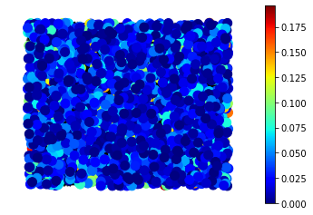
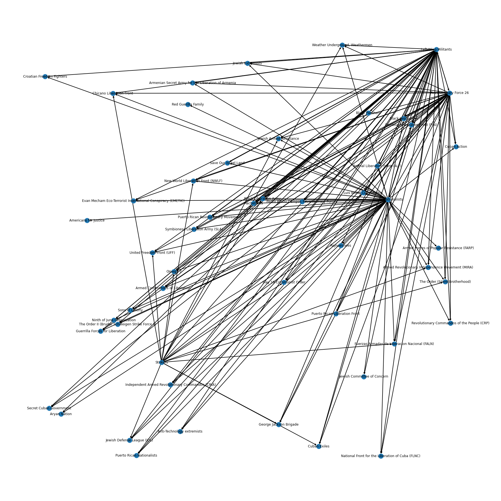
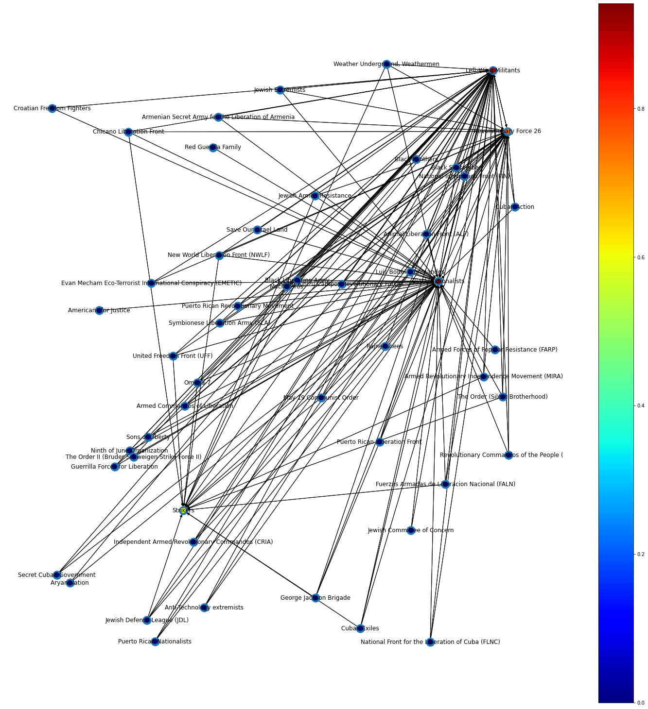
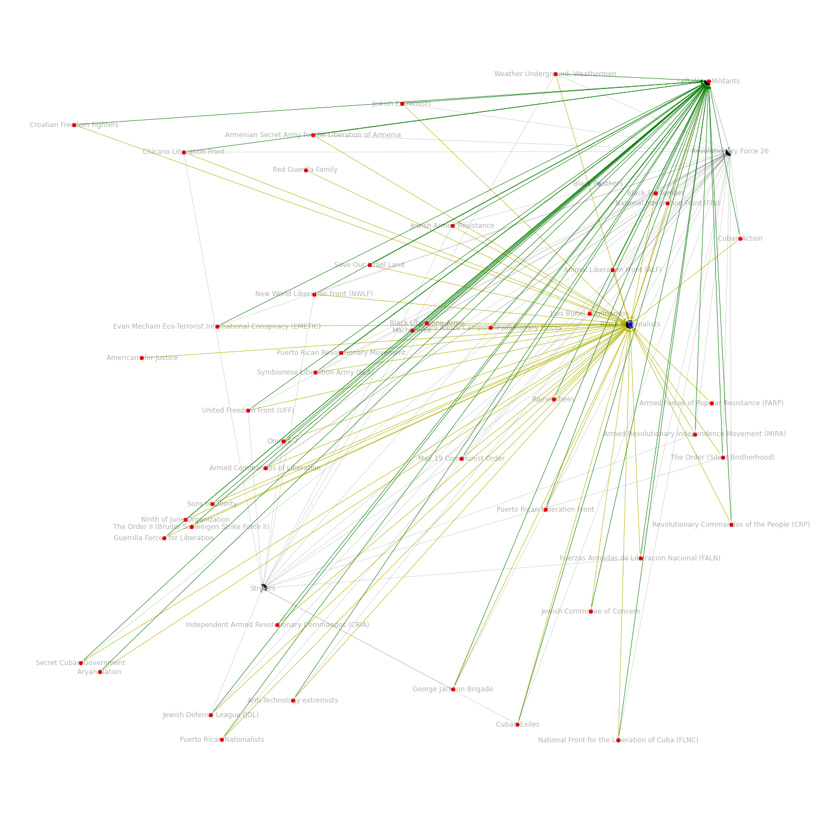

# Terrorist Network Analysis

## Read the data and filter out US data


```python
import networkx as nx
import matplotlib.pyplot as plt
import random
import pandas as pd
import io
import math
from itertools import combinations
import datetime
from gurobipy import *
```


```python
dataset = pd.read_csv('GTD Database1.csv',encoding='latin1')
df = pd.DataFrame(dataset)
df = pd.DataFrame(df.loc[df['country_txt']== 'United States'], columns = ['iyear','imonth','iday','country_txt','targtype1_txt','gname','latitude','longitude'])
df.drop(df.index[df['gname']=='Unknown'], inplace = True)
#df=df.sample(n=500)
df['iday'].replace({0:15}, inplace=True)
```

    /Users/sushama/opt/anaconda3/lib/python3.8/site-packages/IPython/core/interactiveshell.py:3165: DtypeWarning: Columns (4,31,33,54,61,62,63,76,79,90,92,94,96,114,115,121) have mixed types.Specify dtype option on import or set low_memory=False.
      has_raised = await self.run_ast_nodes(code_ast.body, cell_name,


#### Data cleaning - checking for missing values


```python
print (df['country_txt'].isnull().sum())
print (df['iyear'].isnull().sum())
print (df['imonth'].isnull().sum())
print (df['targtype1_txt'].isnull().sum())
print (df['gname'].isnull().sum())
```

    0
    0
    0
    0
    0


#### Graph Creation


```python
G=nx.DiGraph()
for i in range(len(list(df.index))):
    G.add_node(list(df.index)[i])
#print(G.number_of_nodes())
```

## Function to determine difference in number of days between two events


```python
def date_gap(i,j,k,l,m,n):
    a=datetime.datetime(i,j,k)
    b=datetime.datetime(l,m,n)
    return (a-b).days
```

## Function to determine proximity between two events


```python
def haversine(a,b,x,y): # Code taken from https://stackoverflow.com/questions/4913349/haversine-formula-in-python-bearing-and-distance-between-two-gps-points
    lon1=a
    lat1=b
    lon2=x
    lat2=y
    lon1, lat1, lon2, lat2 = map(math.radians, [lon1, lat1, lon2, lat2])
    dlon = lon2 - lon1 
    dlat = lat2 - lat1 
    a = math.sin(dlat/2)**2 + math.cos(lat1) * math.cos(lat2) * math.sin(dlon/2)**2
    c = 2 * math.asin(math.sqrt(a)) 
    r = 3956 # This value does *not* affect the spanning tree calculations! 
    # It is the radius of the earth (needed for the Haversine calculation) in miles. It would be 6371 for kilometers. 
    return c*r
```

## Forming the graph of events with calculated weights based on spatial, temporal and target group parameters

### Temporal relation:
##### The temporal relation is calculated using the "dist_gap" function and the edge weight based on temporal distance is calculated using -
$e^{-|t_i-t_j|} \leq \tau$
##### where, $\tau$ is an arbitrarily large time value to set an upper limit for time-based connection
### Spatial relation:
##### The spatial distance is calculated using the "haversine" function. The difference in distance is calculated and the edge weight is set using - 
$e^{-|d_i-d_j|} \leq \delta $
### Target type:
##### If the target type for event i and j is the same, then edge weights can be calculated  


```python
time_limit = 7000 #in days
dist_limit= 2000
for (i,j) in combinations(range(len(list(df.index))),2):
    
    diff_days = date_gap(df.iat[i,0],df.iat[i,1],df.iat[i,2],df.iat[j,0],df.iat[j,1],df.iat[j,2])
    diff_dist = haversine(df.iat[i,7],df.iat[i,6],df.iat[j,7],df.iat[j,6])

    curr=0
    
    if(diff_days>0)and(diff_days<time_limit)and(diff_dist<dist_limit): 
        curr+= math.e**(-1*diff_dist-1*diff_days)
        if(df.iat[i,4].casefold()==df.iat[j,4].casefold()):
            curr+=1
            G.add_edge(df.index[j],df.index[i], weight = curr)
        
    if(diff_days<0)and(abs(diff_days)<time_limit)and(diff_dist<dist_limit): 
        curr+= math.e**(-1*diff_dist-1*abs(diff_days))
        if(df.iat[i,4].casefold()==df.iat[j,4].casefold()):
            curr+=1
            G.add_edge(df.index[i],df.index[j], weight = curr)
```

#### Checking for bidirectional edges


```python
for i in G.nodes():
    for j in G.nodes():
        if (G.has_edge(i, j) and G.has_edge(j, i)):
            print("Bidirectional edges")
```

#### Plotting the graph and number of edges


```python
pos=nx.random_layout(G)
nx.draw(G,pos, node_size=1)
G.number_of_edges()
```


    186789


    

    


## Determining the closeness centrality for each node (event)


```python
G=G.reverse(copy=True)
close=nx.closeness_centrality(G, wf_improved=True)

colors = [close[i] for i in G.nodes()]

ec = nx.draw_networkx_edges(G, pos, alpha=0.2)
nc = nx.draw_networkx_nodes(G, pos, nodelist=G.nodes(), node_color=colors, 
                            node_size=100, cmap=plt.cm.jet)
plt.colorbar(nc)
plt.axis('off')
plt.show()
```


    

    


#### Sorting events based on closeness centrality


```python
close_sorted=sorted(close.items(), key=lambda item:item[1], reverse=True)
#print(len(close_sorted))
#print(close_sorted[0])
maxClose=max(close.values())
close_centralization = sum(maxClose - close[i] for i in G.nodes())/((G.number_of_nodes()-1)*(G.number_of_nodes()-2)/(2*G.number_of_nodes()-3))
print(close_centralization)
```

    (251, 0.19589053740247372)


#### Printing the top n influential events


```python
top_n=10
print("Top",top_n,"Influential nodes:")
for i in range(0,top_n):
    print(df.loc[df.index == close_sorted[i][0]]['gname'].to_string())
```

    Top 10 Influential nodes:
    251    Revolutionary Force 26
    252    Revolutionary Force 26
    37    Strikers
    243    Black Nationalists
    570    Black Nationalists
    593    Black Nationalists
    228    Left-Wing Militants
    229    Left-Wing Militants
    230    Left-Wing Militants
    234    Black Nationalists


#### Forming dictionary of (influencer, influenced) pair


```python
# Re-reversing all edges 
G=G.reverse(copy=True)
influence={}
# Finding pairs of influencer, influenced based on 'events' graph (G) edges for top N nodes
for i in range(0,top_n):
    influence[i]=list(G.out_edges(close_sorted[i][0]))
print(len(influence[0])) 
```

    458


## List of events influenced by top n events with maximum closeness centrality


```python
for i in range(len(influence)):
    print("Events influenced by", df.loc[df.index == influence[i][0][0]]['gname'].to_string(),':')
    for j in range(len(influence[i])):
        print('\t', df.loc[df.index == influence[i][j][1]]['gname'].to_string())
    print('\n')
```

    Events influenced by 251    Revolutionary Force 26 :
    	 245    Puerto Rican Nationalists
    	 283    Black Afro Militant Movement
    	 287    Black Nationalists
    	 291    Black Nationalists
    	 301    Black Nationalists
    	 302    Black Nationalists
    	 303    Black Nationalists
    	 315    Left-Wing Militants
    	 347    Black Panthers
    	 348    Black Nationalists
    	 362    Jewish Defense League (JDL)
    	 371    Left-Wing Militants
    	 377    Left-Wing Militants
    	 386    Black Panthers
    	 389    Seattle Liberation Front
    	 415    Left-Wing Militants
    	 420    Left-Wing Militants
    	 430    Weather Underground, Weathermen
    	 446    Weather Underground, Weathermen
    	 449    Left-Wing Militants
    	 489    Weather Underground, Weathermen
    	 492    Left-Wing Militants
    	 493    Left-Wing Militants
    	 498    Left-Wing Militants
    	 570    Black Nationalists
    	 593    Black Nationalists
    	 599    Armed Commandos of Liberation
    	 600    Armed Commandos of Liberation
    	 601    Armed Commandos of Liberation
    	 602    Armed Commandos of Liberation
    	 633    Armed Revolutionary Independence Movement (MIRA)
    	 720    Puerto Rican Nationalists
    	 721    Puerto Rican Nationalists
    	 723    Puerto Rican Nationalists
    	 724    Puerto Rican Nationalists
    	 733    Chicano Liberation Front
    	 741    Chicano Liberation Front
    	 773    Armed Revolutionary Independence Movement (MIRA)
    	 775    Weather Underground, Weathermen
    	 777    Left-Wing Militants
    	 799    Left-Wing Militants
    	 814    Puerto Rican Nationalists
    	 820    Armed Commandos of Liberation
    	 822    Left-Wing Militants
    	 824    Jewish Defense League (JDL)
    	 828    Weather Underground, Weathermen
    	 835    Left-Wing Militants
    	 836    Left-Wing Militants
    	 837    Chicano Liberation Front
    	 839    Chicano Liberation Front
    	 840    Chicano Liberation Front
    	 841    Left-Wing Militants
    	 845    People's Revolutionary Party
    	 851    Left-Wing Militants
    	 855    Left-Wing Militants
    	 871    Chicano Liberation Front
    	 874    Chicano Liberation Front
    	 875    Left-Wing Militants
    	 903    Black Liberation Army
    	 916    Black Liberation Army
    	 926    Secret Cuban Government
    	 931    Chicano Liberation Front
    	 940    Chicano Liberation Front
    	 941    Black Liberation Army
    	 946    Left-Wing Militants
    	 948    Jewish Defense League (JDL)
    	 953    Jewish Defense League (JDL)
    	 959    Black Liberation Army
    	 962    Armed Revolutionary Independence Movement (MIRA)
    	 963    Armed Revolutionary Independence Movement (MIRA)
    	 964    Armed Revolutionary Independence Movement (MIRA)
    	 965    Armed Revolutionary Independence Movement (MIRA)
    	 966    Armed Revolutionary Independence Movement (MIRA)
    	 967    Armed Revolutionary Independence Movement (MIRA)
    	 968    Armed Revolutionary Independence Movement (MIRA)
    	 969    Armed Revolutionary Independence Movement (MIRA)
    	 970    Armed Revolutionary Independence Movement (MIRA)
    	 971    Armed Revolutionary Independence Movement (MIRA)
    	 972    Armed Revolutionary Independence Movement (MIRA)
    	 973    Armed Revolutionary Independence Movement (MIRA)
    	 974    Armed Revolutionary Independence Movement (MIRA)
    	 975    Armed Revolutionary Independence Movement (MIRA)
    	 976    Armed Revolutionary Independence Movement (MIRA)
    	 978    Black Liberation Army
    	 984    Chicano Liberation Front
    	 991    Chicano Liberation Front
    	 992    Weather Underground, Weathermen
    	 1004    Left-Wing Militants
    	 1026    Weather Underground, Weathermen
    	 1027    Weather Underground, Weathermen
    	 1041    Black Liberation Army
    	 1045    Left-Wing Militants
    	 1052    Jewish Defense League (JDL)
    	 1062    Weather Underground, Weathermen
    	 1076    Sons of Liberty
    	 1086    Puerto Rican Liberation Front
    	 1101    Jewish Armed Resistance
    	 1103    Jewish Armed Resistance
    	 1113    Sons of Liberty
    	 1119    Puerto Rican Liberation Front
    	 1130    Left-Wing Militants
    	 1131    Left-Wing Militants
    	 1132    Left-Wing Militants
    	 1133    Left-Wing Militants
    	 1134    Left-Wing Militants
    	 1135    Left-Wing Militants
    	 1136    Left-Wing Militants
    	 1137    Left-Wing Militants
    	 1153    Jewish Defense League (JDL)
    	 1155    Jewish Defense League (JDL)
    	 1190    Secret Cuban Government
    	 1191    Secret Cuban Government
    	 1192    Secret Cuban Government
    	 1211    Black Liberation Army
    	 1242    Jewish Defense League (JDL)
    	 1282    Left-Wing Militants
    	 1292    Puerto Rican Nationalists
    	 1340    National Front for the Liberation of Cuba (FLNC)
    	 1345    Secret Army Organization
    	 1436    Puerto Rican Revolutionary Movement
    	 1437    Puerto Rican Revolutionary Movement
    	 1442    Puerto Rican Revolutionary Movement
    	 1443    Puerto Rican Revolutionary Movement
    	 1444    Puerto Rican Revolutionary Movement
    	 1570    Black Liberation Army
    	 1602    Left-Wing Militants
    	 1641    National Integration Front (FIN)
    	 1657    National Integration Front (FIN)
    	 1658    Secret Cuban Government
    	 1677    Armed Revolutionary Independence Movement (MIRA)
    	 1678    Armed Revolutionary Independence Movement (MIRA)
    	 1679    Armed Revolutionary Independence Movement (MIRA)
    	 1686    Black Liberation Army
    	 1754    Black Liberation Army
    	 1758    Armed Revolutionary Independence Movement (MIRA)
    	 1784    Black September
    	 1785    Black September
    	 1811    Black Liberation Army
    	 1815    National Integration Front (FIN)
    	 1834    Black Liberation Army
    	 1955    Black Liberation Army
    	 2040    Weather Underground, Weathermen
    	 2267    Americans for Justice
    	 2271    Americans for Justice
    	 2337    Symbionese Liberation Army (SLA)
    	 2365    Black Liberation Army
    	 2379    Symbionese Liberation Army (SLA)
    	 2431    Weather Underground, Weathermen
    	 2438    Fuerzas Armadas de Liberacion Nacional (FALN)
    	 2501    New World Liberation Front (NWLF)
    	 2508    New World Liberation Front (NWLF)
    	 2525    Fuerzas Armadas de Liberacion Nacional (FALN)
    	 2528    New World Liberation Front (NWLF)
    	 2533    Weather Underground, Weathermen
    	 2577    New World Liberation Front (NWLF)
    	 2583    New World Liberation Front (NWLF)
    	 2584    National Front for the Liberation of Cuba (FLNC)
    	 2588    National Front for the Liberation of Cuba (FLNC)
    	 2589    National Front for the Liberation of Cuba (FLNC)
    	 2612    Fuerzas Armadas de Liberacion Nacional (FALN)
    	 2613    Fuerzas Armadas de Liberacion Nacional (FALN)
    	 2614    Fuerzas Armadas de Liberacion Nacional (FALN)
    	 2616    National Front for the Liberation of Cuba (FLNC)
    	 2624    New World Liberation Front (NWLF)
    	 2696    Fuerzas Armadas de Liberacion Nacional (FALN)
    	 2712    National Front for the Liberation of Cuba (FLNC)
    	 2717    National Front for the Liberation of Cuba (FLNC)
    	 2724    New World Liberation Front (NWLF)
    	 2739    Fuerzas Armadas de Liberacion Nacional (FALN)
    	 2740    Fuerzas Armadas de Liberacion Nacional (FALN)
    	 2741    Fuerzas Armadas de Liberacion Nacional (FALN)
    	 2767    Fuerzas Armadas de Liberacion Nacional (FALN)
    	 2783    New World Liberation Front (NWLF)
    	 2786    New World Liberation Front (NWLF)
    	 2789    New World Liberation Front (NWLF)
    	 2791    Cuban Action
    	 2807    Cuban Action
    	 2834    Cuban Exiles
    	 2855    Weather Underground, Weathermen
    	 2871    Chicano Liberation Front
    	 2872    Chicano Liberation Front
    	 2873    Chicano Liberation Front
    	 2924    Fuerzas Armadas de Liberacion Nacional (FALN)
    	 2925    Fuerzas Armadas de Liberacion Nacional (FALN)
    	 2926    Fuerzas Armadas de Liberacion Nacional (FALN)
    	 2927    Fuerzas Armadas de Liberacion Nacional (FALN)
    	 2928    Fuerzas Armadas de Liberacion Nacional (FALN)
    	 2933    Red Guerilla Family
    	 2934    Jewish Extremists
    	 2957    Cuban Action
    	 2960    Symbionese Liberation Army (SLA)
    	 2961    Symbionese Liberation Army (SLA)
    	 3006    Cuban Action
    	 3008    New World Liberation Front (NWLF)
    	 3010    The Scorpion
    	 3027    New World Liberation Front (NWLF)
    	 3039    Fuerzas Armadas de Liberacion Nacional (FALN)
    	 3040    Fuerzas Armadas de Liberacion Nacional (FALN)
    	 3041    Fuerzas Armadas de Liberacion Nacional (FALN)
    	 3084    Fuerzas Armadas de Liberacion Nacional (FALN)
    	 3085    Fuerzas Armadas de Liberacion Nacional (FALN)
    	 3090    Weather Underground, Weathermen
    	 3165    New World Liberation Front (NWLF)
    	 3226    Weather Underground, Weathermen
    	 3251    George Jackson Brigade
    	 3257    George Jackson Brigade
    	 3305    United Freedom Front (UFF)
    	 3361    Fuerzas Armadas de Liberacion Nacional (FALN)
    	 3362    Fuerzas Armadas de Liberacion Nacional (FALN)
    	 3365    Fuerzas Armadas de Liberacion Nacional (FALN)
    	 3367    Fuerzas Armadas de Liberacion Nacional (FALN)
    	 3368    Fuerzas Armadas de Liberacion Nacional (FALN)
    	 3369    Fuerzas Armadas de Liberacion Nacional (FALN)
    	 3379    New World Liberation Front (NWLF)
    	 3394    Fuerzas Armadas de Liberacion Nacional (FALN)
    	 3423    New World Liberation Front (NWLF)
    	 3430    New World Liberation Front (NWLF)
    	 3446    Cuban Exiles
    	 3449    United Freedom Front (UFF)
    	 3452    Fuerzas Armadas de Liberacion Nacional (FALN)
    	 3468    New World Liberation Front (NWLF)
    	 3477    New World Liberation Front (NWLF)
    	 3481    George Jackson Brigade
    	 3513    New World Liberation Front (NWLF)
    	 3536    George Jackson Brigade
    	 3561    New World Liberation Front (NWLF)
    	 3587    New World Liberation Front (NWLF)
    	 3636    Red Guerilla Family
    	 3668    Jewish Armed Resistance
    	 3778    Jewish Armed Resistance
    	 3779    Jewish Armed Resistance
    	 3809    Fred Hampton Unit of the People's Forces
    	 3820    New World Liberation Front (NWLF)
    	 3832    Cuban Exiles
    	 3833    Save Our Israel Land
    	 3834    Save Our Israel Land
    	 3878    Jewish Extremists
    	 3901    Fuerzas Armadas de Liberacion Nacional (FALN)
    	 3903    Fuerzas Armadas de Liberacion Nacional (FALN)
    	 3904    Fuerzas Armadas de Liberacion Nacional (FALN)
    	 3945    Fuerzas Armadas de Liberacion Nacional (FALN)
    	 3946    Fuerzas Armadas de Liberacion Nacional (FALN)
    	 3948    Fuerzas Armadas de Liberacion Nacional (FALN)
    	 3949    Fuerzas Armadas de Liberacion Nacional (FALN)
    	 3950    Jewish Defense League (JDL)
    	 3970    United Freedom Front (UFF)
    	 3985    Fuerzas Armadas de Liberacion Nacional (FALN)
    	 3986    Fuerzas Armadas de Liberacion Nacional (FALN)
    	 3987    Fuerzas Armadas de Liberacion Nacional (FALN)
    	 3988    Fuerzas Armadas de Liberacion Nacional (FALN)
    	 3989    Fuerzas Armadas de Liberacion Nacional (FALN)
    	 3990    Fuerzas Armadas de Liberacion Nacional (FALN)
    	 4023    Omega-7
    	 4130    Fuerzas Armadas de Liberacion Nacional (FALN)
    	 4365    May 19 Communist Order
    	 4375    United Freedom Front (UFF)
    	 4533    Fuerzas Armadas de Liberacion Nacional (FALN)
    	 4534    Fuerzas Armadas de Liberacion Nacional (FALN)
    	 4536    Fuerzas Armadas de Liberacion Nacional (FALN)
    	 4537    Fuerzas Armadas de Liberacion Nacional (FALN)
    	 4548    Independent Armed Revolutionary Commandos (CRIA)
    	 4549    Independent Armed Revolutionary Commandos (CRIA)
    	 4556    Independent Armed Revolutionary Commandos (CRIA)
    	 4599    United Freedom Front (UFF)
    	 4617    Fuerzas Armadas de Liberacion Nacional (FALN)
    	 4618    Fuerzas Armadas de Liberacion Nacional (FALN)
    	 4621    Fuerzas Armadas de Liberacion Nacional (FALN)
    	 4647    Condor
    	 4660    Independent Armed Revolutionary Commandos (CRIA)
    	 4674    Independent Armed Revolutionary Commandos (CRIA)
    	 4691    Fuerzas Armadas de Liberacion Nacional (FALN)
    	 4694    Fuerzas Armadas de Liberacion Nacional (FALN)
    	 4695    Fuerzas Armadas de Liberacion Nacional (FALN)
    	 4703    New World Liberation Front (NWLF)
    	 4774    George Jackson Brigade
    	 4775    George Jackson Brigade
    	 4804    George Jackson Brigade
    	 4810    Luis Boitel Commandos
    	 4812    May 19 Communist Order
    	 4860    Gay Liberation Front
    	 4861    Jewish Armed Resistance
    	 4926    George Jackson Brigade
    	 4979    George Jackson Brigade
    	 5026    New World Liberation Front (NWLF)
    	 5076    New World Liberation Front (NWLF)
    	 5102    Environmental Life Force
    	 5122    Fuerzas Armadas de Liberacion Nacional (FALN)
    	 5123    Fuerzas Armadas de Liberacion Nacional (FALN)
    	 5155    Fuerzas Armadas de Liberacion Nacional (FALN)
    	 5171    New World Liberation Front (NWLF)
    	 5172    New World Liberation Front (NWLF)
    	 5199    New World Liberation Front (NWLF)
    	 5258    Luis Boitel Commandos
    	 5303    Luis Boitel Commandos
    	 5304    Luis Boitel Commandos
    	 5305    Luis Boitel Commandos
    	 5306    Luis Boitel Commandos
    	 5362    George Jackson Brigade
    	 5392    Fuerzas Armadas de Liberacion Nacional (FALN)
    	 5394    Fuerzas Armadas de Liberacion Nacional (FALN)
    	 5395    Fuerzas Armadas de Liberacion Nacional (FALN)
    	 5396    Revolutionary Commandos of the People (CRP)
    	 5397    Revolutionary Commandos of the People (CRP)
    	 5416    George Jackson Brigade
    	 5424    George Jackson Brigade
    	 5459    May 19 Communist Order
    	 5462    Universal Proutist Revolutionary Federation
    	 5504    George Jackson Brigade
    	 5507    George Jackson Brigade
    	 5532    Fuerzas Armadas de Liberacion Nacional (FALN)
    	 5544    Fuerzas Armadas de Liberacion Nacional (FALN)
    	 5659    Omega-7
    	 5660    Omega-7
    	 5888    Fuerzas Armadas de Liberacion Nacional (FALN)
    	 5921    Revolutionary Commandos of the People (CRP)
    	 5943    Jewish Committee of Concern
    	 5955    Puerto Rican Nationalists
    	 5956    Puerto Rican Nationalists
    	 5987    Jewish Committee of Concern
    	 6023    Coordination of the United Revolutionary Organ...
    	 6207    Front for the National Liberation of Puerto Rico
    	 6452    Jewish Defense League (JDL)
    	 6478    Fuerzas Armadas de Liberacion Nacional (FALN)
    	 6479    Fuerzas Armadas de Liberacion Nacional (FALN)
    	 6480    Fuerzas Armadas de Liberacion Nacional (FALN)
    	 6542    Fuerzas Armadas de Liberacion Nacional (FALN)
    	 6543    Fuerzas Armadas de Liberacion Nacional (FALN)
    	 6827    Otpor
    	 6831    Omega-7
    	 6834    Omega-7
    	 6835    Omega-7
    	 6836    Omega-7
    	 6861    Omega-7
    	 6862    May 19 Communist Order
    	 6865    Omega-7
    	 6918    United Freedom Front (UFF)
    	 6919    United Freedom Front (UFF)
    	 7200    May 19 Communist Order
    	 7734    United Freedom Front (UFF)
    	 7951    Omega-7
    	 8047    Omega-7
    	 8180    Omega-7
    	 9226    May 19 Communist Order
    	 9520    Fuerzas Armadas de Liberacion Nacional (FALN)
    	 9677    Jewish Defense League (JDL)
    	 9764    Croatian Freedom Fighters
    	 9982    Omega-7
    	 10042    Omega-7
    	 10120    Omega-7
    	 10256    May 19 Communist Order
    	 10473    Croatian Freedom Fighters
    	 10788    May 19 Communist Order
    	 12067    Justice Commandos for the Armenian Genocide
    	 12568    Omega-7
    	 12587    Macheteros
    	 12746    Jewish Defense League (JDL)
    	 12964    Armenian Secret Army for the Liberation of Arm...
    	 13102    Armed Forces of Popular Resistance (FARP)
    	 13147    May 19 Communist Order
    	 13336    Macheteros
    	 13391    Imperial Iranian Patriotic Organization
    	 13654    May 19 Communist Order
    	 13783    United Freedom Front (UFF)
    	 13791    Ninth of June Organization
    	 13810    Organization of Volunteers for the Puerto Rica...
    	 14185    Armenian Secret Army for the Liberation of Arm...
    	 14186    Ninth of June Organization
    	 14306    Jewish Defense League (JDL)
    	 14459    Armenian Secret Army for the Liberation of Arm...
    	 14846    May 19 Communist Order
    	 15085    May 19 Communist Order
    	 15502    Jewish Defense League (JDL)
    	 15511    Omega-7
    	 15521    Omega-7
    	 15527    Omega-7
    	 15564    Fuerzas Armadas de Liberacion Nacional (FALN)
    	 15565    Fuerzas Armadas de Liberacion Nacional (FALN)
    	 15566    Fuerzas Armadas de Liberacion Nacional (FALN)
    	 15567    Fuerzas Armadas de Liberacion Nacional (FALN)
    	 15874    United Freedom Front (UFF)
    	 15897    Jewish Defense League (JDL)
    	 16074    Jewish Defense League (JDL)
    	 16258    Omega-7
    	 16271    Macheteros
    	 16284    Macheteros
    	 16318    Armenian Secret Army for the Liberation of Arm...
    	 16483    United Freedom Front (UFF)
    	 16962    Macheteros
    	 16993    Omega-7
    	 17053    Fuerzas Armadas de Liberacion Nacional (FALN)
    	 17380    Jewish Defense League (JDL)
    	 17607    United Freedom Front (UFF)
    	 17608    United Freedom Front (UFF)
    	 17833    Omega-7
    	 17834    Omega-7
    	 18165    United Freedom Front (UFF)
    	 18644    Macheteros
    	 18943    Omega-7
    	 19242    United Freedom Front (UFF)
    	 19309    Macheteros
    	 19405    Jamaat-al-Fuqra
    	 19730    Macheteros
    	 19975    Omega-7
    	 20045    United Freedom Front (UFF)
    	 20110    The Order (Silent Brotherhood)
    	 20224    Covenant, Sword and the Arm of the Lord (CSA)
    	 20477    United Freedom Front (UFF)
    	 20845    United Freedom Front (UFF)
    	 20850    The Order (Silent Brotherhood)
    	 21333    The Order (Silent Brotherhood)
    	 21397    United Freedom Front (UFF)
    	 21579    May 19 Communist Order
    	 21801    The Order (Silent Brotherhood)
    	 21821    The Order (Silent Brotherhood)
    	 21852    United Freedom Front (UFF)
    	 22222    United Freedom Front (UFF)
    	 22673    The Order (Silent Brotherhood)
    	 22988    United Freedom Front (UFF)
    	 23231    Rajneeshees
    	 23312    Rajneeshees
    	 23355    United Freedom Front (UFF)
    	 24818    Jewish Extremists
    	 25432    Anti-Technology extremists
    	 26855    Anti-Technology extremists
    	 27033    Jewish Defense League (JDL)
    	 27436    The Order II (Bruder Schweigen Strike Force II)
    	 27550    Puerto Rican Nationalists
    	 28865    The Order II (Bruder Schweigen Strike Force II)
    	 29069    Jewish Defense League (JDL)
    	 29249    Aryan Nation
    	 29250    Aryan Nation
    	 29623    Jewish Defense League (JDL)
    	 30226    Anti-Technology extremists
    	 30900    Cuban Exiles
    	 30904    Cuban Exiles
    	 31099    Guerrilla Forces for Liberation
    	 31100    Guerrilla Forces for Liberation
    	 31101    Guerrilla Forces for Liberation
    	 31109    Anti-Castro Group
    	 31980    Cuban Exiles
    	 32017    Animal Liberation Front (ALF)
    	 32335    Evan Mecham Eco-Terrorist International Conspi...
    	 32644    Evan Mecham Eco-Terrorist International Conspi...
    	 32832    Animal Liberation Front (ALF)
    	 32851    Animal Liberation Front (ALF)
    	 33051    Cuban Exiles
    	 33134    Pedro Albizu Campos Revolutionary Forces
    	 35563    Cuban Exiles
    	 35675    Cuban Exiles
    	 36059    Evan Mecham Eco-Terrorist International Conspi...
    	 36103    Pedro Albizu Campos Revolutionary Forces
    	 36104    Pedro Albizu Campos Revolutionary Forces
    	 36185    Animal Rights extremists
    	 37048    Earth First!
    	 37391    Cuban Exiles
    	 37727    Cuban Exiles
    	 38100    Animal Liberation Front (ALF)
    	 38627    Macheteros
    
    
    Events influenced by 252    Revolutionary Force 26 :
    	 245    Puerto Rican Nationalists
    	 283    Black Afro Militant Movement
    	 287    Black Nationalists
    	 291    Black Nationalists
    	 301    Black Nationalists
    	 302    Black Nationalists
    	 303    Black Nationalists
    	 315    Left-Wing Militants
    	 347    Black Panthers
    	 348    Black Nationalists
    	 362    Jewish Defense League (JDL)
    	 371    Left-Wing Militants
    	 377    Left-Wing Militants
    	 386    Black Panthers
    	 389    Seattle Liberation Front
    	 415    Left-Wing Militants
    	 420    Left-Wing Militants
    	 430    Weather Underground, Weathermen
    	 446    Weather Underground, Weathermen
    	 449    Left-Wing Militants
    	 489    Weather Underground, Weathermen
    	 492    Left-Wing Militants
    	 493    Left-Wing Militants
    	 498    Left-Wing Militants
    	 570    Black Nationalists
    	 593    Black Nationalists
    	 599    Armed Commandos of Liberation
    	 600    Armed Commandos of Liberation
    	 601    Armed Commandos of Liberation
    	 602    Armed Commandos of Liberation
    	 633    Armed Revolutionary Independence Movement (MIRA)
    	 720    Puerto Rican Nationalists
    	 721    Puerto Rican Nationalists
    	 723    Puerto Rican Nationalists
    	 724    Puerto Rican Nationalists
    	 733    Chicano Liberation Front
    	 741    Chicano Liberation Front
    	 773    Armed Revolutionary Independence Movement (MIRA)
    	 775    Weather Underground, Weathermen
    	 777    Left-Wing Militants
    	 799    Left-Wing Militants
    	 814    Puerto Rican Nationalists
    	 820    Armed Commandos of Liberation
    	 822    Left-Wing Militants
    	 824    Jewish Defense League (JDL)
    	 828    Weather Underground, Weathermen
    	 835    Left-Wing Militants
    	 836    Left-Wing Militants
    	 837    Chicano Liberation Front
    	 839    Chicano Liberation Front
    	 840    Chicano Liberation Front
    	 841    Left-Wing Militants
    	 845    People's Revolutionary Party
    	 851    Left-Wing Militants
    	 855    Left-Wing Militants
    	 871    Chicano Liberation Front
    	 874    Chicano Liberation Front
    	 875    Left-Wing Militants
    	 903    Black Liberation Army
    	 916    Black Liberation Army
    	 926    Secret Cuban Government
    	 931    Chicano Liberation Front
    	 940    Chicano Liberation Front
    	 941    Black Liberation Army
    	 946    Left-Wing Militants
    	 948    Jewish Defense League (JDL)
    	 953    Jewish Defense League (JDL)
    	 959    Black Liberation Army
    	 962    Armed Revolutionary Independence Movement (MIRA)
    	 963    Armed Revolutionary Independence Movement (MIRA)
    	 964    Armed Revolutionary Independence Movement (MIRA)
    	 965    Armed Revolutionary Independence Movement (MIRA)
    	 966    Armed Revolutionary Independence Movement (MIRA)
    	 967    Armed Revolutionary Independence Movement (MIRA)
    	 968    Armed Revolutionary Independence Movement (MIRA)
    	 969    Armed Revolutionary Independence Movement (MIRA)
    	 970    Armed Revolutionary Independence Movement (MIRA)
    	 971    Armed Revolutionary Independence Movement (MIRA)
    	 972    Armed Revolutionary Independence Movement (MIRA)
    	 973    Armed Revolutionary Independence Movement (MIRA)
    	 974    Armed Revolutionary Independence Movement (MIRA)
    	 975    Armed Revolutionary Independence Movement (MIRA)
    	 976    Armed Revolutionary Independence Movement (MIRA)
    	 978    Black Liberation Army
    	 984    Chicano Liberation Front
    	 991    Chicano Liberation Front
    	 992    Weather Underground, Weathermen
    	 1004    Left-Wing Militants
    	 1026    Weather Underground, Weathermen
    	 1027    Weather Underground, Weathermen
    	 1041    Black Liberation Army
    	 1045    Left-Wing Militants
    	 1052    Jewish Defense League (JDL)
    	 1062    Weather Underground, Weathermen
    	 1076    Sons of Liberty
    	 1086    Puerto Rican Liberation Front
    	 1101    Jewish Armed Resistance
    	 1103    Jewish Armed Resistance
    	 1113    Sons of Liberty
    	 1119    Puerto Rican Liberation Front
    	 1130    Left-Wing Militants
    	 1131    Left-Wing Militants
    	 1132    Left-Wing Militants
    	 1133    Left-Wing Militants
    	 1134    Left-Wing Militants
    	 1135    Left-Wing Militants
    	 1136    Left-Wing Militants
    	 1137    Left-Wing Militants
    	 1153    Jewish Defense League (JDL)
    	 1155    Jewish Defense League (JDL)
    	 1190    Secret Cuban Government
    	 1191    Secret Cuban Government
    	 1192    Secret Cuban Government
    	 1211    Black Liberation Army
    	 1242    Jewish Defense League (JDL)
    	 1282    Left-Wing Militants
    	 1292    Puerto Rican Nationalists
    	 1340    National Front for the Liberation of Cuba (FLNC)
    	 1345    Secret Army Organization
    	 1436    Puerto Rican Revolutionary Movement
    	 1437    Puerto Rican Revolutionary Movement
    	 1442    Puerto Rican Revolutionary Movement
    	 1443    Puerto Rican Revolutionary Movement
    	 1444    Puerto Rican Revolutionary Movement
    	 1570    Black Liberation Army
    	 1602    Left-Wing Militants
    	 1641    National Integration Front (FIN)
    	 1657    National Integration Front (FIN)
    	 1658    Secret Cuban Government
    	 1677    Armed Revolutionary Independence Movement (MIRA)
    	 1678    Armed Revolutionary Independence Movement (MIRA)
    	 1679    Armed Revolutionary Independence Movement (MIRA)
    	 1686    Black Liberation Army
    	 1754    Black Liberation Army
    	 1758    Armed Revolutionary Independence Movement (MIRA)
    	 1784    Black September
    	 1785    Black September
    	 1811    Black Liberation Army
    	 1815    National Integration Front (FIN)
    	 1834    Black Liberation Army
    	 1955    Black Liberation Army
    	 2040    Weather Underground, Weathermen
    	 2267    Americans for Justice
    	 2271    Americans for Justice
    	 2337    Symbionese Liberation Army (SLA)
    	 2365    Black Liberation Army
    	 2379    Symbionese Liberation Army (SLA)
    	 2431    Weather Underground, Weathermen
    	 2438    Fuerzas Armadas de Liberacion Nacional (FALN)
    	 2501    New World Liberation Front (NWLF)
    	 2508    New World Liberation Front (NWLF)
    	 2525    Fuerzas Armadas de Liberacion Nacional (FALN)
    	 2528    New World Liberation Front (NWLF)
    	 2533    Weather Underground, Weathermen
    	 2577    New World Liberation Front (NWLF)
    	 2583    New World Liberation Front (NWLF)
    	 2584    National Front for the Liberation of Cuba (FLNC)
    	 2588    National Front for the Liberation of Cuba (FLNC)
    	 2589    National Front for the Liberation of Cuba (FLNC)
    	 2612    Fuerzas Armadas de Liberacion Nacional (FALN)
    	 2613    Fuerzas Armadas de Liberacion Nacional (FALN)
    	 2614    Fuerzas Armadas de Liberacion Nacional (FALN)
    	 2616    National Front for the Liberation of Cuba (FLNC)
    	 2624    New World Liberation Front (NWLF)
    	 2696    Fuerzas Armadas de Liberacion Nacional (FALN)
    	 2712    National Front for the Liberation of Cuba (FLNC)
    	 2717    National Front for the Liberation of Cuba (FLNC)
    	 2724    New World Liberation Front (NWLF)
    	 2739    Fuerzas Armadas de Liberacion Nacional (FALN)
    	 2740    Fuerzas Armadas de Liberacion Nacional (FALN)
    	 2741    Fuerzas Armadas de Liberacion Nacional (FALN)
    	 2767    Fuerzas Armadas de Liberacion Nacional (FALN)
    	 2783    New World Liberation Front (NWLF)
    	 2786    New World Liberation Front (NWLF)
    	 2789    New World Liberation Front (NWLF)
    	 2791    Cuban Action
    	 2807    Cuban Action
    	 2834    Cuban Exiles
    	 2855    Weather Underground, Weathermen
    	 2871    Chicano Liberation Front
    	 2872    Chicano Liberation Front
    	 2873    Chicano Liberation Front
    	 2924    Fuerzas Armadas de Liberacion Nacional (FALN)
    	 2925    Fuerzas Armadas de Liberacion Nacional (FALN)
    	 2926    Fuerzas Armadas de Liberacion Nacional (FALN)
    	 2927    Fuerzas Armadas de Liberacion Nacional (FALN)
    	 2928    Fuerzas Armadas de Liberacion Nacional (FALN)
    	 2933    Red Guerilla Family
    	 2934    Jewish Extremists
    	 2957    Cuban Action
    	 2960    Symbionese Liberation Army (SLA)
    	 2961    Symbionese Liberation Army (SLA)
    	 3006    Cuban Action
    	 3008    New World Liberation Front (NWLF)
    	 3010    The Scorpion
    	 3027    New World Liberation Front (NWLF)
    	 3039    Fuerzas Armadas de Liberacion Nacional (FALN)
    	 3040    Fuerzas Armadas de Liberacion Nacional (FALN)
    	 3041    Fuerzas Armadas de Liberacion Nacional (FALN)
    	 3084    Fuerzas Armadas de Liberacion Nacional (FALN)
    	 3085    Fuerzas Armadas de Liberacion Nacional (FALN)
    	 3090    Weather Underground, Weathermen
    	 3165    New World Liberation Front (NWLF)
    	 3226    Weather Underground, Weathermen
    	 3251    George Jackson Brigade
    	 3257    George Jackson Brigade
    	 3305    United Freedom Front (UFF)
    	 3361    Fuerzas Armadas de Liberacion Nacional (FALN)
    	 3362    Fuerzas Armadas de Liberacion Nacional (FALN)
    	 3365    Fuerzas Armadas de Liberacion Nacional (FALN)
    	 3367    Fuerzas Armadas de Liberacion Nacional (FALN)
    	 3368    Fuerzas Armadas de Liberacion Nacional (FALN)
    	 3369    Fuerzas Armadas de Liberacion Nacional (FALN)
    	 3379    New World Liberation Front (NWLF)
    	 3394    Fuerzas Armadas de Liberacion Nacional (FALN)
    	 3423    New World Liberation Front (NWLF)
    	 3430    New World Liberation Front (NWLF)
    	 3446    Cuban Exiles
    	 3449    United Freedom Front (UFF)
    	 3452    Fuerzas Armadas de Liberacion Nacional (FALN)
    	 3468    New World Liberation Front (NWLF)
    	 3477    New World Liberation Front (NWLF)
    	 3481    George Jackson Brigade
    	 3513    New World Liberation Front (NWLF)
    	 3536    George Jackson Brigade
    	 3561    New World Liberation Front (NWLF)
    	 3587    New World Liberation Front (NWLF)
    	 3636    Red Guerilla Family
    	 3668    Jewish Armed Resistance
    	 3778    Jewish Armed Resistance
    	 3779    Jewish Armed Resistance
    	 3809    Fred Hampton Unit of the People's Forces
    	 3820    New World Liberation Front (NWLF)
    	 3832    Cuban Exiles
    	 3833    Save Our Israel Land
    	 3834    Save Our Israel Land
    	 3878    Jewish Extremists
    	 3901    Fuerzas Armadas de Liberacion Nacional (FALN)
    	 3903    Fuerzas Armadas de Liberacion Nacional (FALN)
    	 3904    Fuerzas Armadas de Liberacion Nacional (FALN)
    	 3945    Fuerzas Armadas de Liberacion Nacional (FALN)
    	 3946    Fuerzas Armadas de Liberacion Nacional (FALN)
    	 3948    Fuerzas Armadas de Liberacion Nacional (FALN)
    	 3949    Fuerzas Armadas de Liberacion Nacional (FALN)
    	 3950    Jewish Defense League (JDL)
    	 3970    United Freedom Front (UFF)
    	 3985    Fuerzas Armadas de Liberacion Nacional (FALN)
    	 3986    Fuerzas Armadas de Liberacion Nacional (FALN)
    	 3987    Fuerzas Armadas de Liberacion Nacional (FALN)
    	 3988    Fuerzas Armadas de Liberacion Nacional (FALN)
    	 3989    Fuerzas Armadas de Liberacion Nacional (FALN)
    	 3990    Fuerzas Armadas de Liberacion Nacional (FALN)
    	 4023    Omega-7
    	 4130    Fuerzas Armadas de Liberacion Nacional (FALN)
    	 4365    May 19 Communist Order
    	 4375    United Freedom Front (UFF)
    	 4533    Fuerzas Armadas de Liberacion Nacional (FALN)
    	 4534    Fuerzas Armadas de Liberacion Nacional (FALN)
    	 4536    Fuerzas Armadas de Liberacion Nacional (FALN)
    	 4537    Fuerzas Armadas de Liberacion Nacional (FALN)
    	 4548    Independent Armed Revolutionary Commandos (CRIA)
    	 4549    Independent Armed Revolutionary Commandos (CRIA)
    	 4556    Independent Armed Revolutionary Commandos (CRIA)
    	 4599    United Freedom Front (UFF)
    	 4617    Fuerzas Armadas de Liberacion Nacional (FALN)
    	 4618    Fuerzas Armadas de Liberacion Nacional (FALN)
    	 4621    Fuerzas Armadas de Liberacion Nacional (FALN)
    	 4647    Condor
    	 4660    Independent Armed Revolutionary Commandos (CRIA)
    	 4674    Independent Armed Revolutionary Commandos (CRIA)
    	 4691    Fuerzas Armadas de Liberacion Nacional (FALN)
    	 4694    Fuerzas Armadas de Liberacion Nacional (FALN)
    	 4695    Fuerzas Armadas de Liberacion Nacional (FALN)
    	 4703    New World Liberation Front (NWLF)
    	 4774    George Jackson Brigade
    	 4775    George Jackson Brigade
    	 4804    George Jackson Brigade
    	 4810    Luis Boitel Commandos
    	 4812    May 19 Communist Order
    	 4860    Gay Liberation Front
    	 4861    Jewish Armed Resistance
    	 4926    George Jackson Brigade
    	 4979    George Jackson Brigade
    	 5026    New World Liberation Front (NWLF)
    	 5076    New World Liberation Front (NWLF)
    	 5102    Environmental Life Force
    	 5122    Fuerzas Armadas de Liberacion Nacional (FALN)
    	 5123    Fuerzas Armadas de Liberacion Nacional (FALN)
    	 5155    Fuerzas Armadas de Liberacion Nacional (FALN)
    	 5171    New World Liberation Front (NWLF)
    	 5172    New World Liberation Front (NWLF)
    	 5199    New World Liberation Front (NWLF)
    	 5258    Luis Boitel Commandos
    	 5303    Luis Boitel Commandos
    	 5304    Luis Boitel Commandos
    	 5305    Luis Boitel Commandos
    	 5306    Luis Boitel Commandos
    	 5362    George Jackson Brigade
    	 5392    Fuerzas Armadas de Liberacion Nacional (FALN)
    	 5394    Fuerzas Armadas de Liberacion Nacional (FALN)
    	 5395    Fuerzas Armadas de Liberacion Nacional (FALN)
    	 5396    Revolutionary Commandos of the People (CRP)
    	 5397    Revolutionary Commandos of the People (CRP)
    	 5416    George Jackson Brigade
    	 5424    George Jackson Brigade
    	 5459    May 19 Communist Order
    	 5462    Universal Proutist Revolutionary Federation
    	 5504    George Jackson Brigade
    	 5507    George Jackson Brigade
    	 5532    Fuerzas Armadas de Liberacion Nacional (FALN)
    	 5544    Fuerzas Armadas de Liberacion Nacional (FALN)
    	 5659    Omega-7
    	 5660    Omega-7
    	 5888    Fuerzas Armadas de Liberacion Nacional (FALN)
    	 5921    Revolutionary Commandos of the People (CRP)
    	 5943    Jewish Committee of Concern
    	 5955    Puerto Rican Nationalists
    	 5956    Puerto Rican Nationalists
    	 5987    Jewish Committee of Concern
    	 6023    Coordination of the United Revolutionary Organ...
    	 6207    Front for the National Liberation of Puerto Rico
    	 6452    Jewish Defense League (JDL)
    	 6478    Fuerzas Armadas de Liberacion Nacional (FALN)
    	 6479    Fuerzas Armadas de Liberacion Nacional (FALN)
    	 6480    Fuerzas Armadas de Liberacion Nacional (FALN)
    	 6542    Fuerzas Armadas de Liberacion Nacional (FALN)
    	 6543    Fuerzas Armadas de Liberacion Nacional (FALN)
    	 6827    Otpor
    	 6831    Omega-7
    	 6834    Omega-7
    	 6835    Omega-7
    	 6836    Omega-7
    	 6861    Omega-7
    	 6862    May 19 Communist Order
    	 6865    Omega-7
    	 6918    United Freedom Front (UFF)
    	 6919    United Freedom Front (UFF)
    	 7200    May 19 Communist Order
    	 7734    United Freedom Front (UFF)
    	 7951    Omega-7
    	 8047    Omega-7
    	 8180    Omega-7
    	 9226    May 19 Communist Order
    	 9520    Fuerzas Armadas de Liberacion Nacional (FALN)
    	 9677    Jewish Defense League (JDL)
    	 9764    Croatian Freedom Fighters
    	 9982    Omega-7
    	 10042    Omega-7
    	 10120    Omega-7
    	 10256    May 19 Communist Order
    	 10473    Croatian Freedom Fighters
    	 10788    May 19 Communist Order
    	 12067    Justice Commandos for the Armenian Genocide
    	 12568    Omega-7
    	 12587    Macheteros
    	 12746    Jewish Defense League (JDL)
    	 12964    Armenian Secret Army for the Liberation of Arm...
    	 13102    Armed Forces of Popular Resistance (FARP)
    	 13147    May 19 Communist Order
    	 13336    Macheteros
    	 13391    Imperial Iranian Patriotic Organization
    	 13654    May 19 Communist Order
    	 13783    United Freedom Front (UFF)
    	 13791    Ninth of June Organization
    	 13810    Organization of Volunteers for the Puerto Rica...
    	 14185    Armenian Secret Army for the Liberation of Arm...
    	 14186    Ninth of June Organization
    	 14306    Jewish Defense League (JDL)
    	 14459    Armenian Secret Army for the Liberation of Arm...
    	 14846    May 19 Communist Order
    	 15085    May 19 Communist Order
    	 15502    Jewish Defense League (JDL)
    	 15511    Omega-7
    	 15521    Omega-7
    	 15527    Omega-7
    	 15564    Fuerzas Armadas de Liberacion Nacional (FALN)
    	 15565    Fuerzas Armadas de Liberacion Nacional (FALN)
    	 15566    Fuerzas Armadas de Liberacion Nacional (FALN)
    	 15567    Fuerzas Armadas de Liberacion Nacional (FALN)
    	 15874    United Freedom Front (UFF)
    	 15897    Jewish Defense League (JDL)
    	 16074    Jewish Defense League (JDL)
    	 16258    Omega-7
    	 16271    Macheteros
    	 16284    Macheteros
    	 16318    Armenian Secret Army for the Liberation of Arm...
    	 16483    United Freedom Front (UFF)
    	 16962    Macheteros
    	 16993    Omega-7
    	 17053    Fuerzas Armadas de Liberacion Nacional (FALN)
    	 17380    Jewish Defense League (JDL)
    	 17607    United Freedom Front (UFF)
    	 17608    United Freedom Front (UFF)
    	 17833    Omega-7
    	 17834    Omega-7
    	 18165    United Freedom Front (UFF)
    	 18644    Macheteros
    	 18943    Omega-7
    	 19242    United Freedom Front (UFF)
    	 19309    Macheteros
    	 19405    Jamaat-al-Fuqra
    	 19730    Macheteros
    	 19975    Omega-7
    	 20045    United Freedom Front (UFF)
    	 20110    The Order (Silent Brotherhood)
    	 20224    Covenant, Sword and the Arm of the Lord (CSA)
    	 20477    United Freedom Front (UFF)
    	 20845    United Freedom Front (UFF)
    	 20850    The Order (Silent Brotherhood)
    	 21333    The Order (Silent Brotherhood)
    	 21397    United Freedom Front (UFF)
    	 21579    May 19 Communist Order
    	 21801    The Order (Silent Brotherhood)
    	 21821    The Order (Silent Brotherhood)
    	 21852    United Freedom Front (UFF)
    	 22222    United Freedom Front (UFF)
    	 22673    The Order (Silent Brotherhood)
    	 22988    United Freedom Front (UFF)
    	 23231    Rajneeshees
    	 23312    Rajneeshees
    	 23355    United Freedom Front (UFF)
    	 24818    Jewish Extremists
    	 25432    Anti-Technology extremists
    	 26855    Anti-Technology extremists
    	 27033    Jewish Defense League (JDL)
    	 27436    The Order II (Bruder Schweigen Strike Force II)
    	 27550    Puerto Rican Nationalists
    	 28865    The Order II (Bruder Schweigen Strike Force II)
    	 29069    Jewish Defense League (JDL)
    	 29249    Aryan Nation
    	 29250    Aryan Nation
    	 29623    Jewish Defense League (JDL)
    	 30226    Anti-Technology extremists
    	 30900    Cuban Exiles
    	 30904    Cuban Exiles
    	 31099    Guerrilla Forces for Liberation
    	 31100    Guerrilla Forces for Liberation
    	 31101    Guerrilla Forces for Liberation
    	 31109    Anti-Castro Group
    	 31980    Cuban Exiles
    	 32017    Animal Liberation Front (ALF)
    	 32335    Evan Mecham Eco-Terrorist International Conspi...
    	 32644    Evan Mecham Eco-Terrorist International Conspi...
    	 32832    Animal Liberation Front (ALF)
    	 32851    Animal Liberation Front (ALF)
    	 33051    Cuban Exiles
    	 33134    Pedro Albizu Campos Revolutionary Forces
    	 35563    Cuban Exiles
    	 35675    Cuban Exiles
    	 36059    Evan Mecham Eco-Terrorist International Conspi...
    	 36103    Pedro Albizu Campos Revolutionary Forces
    	 36104    Pedro Albizu Campos Revolutionary Forces
    	 36185    Animal Rights extremists
    	 37048    Earth First!
    	 37391    Cuban Exiles
    	 37727    Cuban Exiles
    	 38100    Animal Liberation Front (ALF)
    	 38627    Macheteros
    
    
    Events influenced by 37    Strikers :
    	 55    Armed Revolutionary Independence Movement (MIRA)
    	 56    Armed Revolutionary Independence Movement (MIRA)
    	 57    Armed Revolutionary Independence Movement (MIRA)
    	 64    Left-Wing Militants
    	 122    Student Radicals
    	 125    Revolutionary Force 9
    	 126    Revolutionary Force 9
    	 129    Revolutionary Force 9
    	 144    Puerto Rican Resistance Movement
    	 145    Puerto Rican Resistance Movement
    	 146    Black Panthers
    	 147    Black Panthers
    	 148    Black Panthers
    	 170    Left-Wing Militants
    	 172    Left-Wing Militants
    	 178    Strikers
    	 192    Strikers
    	 202    Strikers
    	 205    White supremacists/nationalists
    	 206    White supremacists/nationalists
    	 211    Left-Wing Militants
    	 212    Strikers
    	 228    Left-Wing Militants
    	 229    Left-Wing Militants
    	 230    Left-Wing Militants
    	 234    Black Nationalists
    	 243    Black Nationalists
    	 249    Armed Revolutionary Independence Movement (MIRA)
    	 250    Armed Revolutionary Independence Movement (MIRA)
    	 251    Revolutionary Force 26
    	 252    Revolutionary Force 26
    	 283    Black Afro Militant Movement
    	 287    Black Nationalists
    	 291    Black Nationalists
    	 301    Black Nationalists
    	 302    Black Nationalists
    	 303    Black Nationalists
    	 315    Left-Wing Militants
    	 347    Black Panthers
    	 348    Black Nationalists
    	 362    Jewish Defense League (JDL)
    	 371    Left-Wing Militants
    	 377    Left-Wing Militants
    	 386    Black Panthers
    	 389    Seattle Liberation Front
    	 415    Left-Wing Militants
    	 420    Left-Wing Militants
    	 430    Weather Underground, Weathermen
    	 446    Weather Underground, Weathermen
    	 449    Left-Wing Militants
    	 489    Weather Underground, Weathermen
    	 492    Left-Wing Militants
    	 493    Left-Wing Militants
    	 498    Left-Wing Militants
    	 570    Black Nationalists
    	 593    Black Nationalists
    	 633    Armed Revolutionary Independence Movement (MIRA)
    	 733    Chicano Liberation Front
    	 741    Chicano Liberation Front
    	 773    Armed Revolutionary Independence Movement (MIRA)
    	 775    Weather Underground, Weathermen
    	 777    Left-Wing Militants
    	 799    Left-Wing Militants
    	 822    Left-Wing Militants
    	 824    Jewish Defense League (JDL)
    	 828    Weather Underground, Weathermen
    	 835    Left-Wing Militants
    	 836    Left-Wing Militants
    	 837    Chicano Liberation Front
    	 839    Chicano Liberation Front
    	 840    Chicano Liberation Front
    	 841    Left-Wing Militants
    	 845    People's Revolutionary Party
    	 851    Left-Wing Militants
    	 855    Left-Wing Militants
    	 871    Chicano Liberation Front
    	 874    Chicano Liberation Front
    	 875    Left-Wing Militants
    	 903    Black Liberation Army
    	 916    Black Liberation Army
    	 926    Secret Cuban Government
    	 931    Chicano Liberation Front
    	 940    Chicano Liberation Front
    	 941    Black Liberation Army
    	 946    Left-Wing Militants
    	 948    Jewish Defense League (JDL)
    	 953    Jewish Defense League (JDL)
    	 959    Black Liberation Army
    	 962    Armed Revolutionary Independence Movement (MIRA)
    	 963    Armed Revolutionary Independence Movement (MIRA)
    	 964    Armed Revolutionary Independence Movement (MIRA)
    	 965    Armed Revolutionary Independence Movement (MIRA)
    	 966    Armed Revolutionary Independence Movement (MIRA)
    	 967    Armed Revolutionary Independence Movement (MIRA)
    	 968    Armed Revolutionary Independence Movement (MIRA)
    	 969    Armed Revolutionary Independence Movement (MIRA)
    	 970    Armed Revolutionary Independence Movement (MIRA)
    	 971    Armed Revolutionary Independence Movement (MIRA)
    	 972    Armed Revolutionary Independence Movement (MIRA)
    	 973    Armed Revolutionary Independence Movement (MIRA)
    	 974    Armed Revolutionary Independence Movement (MIRA)
    	 975    Armed Revolutionary Independence Movement (MIRA)
    	 976    Armed Revolutionary Independence Movement (MIRA)
    	 978    Black Liberation Army
    	 984    Chicano Liberation Front
    	 991    Chicano Liberation Front
    	 992    Weather Underground, Weathermen
    	 1004    Left-Wing Militants
    	 1026    Weather Underground, Weathermen
    	 1027    Weather Underground, Weathermen
    	 1041    Black Liberation Army
    	 1045    Left-Wing Militants
    	 1052    Jewish Defense League (JDL)
    	 1062    Weather Underground, Weathermen
    	 1076    Sons of Liberty
    	 1086    Puerto Rican Liberation Front
    	 1101    Jewish Armed Resistance
    	 1103    Jewish Armed Resistance
    	 1113    Sons of Liberty
    	 1119    Puerto Rican Liberation Front
    	 1130    Left-Wing Militants
    	 1131    Left-Wing Militants
    	 1132    Left-Wing Militants
    	 1133    Left-Wing Militants
    	 1134    Left-Wing Militants
    	 1135    Left-Wing Militants
    	 1136    Left-Wing Militants
    	 1137    Left-Wing Militants
    	 1153    Jewish Defense League (JDL)
    	 1155    Jewish Defense League (JDL)
    	 1192    Secret Cuban Government
    	 1211    Black Liberation Army
    	 1242    Jewish Defense League (JDL)
    	 1282    Left-Wing Militants
    	 1345    Secret Army Organization
    	 1436    Puerto Rican Revolutionary Movement
    	 1437    Puerto Rican Revolutionary Movement
    	 1442    Puerto Rican Revolutionary Movement
    	 1443    Puerto Rican Revolutionary Movement
    	 1444    Puerto Rican Revolutionary Movement
    	 1570    Black Liberation Army
    	 1602    Left-Wing Militants
    	 1641    National Integration Front (FIN)
    	 1657    National Integration Front (FIN)
    	 1658    Secret Cuban Government
    	 1677    Armed Revolutionary Independence Movement (MIRA)
    	 1678    Armed Revolutionary Independence Movement (MIRA)
    	 1679    Armed Revolutionary Independence Movement (MIRA)
    	 1686    Black Liberation Army
    	 1754    Black Liberation Army
    	 1758    Armed Revolutionary Independence Movement (MIRA)
    	 1784    Black September
    	 1785    Black September
    	 1811    Black Liberation Army
    	 1815    National Integration Front (FIN)
    	 1834    Black Liberation Army
    	 1955    Black Liberation Army
    	 2040    Weather Underground, Weathermen
    	 2267    Americans for Justice
    	 2271    Americans for Justice
    	 2337    Symbionese Liberation Army (SLA)
    	 2365    Black Liberation Army
    	 2379    Symbionese Liberation Army (SLA)
    	 2431    Weather Underground, Weathermen
    	 2438    Fuerzas Armadas de Liberacion Nacional (FALN)
    	 2501    New World Liberation Front (NWLF)
    	 2508    New World Liberation Front (NWLF)
    	 2525    Fuerzas Armadas de Liberacion Nacional (FALN)
    	 2528    New World Liberation Front (NWLF)
    	 2533    Weather Underground, Weathermen
    	 2577    New World Liberation Front (NWLF)
    	 2583    New World Liberation Front (NWLF)
    	 2612    Fuerzas Armadas de Liberacion Nacional (FALN)
    	 2613    Fuerzas Armadas de Liberacion Nacional (FALN)
    	 2614    Fuerzas Armadas de Liberacion Nacional (FALN)
    	 2624    New World Liberation Front (NWLF)
    	 2712    National Front for the Liberation of Cuba (FLNC)
    	 2717    National Front for the Liberation of Cuba (FLNC)
    	 2724    New World Liberation Front (NWLF)
    	 2767    Fuerzas Armadas de Liberacion Nacional (FALN)
    	 2783    New World Liberation Front (NWLF)
    	 2786    New World Liberation Front (NWLF)
    	 2789    New World Liberation Front (NWLF)
    	 2791    Cuban Action
    	 2807    Cuban Action
    	 2855    Weather Underground, Weathermen
    	 2871    Chicano Liberation Front
    	 2872    Chicano Liberation Front
    	 2873    Chicano Liberation Front
    	 2924    Fuerzas Armadas de Liberacion Nacional (FALN)
    	 2925    Fuerzas Armadas de Liberacion Nacional (FALN)
    	 2926    Fuerzas Armadas de Liberacion Nacional (FALN)
    	 2927    Fuerzas Armadas de Liberacion Nacional (FALN)
    	 2928    Fuerzas Armadas de Liberacion Nacional (FALN)
    	 2933    Red Guerilla Family
    	 2934    Jewish Extremists
    	 2957    Cuban Action
    	 2960    Symbionese Liberation Army (SLA)
    	 2961    Symbionese Liberation Army (SLA)
    	 3006    Cuban Action
    	 3008    New World Liberation Front (NWLF)
    	 3010    The Scorpion
    	 3027    New World Liberation Front (NWLF)
    	 3084    Fuerzas Armadas de Liberacion Nacional (FALN)
    	 3085    Fuerzas Armadas de Liberacion Nacional (FALN)
    	 3090    Weather Underground, Weathermen
    	 3165    New World Liberation Front (NWLF)
    	 3226    Weather Underground, Weathermen
    	 3251    George Jackson Brigade
    	 3257    George Jackson Brigade
    	 3305    United Freedom Front (UFF)
    	 3361    Fuerzas Armadas de Liberacion Nacional (FALN)
    	 3362    Fuerzas Armadas de Liberacion Nacional (FALN)
    	 3365    Fuerzas Armadas de Liberacion Nacional (FALN)
    	 3367    Fuerzas Armadas de Liberacion Nacional (FALN)
    	 3368    Fuerzas Armadas de Liberacion Nacional (FALN)
    	 3369    Fuerzas Armadas de Liberacion Nacional (FALN)
    	 3379    New World Liberation Front (NWLF)
    	 3394    Fuerzas Armadas de Liberacion Nacional (FALN)
    	 3423    New World Liberation Front (NWLF)
    	 3430    New World Liberation Front (NWLF)
    	 3446    Cuban Exiles
    	 3449    United Freedom Front (UFF)
    	 3452    Fuerzas Armadas de Liberacion Nacional (FALN)
    	 3468    New World Liberation Front (NWLF)
    	 3477    New World Liberation Front (NWLF)
    	 3481    George Jackson Brigade
    	 3513    New World Liberation Front (NWLF)
    	 3536    George Jackson Brigade
    	 3561    New World Liberation Front (NWLF)
    	 3587    New World Liberation Front (NWLF)
    	 3636    Red Guerilla Family
    	 3668    Jewish Armed Resistance
    	 3778    Jewish Armed Resistance
    	 3779    Jewish Armed Resistance
    	 3809    Fred Hampton Unit of the People's Forces
    	 3820    New World Liberation Front (NWLF)
    	 3832    Cuban Exiles
    	 3833    Save Our Israel Land
    	 3834    Save Our Israel Land
    	 3878    Jewish Extremists
    	 3901    Fuerzas Armadas de Liberacion Nacional (FALN)
    	 3903    Fuerzas Armadas de Liberacion Nacional (FALN)
    	 3904    Fuerzas Armadas de Liberacion Nacional (FALN)
    	 3945    Fuerzas Armadas de Liberacion Nacional (FALN)
    	 3946    Fuerzas Armadas de Liberacion Nacional (FALN)
    	 3948    Fuerzas Armadas de Liberacion Nacional (FALN)
    	 3949    Fuerzas Armadas de Liberacion Nacional (FALN)
    	 3950    Jewish Defense League (JDL)
    	 3970    United Freedom Front (UFF)
    	 3985    Fuerzas Armadas de Liberacion Nacional (FALN)
    	 3986    Fuerzas Armadas de Liberacion Nacional (FALN)
    	 3987    Fuerzas Armadas de Liberacion Nacional (FALN)
    	 3988    Fuerzas Armadas de Liberacion Nacional (FALN)
    	 3989    Fuerzas Armadas de Liberacion Nacional (FALN)
    	 3990    Fuerzas Armadas de Liberacion Nacional (FALN)
    	 4023    Omega-7
    	 4130    Fuerzas Armadas de Liberacion Nacional (FALN)
    	 4365    May 19 Communist Order
    	 4375    United Freedom Front (UFF)
    	 4533    Fuerzas Armadas de Liberacion Nacional (FALN)
    	 4534    Fuerzas Armadas de Liberacion Nacional (FALN)
    	 4536    Fuerzas Armadas de Liberacion Nacional (FALN)
    	 4537    Fuerzas Armadas de Liberacion Nacional (FALN)
    	 4548    Independent Armed Revolutionary Commandos (CRIA)
    	 4549    Independent Armed Revolutionary Commandos (CRIA)
    	 4556    Independent Armed Revolutionary Commandos (CRIA)
    	 4599    United Freedom Front (UFF)
    	 4617    Fuerzas Armadas de Liberacion Nacional (FALN)
    	 4618    Fuerzas Armadas de Liberacion Nacional (FALN)
    	 4621    Fuerzas Armadas de Liberacion Nacional (FALN)
    	 4674    Independent Armed Revolutionary Commandos (CRIA)
    	 4691    Fuerzas Armadas de Liberacion Nacional (FALN)
    	 4694    Fuerzas Armadas de Liberacion Nacional (FALN)
    	 4695    Fuerzas Armadas de Liberacion Nacional (FALN)
    	 4703    New World Liberation Front (NWLF)
    	 4774    George Jackson Brigade
    	 4775    George Jackson Brigade
    	 4804    George Jackson Brigade
    	 4810    Luis Boitel Commandos
    	 4812    May 19 Communist Order
    	 4860    Gay Liberation Front
    	 4861    Jewish Armed Resistance
    	 4926    George Jackson Brigade
    	 4979    George Jackson Brigade
    	 5026    New World Liberation Front (NWLF)
    	 5076    New World Liberation Front (NWLF)
    	 5102    Environmental Life Force
    	 5122    Fuerzas Armadas de Liberacion Nacional (FALN)
    	 5123    Fuerzas Armadas de Liberacion Nacional (FALN)
    	 5155    Fuerzas Armadas de Liberacion Nacional (FALN)
    	 5171    New World Liberation Front (NWLF)
    	 5172    New World Liberation Front (NWLF)
    	 5199    New World Liberation Front (NWLF)
    	 5258    Luis Boitel Commandos
    	 5303    Luis Boitel Commandos
    	 5304    Luis Boitel Commandos
    	 5305    Luis Boitel Commandos
    	 5306    Luis Boitel Commandos
    	 5362    George Jackson Brigade
    	 5392    Fuerzas Armadas de Liberacion Nacional (FALN)
    	 5394    Fuerzas Armadas de Liberacion Nacional (FALN)
    	 5395    Fuerzas Armadas de Liberacion Nacional (FALN)
    	 5416    George Jackson Brigade
    	 5424    George Jackson Brigade
    	 5459    May 19 Communist Order
    	 5462    Universal Proutist Revolutionary Federation
    	 5504    George Jackson Brigade
    	 5507    George Jackson Brigade
    	 5532    Fuerzas Armadas de Liberacion Nacional (FALN)
    	 5544    Fuerzas Armadas de Liberacion Nacional (FALN)
    	 5659    Omega-7
    	 5660    Omega-7
    	 5888    Fuerzas Armadas de Liberacion Nacional (FALN)
    	 5943    Jewish Committee of Concern
    	 5987    Jewish Committee of Concern
    	 6023    Coordination of the United Revolutionary Organ...
    	 6452    Jewish Defense League (JDL)
    	 6478    Fuerzas Armadas de Liberacion Nacional (FALN)
    	 6479    Fuerzas Armadas de Liberacion Nacional (FALN)
    	 6480    Fuerzas Armadas de Liberacion Nacional (FALN)
    	 6542    Fuerzas Armadas de Liberacion Nacional (FALN)
    	 6543    Fuerzas Armadas de Liberacion Nacional (FALN)
    	 6827    Otpor
    	 6831    Omega-7
    	 6862    May 19 Communist Order
    	 6918    United Freedom Front (UFF)
    	 6919    United Freedom Front (UFF)
    	 7200    May 19 Communist Order
    	 7734    United Freedom Front (UFF)
    	 7951    Omega-7
    	 9226    May 19 Communist Order
    	 9677    Jewish Defense League (JDL)
    	 9764    Croatian Freedom Fighters
    	 9982    Omega-7
    	 10120    Omega-7
    	 10256    May 19 Communist Order
    	 10473    Croatian Freedom Fighters
    	 10788    May 19 Communist Order
    	 12067    Justice Commandos for the Armenian Genocide
    	 12568    Omega-7
    	 12746    Jewish Defense League (JDL)
    	 12964    Armenian Secret Army for the Liberation of Arm...
    	 13147    May 19 Communist Order
    	 13391    Imperial Iranian Patriotic Organization
    	 13654    May 19 Communist Order
    	 13783    United Freedom Front (UFF)
    	 13791    Ninth of June Organization
    	 14185    Armenian Secret Army for the Liberation of Arm...
    	 14186    Ninth of June Organization
    	 14306    Jewish Defense League (JDL)
    	 14459    Armenian Secret Army for the Liberation of Arm...
    	 14846    May 19 Communist Order
    	 15085    May 19 Communist Order
    	 15502    Jewish Defense League (JDL)
    	 15511    Omega-7
    	 15521    Omega-7
    	 15527    Omega-7
    	 15564    Fuerzas Armadas de Liberacion Nacional (FALN)
    	 15565    Fuerzas Armadas de Liberacion Nacional (FALN)
    	 15566    Fuerzas Armadas de Liberacion Nacional (FALN)
    	 15567    Fuerzas Armadas de Liberacion Nacional (FALN)
    	 15874    United Freedom Front (UFF)
    	 15897    Jewish Defense League (JDL)
    	 16074    Jewish Defense League (JDL)
    	 16258    Omega-7
    	 16318    Armenian Secret Army for the Liberation of Arm...
    	 16483    United Freedom Front (UFF)
    	 16993    Omega-7
    	 17053    Fuerzas Armadas de Liberacion Nacional (FALN)
    	 17380    Jewish Defense League (JDL)
    	 17607    United Freedom Front (UFF)
    	 17608    United Freedom Front (UFF)
    	 17833    Omega-7
    	 17834    Omega-7
    	 18165    United Freedom Front (UFF)
    	 18943    Omega-7
    	 19242    United Freedom Front (UFF)
    	 19405    Jamaat-al-Fuqra
    	 19730    Macheteros
    	 19975    Omega-7
    	 20045    United Freedom Front (UFF)
    	 20110    The Order (Silent Brotherhood)
    	 20224    Covenant, Sword and the Arm of the Lord (CSA)
    	 20477    United Freedom Front (UFF)
    	 20845    United Freedom Front (UFF)
    	 20850    The Order (Silent Brotherhood)
    	 21333    The Order (Silent Brotherhood)
    	 21397    United Freedom Front (UFF)
    	 21579    May 19 Communist Order
    	 21801    The Order (Silent Brotherhood)
    	 21821    The Order (Silent Brotherhood)
    	 21852    United Freedom Front (UFF)
    	 22222    United Freedom Front (UFF)
    	 22673    The Order (Silent Brotherhood)
    	 22988    United Freedom Front (UFF)
    	 23231    Rajneeshees
    	 23312    Rajneeshees
    	 23355    United Freedom Front (UFF)
    	 24818    Jewish Extremists
    	 25432    Anti-Technology extremists
    	 26855    Anti-Technology extremists
    	 27033    Jewish Defense League (JDL)
    	 27436    The Order II (Bruder Schweigen Strike Force II)
    	 28865    The Order II (Bruder Schweigen Strike Force II)
    	 29069    Jewish Defense League (JDL)
    	 29249    Aryan Nation
    	 29250    Aryan Nation
    	 29623    Jewish Defense League (JDL)
    	 30226    Anti-Technology extremists
    	 30900    Cuban Exiles
    	 30904    Cuban Exiles
    	 31109    Anti-Castro Group
    	 31980    Cuban Exiles
    	 32017    Animal Liberation Front (ALF)
    	 32335    Evan Mecham Eco-Terrorist International Conspi...
    	 32644    Evan Mecham Eco-Terrorist International Conspi...
    	 32832    Animal Liberation Front (ALF)
    	 32851    Animal Liberation Front (ALF)
    	 33051    Cuban Exiles
    	 35563    Cuban Exiles
    	 35675    Cuban Exiles
    	 36059    Evan Mecham Eco-Terrorist International Conspi...
    	 36185    Animal Rights extremists
    	 37048    Earth First!
    	 37391    Cuban Exiles
    	 37727    Cuban Exiles
    
    
    Events influenced by 243    Black Nationalists :
    	 245    Puerto Rican Nationalists
    	 249    Armed Revolutionary Independence Movement (MIRA)
    	 250    Armed Revolutionary Independence Movement (MIRA)
    	 251    Revolutionary Force 26
    	 252    Revolutionary Force 26
    	 283    Black Afro Militant Movement
    	 287    Black Nationalists
    	 301    Black Nationalists
    	 302    Black Nationalists
    	 303    Black Nationalists
    	 315    Left-Wing Militants
    	 347    Black Panthers
    	 348    Black Nationalists
    	 362    Jewish Defense League (JDL)
    	 371    Left-Wing Militants
    	 377    Left-Wing Militants
    	 386    Black Panthers
    	 415    Left-Wing Militants
    	 420    Left-Wing Militants
    	 430    Weather Underground, Weathermen
    	 446    Weather Underground, Weathermen
    	 449    Left-Wing Militants
    	 489    Weather Underground, Weathermen
    	 492    Left-Wing Militants
    	 493    Left-Wing Militants
    	 498    Left-Wing Militants
    	 570    Black Nationalists
    	 593    Black Nationalists
    	 599    Armed Commandos of Liberation
    	 600    Armed Commandos of Liberation
    	 601    Armed Commandos of Liberation
    	 602    Armed Commandos of Liberation
    	 633    Armed Revolutionary Independence Movement (MIRA)
    	 720    Puerto Rican Nationalists
    	 721    Puerto Rican Nationalists
    	 723    Puerto Rican Nationalists
    	 724    Puerto Rican Nationalists
    	 733    Chicano Liberation Front
    	 741    Chicano Liberation Front
    	 773    Armed Revolutionary Independence Movement (MIRA)
    	 775    Weather Underground, Weathermen
    	 777    Left-Wing Militants
    	 799    Left-Wing Militants
    	 814    Puerto Rican Nationalists
    	 820    Armed Commandos of Liberation
    	 822    Left-Wing Militants
    	 824    Jewish Defense League (JDL)
    	 828    Weather Underground, Weathermen
    	 835    Left-Wing Militants
    	 836    Left-Wing Militants
    	 837    Chicano Liberation Front
    	 839    Chicano Liberation Front
    	 840    Chicano Liberation Front
    	 841    Left-Wing Militants
    	 845    People's Revolutionary Party
    	 851    Left-Wing Militants
    	 855    Left-Wing Militants
    	 871    Chicano Liberation Front
    	 874    Chicano Liberation Front
    	 875    Left-Wing Militants
    	 903    Black Liberation Army
    	 916    Black Liberation Army
    	 926    Secret Cuban Government
    	 931    Chicano Liberation Front
    	 940    Chicano Liberation Front
    	 941    Black Liberation Army
    	 946    Left-Wing Militants
    	 948    Jewish Defense League (JDL)
    	 953    Jewish Defense League (JDL)
    	 959    Black Liberation Army
    	 962    Armed Revolutionary Independence Movement (MIRA)
    	 963    Armed Revolutionary Independence Movement (MIRA)
    	 964    Armed Revolutionary Independence Movement (MIRA)
    	 965    Armed Revolutionary Independence Movement (MIRA)
    	 966    Armed Revolutionary Independence Movement (MIRA)
    	 967    Armed Revolutionary Independence Movement (MIRA)
    	 968    Armed Revolutionary Independence Movement (MIRA)
    	 969    Armed Revolutionary Independence Movement (MIRA)
    	 970    Armed Revolutionary Independence Movement (MIRA)
    	 971    Armed Revolutionary Independence Movement (MIRA)
    	 972    Armed Revolutionary Independence Movement (MIRA)
    	 973    Armed Revolutionary Independence Movement (MIRA)
    	 974    Armed Revolutionary Independence Movement (MIRA)
    	 975    Armed Revolutionary Independence Movement (MIRA)
    	 976    Armed Revolutionary Independence Movement (MIRA)
    	 978    Black Liberation Army
    	 984    Chicano Liberation Front
    	 991    Chicano Liberation Front
    	 992    Weather Underground, Weathermen
    	 1004    Left-Wing Militants
    	 1026    Weather Underground, Weathermen
    	 1027    Weather Underground, Weathermen
    	 1041    Black Liberation Army
    	 1045    Left-Wing Militants
    	 1052    Jewish Defense League (JDL)
    	 1062    Weather Underground, Weathermen
    	 1076    Sons of Liberty
    	 1086    Puerto Rican Liberation Front
    	 1101    Jewish Armed Resistance
    	 1103    Jewish Armed Resistance
    	 1113    Sons of Liberty
    	 1119    Puerto Rican Liberation Front
    	 1130    Left-Wing Militants
    	 1131    Left-Wing Militants
    	 1132    Left-Wing Militants
    	 1133    Left-Wing Militants
    	 1134    Left-Wing Militants
    	 1135    Left-Wing Militants
    	 1136    Left-Wing Militants
    	 1137    Left-Wing Militants
    	 1153    Jewish Defense League (JDL)
    	 1155    Jewish Defense League (JDL)
    	 1190    Secret Cuban Government
    	 1191    Secret Cuban Government
    	 1192    Secret Cuban Government
    	 1211    Black Liberation Army
    	 1242    Jewish Defense League (JDL)
    	 1282    Left-Wing Militants
    	 1292    Puerto Rican Nationalists
    	 1340    National Front for the Liberation of Cuba (FLNC)
    	 1345    Secret Army Organization
    	 1436    Puerto Rican Revolutionary Movement
    	 1437    Puerto Rican Revolutionary Movement
    	 1442    Puerto Rican Revolutionary Movement
    	 1443    Puerto Rican Revolutionary Movement
    	 1444    Puerto Rican Revolutionary Movement
    	 1570    Black Liberation Army
    	 1602    Left-Wing Militants
    	 1641    National Integration Front (FIN)
    	 1657    National Integration Front (FIN)
    	 1658    Secret Cuban Government
    	 1677    Armed Revolutionary Independence Movement (MIRA)
    	 1678    Armed Revolutionary Independence Movement (MIRA)
    	 1679    Armed Revolutionary Independence Movement (MIRA)
    	 1686    Black Liberation Army
    	 1754    Black Liberation Army
    	 1758    Armed Revolutionary Independence Movement (MIRA)
    	 1784    Black September
    	 1785    Black September
    	 1811    Black Liberation Army
    	 1815    National Integration Front (FIN)
    	 1834    Black Liberation Army
    	 1955    Black Liberation Army
    	 2040    Weather Underground, Weathermen
    	 2267    Americans for Justice
    	 2271    Americans for Justice
    	 2337    Symbionese Liberation Army (SLA)
    	 2365    Black Liberation Army
    	 2379    Symbionese Liberation Army (SLA)
    	 2431    Weather Underground, Weathermen
    	 2438    Fuerzas Armadas de Liberacion Nacional (FALN)
    	 2501    New World Liberation Front (NWLF)
    	 2508    New World Liberation Front (NWLF)
    	 2525    Fuerzas Armadas de Liberacion Nacional (FALN)
    	 2528    New World Liberation Front (NWLF)
    	 2533    Weather Underground, Weathermen
    	 2577    New World Liberation Front (NWLF)
    	 2583    New World Liberation Front (NWLF)
    	 2584    National Front for the Liberation of Cuba (FLNC)
    	 2588    National Front for the Liberation of Cuba (FLNC)
    	 2589    National Front for the Liberation of Cuba (FLNC)
    	 2612    Fuerzas Armadas de Liberacion Nacional (FALN)
    	 2613    Fuerzas Armadas de Liberacion Nacional (FALN)
    	 2614    Fuerzas Armadas de Liberacion Nacional (FALN)
    	 2616    National Front for the Liberation of Cuba (FLNC)
    	 2624    New World Liberation Front (NWLF)
    	 2694    Fuerzas Armadas de Liberacion Nacional (FALN)
    	 2695    Fuerzas Armadas de Liberacion Nacional (FALN)
    	 2696    Fuerzas Armadas de Liberacion Nacional (FALN)
    	 2712    National Front for the Liberation of Cuba (FLNC)
    	 2717    National Front for the Liberation of Cuba (FLNC)
    	 2724    New World Liberation Front (NWLF)
    	 2738    Fuerzas Armadas de Liberacion Nacional (FALN)
    	 2739    Fuerzas Armadas de Liberacion Nacional (FALN)
    	 2740    Fuerzas Armadas de Liberacion Nacional (FALN)
    	 2741    Fuerzas Armadas de Liberacion Nacional (FALN)
    	 2767    Fuerzas Armadas de Liberacion Nacional (FALN)
    	 2783    New World Liberation Front (NWLF)
    	 2786    New World Liberation Front (NWLF)
    	 2789    New World Liberation Front (NWLF)
    	 2791    Cuban Action
    	 2807    Cuban Action
    	 2834    Cuban Exiles
    	 2855    Weather Underground, Weathermen
    	 2871    Chicano Liberation Front
    	 2872    Chicano Liberation Front
    	 2873    Chicano Liberation Front
    	 2924    Fuerzas Armadas de Liberacion Nacional (FALN)
    	 2925    Fuerzas Armadas de Liberacion Nacional (FALN)
    	 2926    Fuerzas Armadas de Liberacion Nacional (FALN)
    	 2927    Fuerzas Armadas de Liberacion Nacional (FALN)
    	 2928    Fuerzas Armadas de Liberacion Nacional (FALN)
    	 2933    Red Guerilla Family
    	 2934    Jewish Extremists
    	 2957    Cuban Action
    	 2960    Symbionese Liberation Army (SLA)
    	 2961    Symbionese Liberation Army (SLA)
    	 3006    Cuban Action
    	 3008    New World Liberation Front (NWLF)
    	 3010    The Scorpion
    	 3027    New World Liberation Front (NWLF)
    	 3039    Fuerzas Armadas de Liberacion Nacional (FALN)
    	 3040    Fuerzas Armadas de Liberacion Nacional (FALN)
    	 3041    Fuerzas Armadas de Liberacion Nacional (FALN)
    	 3084    Fuerzas Armadas de Liberacion Nacional (FALN)
    	 3085    Fuerzas Armadas de Liberacion Nacional (FALN)
    	 3090    Weather Underground, Weathermen
    	 3165    New World Liberation Front (NWLF)
    	 3226    Weather Underground, Weathermen
    	 3305    United Freedom Front (UFF)
    	 3361    Fuerzas Armadas de Liberacion Nacional (FALN)
    	 3362    Fuerzas Armadas de Liberacion Nacional (FALN)
    	 3365    Fuerzas Armadas de Liberacion Nacional (FALN)
    	 3367    Fuerzas Armadas de Liberacion Nacional (FALN)
    	 3368    Fuerzas Armadas de Liberacion Nacional (FALN)
    	 3369    Fuerzas Armadas de Liberacion Nacional (FALN)
    	 3379    New World Liberation Front (NWLF)
    	 3394    Fuerzas Armadas de Liberacion Nacional (FALN)
    	 3423    New World Liberation Front (NWLF)
    	 3430    New World Liberation Front (NWLF)
    	 3446    Cuban Exiles
    	 3449    United Freedom Front (UFF)
    	 3452    Fuerzas Armadas de Liberacion Nacional (FALN)
    	 3468    New World Liberation Front (NWLF)
    	 3477    New World Liberation Front (NWLF)
    	 3513    New World Liberation Front (NWLF)
    	 3561    New World Liberation Front (NWLF)
    	 3587    New World Liberation Front (NWLF)
    	 3636    Red Guerilla Family
    	 3668    Jewish Armed Resistance
    	 3778    Jewish Armed Resistance
    	 3779    Jewish Armed Resistance
    	 3809    Fred Hampton Unit of the People's Forces
    	 3820    New World Liberation Front (NWLF)
    	 3832    Cuban Exiles
    	 3833    Save Our Israel Land
    	 3834    Save Our Israel Land
    	 3878    Jewish Extremists
    	 3901    Fuerzas Armadas de Liberacion Nacional (FALN)
    	 3903    Fuerzas Armadas de Liberacion Nacional (FALN)
    	 3904    Fuerzas Armadas de Liberacion Nacional (FALN)
    	 3945    Fuerzas Armadas de Liberacion Nacional (FALN)
    	 3946    Fuerzas Armadas de Liberacion Nacional (FALN)
    	 3948    Fuerzas Armadas de Liberacion Nacional (FALN)
    	 3949    Fuerzas Armadas de Liberacion Nacional (FALN)
    	 3950    Jewish Defense League (JDL)
    	 3970    United Freedom Front (UFF)
    	 3985    Fuerzas Armadas de Liberacion Nacional (FALN)
    	 3986    Fuerzas Armadas de Liberacion Nacional (FALN)
    	 3987    Fuerzas Armadas de Liberacion Nacional (FALN)
    	 3988    Fuerzas Armadas de Liberacion Nacional (FALN)
    	 3989    Fuerzas Armadas de Liberacion Nacional (FALN)
    	 3990    Fuerzas Armadas de Liberacion Nacional (FALN)
    	 4023    Omega-7
    	 4130    Fuerzas Armadas de Liberacion Nacional (FALN)
    	 4365    May 19 Communist Order
    	 4375    United Freedom Front (UFF)
    	 4533    Fuerzas Armadas de Liberacion Nacional (FALN)
    	 4534    Fuerzas Armadas de Liberacion Nacional (FALN)
    	 4536    Fuerzas Armadas de Liberacion Nacional (FALN)
    	 4537    Fuerzas Armadas de Liberacion Nacional (FALN)
    	 4548    Independent Armed Revolutionary Commandos (CRIA)
    	 4549    Independent Armed Revolutionary Commandos (CRIA)
    	 4556    Independent Armed Revolutionary Commandos (CRIA)
    	 4599    United Freedom Front (UFF)
    	 4617    Fuerzas Armadas de Liberacion Nacional (FALN)
    	 4618    Fuerzas Armadas de Liberacion Nacional (FALN)
    	 4621    Fuerzas Armadas de Liberacion Nacional (FALN)
    	 4647    Condor
    	 4660    Independent Armed Revolutionary Commandos (CRIA)
    	 4674    Independent Armed Revolutionary Commandos (CRIA)
    	 4691    Fuerzas Armadas de Liberacion Nacional (FALN)
    	 4694    Fuerzas Armadas de Liberacion Nacional (FALN)
    	 4695    Fuerzas Armadas de Liberacion Nacional (FALN)
    	 4703    New World Liberation Front (NWLF)
    	 4810    Luis Boitel Commandos
    	 4812    May 19 Communist Order
    	 4860    Gay Liberation Front
    	 4861    Jewish Armed Resistance
    	 5026    New World Liberation Front (NWLF)
    	 5076    New World Liberation Front (NWLF)
    	 5102    Environmental Life Force
    	 5122    Fuerzas Armadas de Liberacion Nacional (FALN)
    	 5123    Fuerzas Armadas de Liberacion Nacional (FALN)
    	 5155    Fuerzas Armadas de Liberacion Nacional (FALN)
    	 5171    New World Liberation Front (NWLF)
    	 5172    New World Liberation Front (NWLF)
    	 5199    New World Liberation Front (NWLF)
    	 5258    Luis Boitel Commandos
    	 5303    Luis Boitel Commandos
    	 5304    Luis Boitel Commandos
    	 5305    Luis Boitel Commandos
    	 5306    Luis Boitel Commandos
    	 5392    Fuerzas Armadas de Liberacion Nacional (FALN)
    	 5394    Fuerzas Armadas de Liberacion Nacional (FALN)
    	 5395    Fuerzas Armadas de Liberacion Nacional (FALN)
    	 5396    Revolutionary Commandos of the People (CRP)
    	 5397    Revolutionary Commandos of the People (CRP)
    	 5459    May 19 Communist Order
    	 5462    Universal Proutist Revolutionary Federation
    	 5532    Fuerzas Armadas de Liberacion Nacional (FALN)
    	 5544    Fuerzas Armadas de Liberacion Nacional (FALN)
    	 5659    Omega-7
    	 5660    Omega-7
    	 5888    Fuerzas Armadas de Liberacion Nacional (FALN)
    	 5921    Revolutionary Commandos of the People (CRP)
    	 5943    Jewish Committee of Concern
    	 5955    Puerto Rican Nationalists
    	 5956    Puerto Rican Nationalists
    	 5987    Jewish Committee of Concern
    	 6023    Coordination of the United Revolutionary Organ...
    	 6207    Front for the National Liberation of Puerto Rico
    	 6452    Jewish Defense League (JDL)
    	 6478    Fuerzas Armadas de Liberacion Nacional (FALN)
    	 6479    Fuerzas Armadas de Liberacion Nacional (FALN)
    	 6480    Fuerzas Armadas de Liberacion Nacional (FALN)
    	 6542    Fuerzas Armadas de Liberacion Nacional (FALN)
    	 6543    Fuerzas Armadas de Liberacion Nacional (FALN)
    	 6827    Otpor
    	 6831    Omega-7
    	 6834    Omega-7
    	 6835    Omega-7
    	 6836    Omega-7
    	 6861    Omega-7
    	 6862    May 19 Communist Order
    	 6865    Omega-7
    	 6918    United Freedom Front (UFF)
    	 6919    United Freedom Front (UFF)
    	 7200    May 19 Communist Order
    	 7734    United Freedom Front (UFF)
    	 7951    Omega-7
    	 8047    Omega-7
    	 8180    Omega-7
    	 9226    May 19 Communist Order
    	 9387    Armed Forces of Popular Resistance (FARP)
    	 9520    Fuerzas Armadas de Liberacion Nacional (FALN)
    	 9677    Jewish Defense League (JDL)
    	 9764    Croatian Freedom Fighters
    	 9982    Omega-7
    	 10042    Omega-7
    	 10120    Omega-7
    	 10256    May 19 Communist Order
    	 10473    Croatian Freedom Fighters
    	 10788    May 19 Communist Order
    	 12067    Justice Commandos for the Armenian Genocide
    	 12568    Omega-7
    	 12587    Macheteros
    	 12746    Jewish Defense League (JDL)
    	 12964    Armenian Secret Army for the Liberation of Arm...
    	 13102    Armed Forces of Popular Resistance (FARP)
    	 13147    May 19 Communist Order
    	 13336    Macheteros
    	 13391    Imperial Iranian Patriotic Organization
    	 13654    May 19 Communist Order
    	 13783    United Freedom Front (UFF)
    	 13791    Ninth of June Organization
    	 13810    Organization of Volunteers for the Puerto Rica...
    	 14185    Armenian Secret Army for the Liberation of Arm...
    	 14186    Ninth of June Organization
    	 14306    Jewish Defense League (JDL)
    	 14459    Armenian Secret Army for the Liberation of Arm...
    	 14846    May 19 Communist Order
    	 15085    May 19 Communist Order
    	 15502    Jewish Defense League (JDL)
    	 15511    Omega-7
    	 15521    Omega-7
    	 15527    Omega-7
    	 15564    Fuerzas Armadas de Liberacion Nacional (FALN)
    	 15565    Fuerzas Armadas de Liberacion Nacional (FALN)
    	 15566    Fuerzas Armadas de Liberacion Nacional (FALN)
    	 15567    Fuerzas Armadas de Liberacion Nacional (FALN)
    	 15874    United Freedom Front (UFF)
    	 15897    Jewish Defense League (JDL)
    	 16074    Jewish Defense League (JDL)
    	 16258    Omega-7
    	 16271    Macheteros
    	 16284    Macheteros
    	 16318    Armenian Secret Army for the Liberation of Arm...
    	 16483    United Freedom Front (UFF)
    	 16962    Macheteros
    	 16993    Omega-7
    	 17053    Fuerzas Armadas de Liberacion Nacional (FALN)
    	 17380    Jewish Defense League (JDL)
    	 17455    Macheteros
    	 17607    United Freedom Front (UFF)
    	 17608    United Freedom Front (UFF)
    	 17833    Omega-7
    	 17834    Omega-7
    	 18165    United Freedom Front (UFF)
    	 18644    Macheteros
    	 18943    Omega-7
    	 19242    United Freedom Front (UFF)
    	 19309    Macheteros
    	 19405    Jamaat-al-Fuqra
    	 19730    Macheteros
    	 19975    Omega-7
    	 20045    United Freedom Front (UFF)
    	 20110    The Order (Silent Brotherhood)
    	 20224    Covenant, Sword and the Arm of the Lord (CSA)
    	 20477    United Freedom Front (UFF)
    	 20845    United Freedom Front (UFF)
    	 20850    The Order (Silent Brotherhood)
    	 21397    United Freedom Front (UFF)
    	 21579    May 19 Communist Order
    	 21852    United Freedom Front (UFF)
    	 22222    United Freedom Front (UFF)
    	 22673    The Order (Silent Brotherhood)
    	 22988    United Freedom Front (UFF)
    	 23231    Rajneeshees
    	 23312    Rajneeshees
    	 23355    United Freedom Front (UFF)
    	 24818    Jewish Extremists
    	 26855    Anti-Technology extremists
    	 27033    Jewish Defense League (JDL)
    	 27436    The Order II (Bruder Schweigen Strike Force II)
    	 27550    Puerto Rican Nationalists
    	 28865    The Order II (Bruder Schweigen Strike Force II)
    	 29069    Jewish Defense League (JDL)
    	 29249    Aryan Nation
    	 29250    Aryan Nation
    	 29623    Jewish Defense League (JDL)
    	 30226    Anti-Technology extremists
    	 30900    Cuban Exiles
    	 30904    Cuban Exiles
    	 31099    Guerrilla Forces for Liberation
    	 31100    Guerrilla Forces for Liberation
    	 31101    Guerrilla Forces for Liberation
    	 31109    Anti-Castro Group
    	 31110    Guerrilla Forces for Liberation
    	 31980    Cuban Exiles
    	 32017    Animal Liberation Front (ALF)
    	 32335    Evan Mecham Eco-Terrorist International Conspi...
    	 32644    Evan Mecham Eco-Terrorist International Conspi...
    	 32832    Animal Liberation Front (ALF)
    	 32851    Animal Liberation Front (ALF)
    	 33051    Cuban Exiles
    	 33134    Pedro Albizu Campos Revolutionary Forces
    	 35563    Cuban Exiles
    	 35675    Cuban Exiles
    	 36059    Evan Mecham Eco-Terrorist International Conspi...
    	 36103    Pedro Albizu Campos Revolutionary Forces
    	 36104    Pedro Albizu Campos Revolutionary Forces
    	 36185    Animal Rights extremists
    	 37048    Earth First!
    	 37391    Cuban Exiles
    	 37727    Cuban Exiles
    	 38100    Animal Liberation Front (ALF)
    	 38627    Macheteros
    
    
    Events influenced by 570    Black Nationalists :
    	 593    Black Nationalists
    	 599    Armed Commandos of Liberation
    	 600    Armed Commandos of Liberation
    	 601    Armed Commandos of Liberation
    	 602    Armed Commandos of Liberation
    	 633    Armed Revolutionary Independence Movement (MIRA)
    	 720    Puerto Rican Nationalists
    	 721    Puerto Rican Nationalists
    	 723    Puerto Rican Nationalists
    	 724    Puerto Rican Nationalists
    	 733    Chicano Liberation Front
    	 741    Chicano Liberation Front
    	 773    Armed Revolutionary Independence Movement (MIRA)
    	 775    Weather Underground, Weathermen
    	 777    Left-Wing Militants
    	 799    Left-Wing Militants
    	 814    Puerto Rican Nationalists
    	 820    Armed Commandos of Liberation
    	 822    Left-Wing Militants
    	 824    Jewish Defense League (JDL)
    	 828    Weather Underground, Weathermen
    	 835    Left-Wing Militants
    	 836    Left-Wing Militants
    	 837    Chicano Liberation Front
    	 839    Chicano Liberation Front
    	 840    Chicano Liberation Front
    	 841    Left-Wing Militants
    	 845    People's Revolutionary Party
    	 851    Left-Wing Militants
    	 855    Left-Wing Militants
    	 871    Chicano Liberation Front
    	 874    Chicano Liberation Front
    	 875    Left-Wing Militants
    	 903    Black Liberation Army
    	 916    Black Liberation Army
    	 926    Secret Cuban Government
    	 931    Chicano Liberation Front
    	 940    Chicano Liberation Front
    	 941    Black Liberation Army
    	 946    Left-Wing Militants
    	 948    Jewish Defense League (JDL)
    	 953    Jewish Defense League (JDL)
    	 959    Black Liberation Army
    	 962    Armed Revolutionary Independence Movement (MIRA)
    	 963    Armed Revolutionary Independence Movement (MIRA)
    	 964    Armed Revolutionary Independence Movement (MIRA)
    	 965    Armed Revolutionary Independence Movement (MIRA)
    	 966    Armed Revolutionary Independence Movement (MIRA)
    	 967    Armed Revolutionary Independence Movement (MIRA)
    	 968    Armed Revolutionary Independence Movement (MIRA)
    	 969    Armed Revolutionary Independence Movement (MIRA)
    	 970    Armed Revolutionary Independence Movement (MIRA)
    	 971    Armed Revolutionary Independence Movement (MIRA)
    	 972    Armed Revolutionary Independence Movement (MIRA)
    	 973    Armed Revolutionary Independence Movement (MIRA)
    	 974    Armed Revolutionary Independence Movement (MIRA)
    	 975    Armed Revolutionary Independence Movement (MIRA)
    	 976    Armed Revolutionary Independence Movement (MIRA)
    	 978    Black Liberation Army
    	 984    Chicano Liberation Front
    	 991    Chicano Liberation Front
    	 992    Weather Underground, Weathermen
    	 1004    Left-Wing Militants
    	 1026    Weather Underground, Weathermen
    	 1027    Weather Underground, Weathermen
    	 1041    Black Liberation Army
    	 1045    Left-Wing Militants
    	 1052    Jewish Defense League (JDL)
    	 1062    Weather Underground, Weathermen
    	 1076    Sons of Liberty
    	 1086    Puerto Rican Liberation Front
    	 1101    Jewish Armed Resistance
    	 1103    Jewish Armed Resistance
    	 1113    Sons of Liberty
    	 1119    Puerto Rican Liberation Front
    	 1130    Left-Wing Militants
    	 1131    Left-Wing Militants
    	 1132    Left-Wing Militants
    	 1133    Left-Wing Militants
    	 1134    Left-Wing Militants
    	 1135    Left-Wing Militants
    	 1136    Left-Wing Militants
    	 1137    Left-Wing Militants
    	 1153    Jewish Defense League (JDL)
    	 1155    Jewish Defense League (JDL)
    	 1190    Secret Cuban Government
    	 1191    Secret Cuban Government
    	 1192    Secret Cuban Government
    	 1211    Black Liberation Army
    	 1242    Jewish Defense League (JDL)
    	 1282    Left-Wing Militants
    	 1292    Puerto Rican Nationalists
    	 1340    National Front for the Liberation of Cuba (FLNC)
    	 1345    Secret Army Organization
    	 1436    Puerto Rican Revolutionary Movement
    	 1437    Puerto Rican Revolutionary Movement
    	 1442    Puerto Rican Revolutionary Movement
    	 1443    Puerto Rican Revolutionary Movement
    	 1444    Puerto Rican Revolutionary Movement
    	 1570    Black Liberation Army
    	 1602    Left-Wing Militants
    	 1641    National Integration Front (FIN)
    	 1657    National Integration Front (FIN)
    	 1658    Secret Cuban Government
    	 1677    Armed Revolutionary Independence Movement (MIRA)
    	 1678    Armed Revolutionary Independence Movement (MIRA)
    	 1679    Armed Revolutionary Independence Movement (MIRA)
    	 1686    Black Liberation Army
    	 1754    Black Liberation Army
    	 1758    Armed Revolutionary Independence Movement (MIRA)
    	 1784    Black September
    	 1785    Black September
    	 1811    Black Liberation Army
    	 1815    National Integration Front (FIN)
    	 1834    Black Liberation Army
    	 1955    Black Liberation Army
    	 2040    Weather Underground, Weathermen
    	 2267    Americans for Justice
    	 2271    Americans for Justice
    	 2337    Symbionese Liberation Army (SLA)
    	 2365    Black Liberation Army
    	 2379    Symbionese Liberation Army (SLA)
    	 2431    Weather Underground, Weathermen
    	 2438    Fuerzas Armadas de Liberacion Nacional (FALN)
    	 2501    New World Liberation Front (NWLF)
    	 2508    New World Liberation Front (NWLF)
    	 2525    Fuerzas Armadas de Liberacion Nacional (FALN)
    	 2528    New World Liberation Front (NWLF)
    	 2533    Weather Underground, Weathermen
    	 2577    New World Liberation Front (NWLF)
    	 2583    New World Liberation Front (NWLF)
    	 2584    National Front for the Liberation of Cuba (FLNC)
    	 2588    National Front for the Liberation of Cuba (FLNC)
    	 2589    National Front for the Liberation of Cuba (FLNC)
    	 2612    Fuerzas Armadas de Liberacion Nacional (FALN)
    	 2613    Fuerzas Armadas de Liberacion Nacional (FALN)
    	 2614    Fuerzas Armadas de Liberacion Nacional (FALN)
    	 2616    National Front for the Liberation of Cuba (FLNC)
    	 2624    New World Liberation Front (NWLF)
    	 2694    Fuerzas Armadas de Liberacion Nacional (FALN)
    	 2695    Fuerzas Armadas de Liberacion Nacional (FALN)
    	 2696    Fuerzas Armadas de Liberacion Nacional (FALN)
    	 2712    National Front for the Liberation of Cuba (FLNC)
    	 2717    National Front for the Liberation of Cuba (FLNC)
    	 2724    New World Liberation Front (NWLF)
    	 2738    Fuerzas Armadas de Liberacion Nacional (FALN)
    	 2739    Fuerzas Armadas de Liberacion Nacional (FALN)
    	 2740    Fuerzas Armadas de Liberacion Nacional (FALN)
    	 2741    Fuerzas Armadas de Liberacion Nacional (FALN)
    	 2767    Fuerzas Armadas de Liberacion Nacional (FALN)
    	 2783    New World Liberation Front (NWLF)
    	 2786    New World Liberation Front (NWLF)
    	 2789    New World Liberation Front (NWLF)
    	 2791    Cuban Action
    	 2807    Cuban Action
    	 2834    Cuban Exiles
    	 2855    Weather Underground, Weathermen
    	 2871    Chicano Liberation Front
    	 2872    Chicano Liberation Front
    	 2873    Chicano Liberation Front
    	 2924    Fuerzas Armadas de Liberacion Nacional (FALN)
    	 2925    Fuerzas Armadas de Liberacion Nacional (FALN)
    	 2926    Fuerzas Armadas de Liberacion Nacional (FALN)
    	 2927    Fuerzas Armadas de Liberacion Nacional (FALN)
    	 2928    Fuerzas Armadas de Liberacion Nacional (FALN)
    	 2933    Red Guerilla Family
    	 2934    Jewish Extremists
    	 2957    Cuban Action
    	 2960    Symbionese Liberation Army (SLA)
    	 2961    Symbionese Liberation Army (SLA)
    	 3006    Cuban Action
    	 3008    New World Liberation Front (NWLF)
    	 3010    The Scorpion
    	 3027    New World Liberation Front (NWLF)
    	 3039    Fuerzas Armadas de Liberacion Nacional (FALN)
    	 3040    Fuerzas Armadas de Liberacion Nacional (FALN)
    	 3041    Fuerzas Armadas de Liberacion Nacional (FALN)
    	 3084    Fuerzas Armadas de Liberacion Nacional (FALN)
    	 3085    Fuerzas Armadas de Liberacion Nacional (FALN)
    	 3090    Weather Underground, Weathermen
    	 3165    New World Liberation Front (NWLF)
    	 3226    Weather Underground, Weathermen
    	 3251    George Jackson Brigade
    	 3257    George Jackson Brigade
    	 3305    United Freedom Front (UFF)
    	 3361    Fuerzas Armadas de Liberacion Nacional (FALN)
    	 3362    Fuerzas Armadas de Liberacion Nacional (FALN)
    	 3365    Fuerzas Armadas de Liberacion Nacional (FALN)
    	 3367    Fuerzas Armadas de Liberacion Nacional (FALN)
    	 3368    Fuerzas Armadas de Liberacion Nacional (FALN)
    	 3369    Fuerzas Armadas de Liberacion Nacional (FALN)
    	 3379    New World Liberation Front (NWLF)
    	 3394    Fuerzas Armadas de Liberacion Nacional (FALN)
    	 3423    New World Liberation Front (NWLF)
    	 3430    New World Liberation Front (NWLF)
    	 3446    Cuban Exiles
    	 3449    United Freedom Front (UFF)
    	 3452    Fuerzas Armadas de Liberacion Nacional (FALN)
    	 3468    New World Liberation Front (NWLF)
    	 3477    New World Liberation Front (NWLF)
    	 3481    George Jackson Brigade
    	 3513    New World Liberation Front (NWLF)
    	 3536    George Jackson Brigade
    	 3561    New World Liberation Front (NWLF)
    	 3587    New World Liberation Front (NWLF)
    	 3636    Red Guerilla Family
    	 3668    Jewish Armed Resistance
    	 3778    Jewish Armed Resistance
    	 3779    Jewish Armed Resistance
    	 3809    Fred Hampton Unit of the People's Forces
    	 3820    New World Liberation Front (NWLF)
    	 3832    Cuban Exiles
    	 3833    Save Our Israel Land
    	 3834    Save Our Israel Land
    	 3878    Jewish Extremists
    	 3901    Fuerzas Armadas de Liberacion Nacional (FALN)
    	 3903    Fuerzas Armadas de Liberacion Nacional (FALN)
    	 3904    Fuerzas Armadas de Liberacion Nacional (FALN)
    	 3945    Fuerzas Armadas de Liberacion Nacional (FALN)
    	 3946    Fuerzas Armadas de Liberacion Nacional (FALN)
    	 3948    Fuerzas Armadas de Liberacion Nacional (FALN)
    	 3949    Fuerzas Armadas de Liberacion Nacional (FALN)
    	 3950    Jewish Defense League (JDL)
    	 3970    United Freedom Front (UFF)
    	 3985    Fuerzas Armadas de Liberacion Nacional (FALN)
    	 3986    Fuerzas Armadas de Liberacion Nacional (FALN)
    	 3987    Fuerzas Armadas de Liberacion Nacional (FALN)
    	 3988    Fuerzas Armadas de Liberacion Nacional (FALN)
    	 3989    Fuerzas Armadas de Liberacion Nacional (FALN)
    	 3990    Fuerzas Armadas de Liberacion Nacional (FALN)
    	 4023    Omega-7
    	 4130    Fuerzas Armadas de Liberacion Nacional (FALN)
    	 4365    May 19 Communist Order
    	 4375    United Freedom Front (UFF)
    	 4533    Fuerzas Armadas de Liberacion Nacional (FALN)
    	 4534    Fuerzas Armadas de Liberacion Nacional (FALN)
    	 4536    Fuerzas Armadas de Liberacion Nacional (FALN)
    	 4537    Fuerzas Armadas de Liberacion Nacional (FALN)
    	 4548    Independent Armed Revolutionary Commandos (CRIA)
    	 4549    Independent Armed Revolutionary Commandos (CRIA)
    	 4556    Independent Armed Revolutionary Commandos (CRIA)
    	 4599    United Freedom Front (UFF)
    	 4617    Fuerzas Armadas de Liberacion Nacional (FALN)
    	 4618    Fuerzas Armadas de Liberacion Nacional (FALN)
    	 4621    Fuerzas Armadas de Liberacion Nacional (FALN)
    	 4647    Condor
    	 4660    Independent Armed Revolutionary Commandos (CRIA)
    	 4674    Independent Armed Revolutionary Commandos (CRIA)
    	 4691    Fuerzas Armadas de Liberacion Nacional (FALN)
    	 4694    Fuerzas Armadas de Liberacion Nacional (FALN)
    	 4695    Fuerzas Armadas de Liberacion Nacional (FALN)
    	 4703    New World Liberation Front (NWLF)
    	 4774    George Jackson Brigade
    	 4775    George Jackson Brigade
    	 4804    George Jackson Brigade
    	 4810    Luis Boitel Commandos
    	 4812    May 19 Communist Order
    	 4860    Gay Liberation Front
    	 4861    Jewish Armed Resistance
    	 4926    George Jackson Brigade
    	 4979    George Jackson Brigade
    	 5026    New World Liberation Front (NWLF)
    	 5076    New World Liberation Front (NWLF)
    	 5102    Environmental Life Force
    	 5122    Fuerzas Armadas de Liberacion Nacional (FALN)
    	 5123    Fuerzas Armadas de Liberacion Nacional (FALN)
    	 5155    Fuerzas Armadas de Liberacion Nacional (FALN)
    	 5171    New World Liberation Front (NWLF)
    	 5172    New World Liberation Front (NWLF)
    	 5199    New World Liberation Front (NWLF)
    	 5258    Luis Boitel Commandos
    	 5303    Luis Boitel Commandos
    	 5304    Luis Boitel Commandos
    	 5305    Luis Boitel Commandos
    	 5306    Luis Boitel Commandos
    	 5362    George Jackson Brigade
    	 5392    Fuerzas Armadas de Liberacion Nacional (FALN)
    	 5394    Fuerzas Armadas de Liberacion Nacional (FALN)
    	 5395    Fuerzas Armadas de Liberacion Nacional (FALN)
    	 5396    Revolutionary Commandos of the People (CRP)
    	 5397    Revolutionary Commandos of the People (CRP)
    	 5416    George Jackson Brigade
    	 5424    George Jackson Brigade
    	 5459    May 19 Communist Order
    	 5462    Universal Proutist Revolutionary Federation
    	 5504    George Jackson Brigade
    	 5507    George Jackson Brigade
    	 5532    Fuerzas Armadas de Liberacion Nacional (FALN)
    	 5544    Fuerzas Armadas de Liberacion Nacional (FALN)
    	 5659    Omega-7
    	 5660    Omega-7
    	 5888    Fuerzas Armadas de Liberacion Nacional (FALN)
    	 5921    Revolutionary Commandos of the People (CRP)
    	 5943    Jewish Committee of Concern
    	 5955    Puerto Rican Nationalists
    	 5956    Puerto Rican Nationalists
    	 5987    Jewish Committee of Concern
    	 6023    Coordination of the United Revolutionary Organ...
    	 6207    Front for the National Liberation of Puerto Rico
    	 6452    Jewish Defense League (JDL)
    	 6478    Fuerzas Armadas de Liberacion Nacional (FALN)
    	 6479    Fuerzas Armadas de Liberacion Nacional (FALN)
    	 6480    Fuerzas Armadas de Liberacion Nacional (FALN)
    	 6542    Fuerzas Armadas de Liberacion Nacional (FALN)
    	 6543    Fuerzas Armadas de Liberacion Nacional (FALN)
    	 6827    Otpor
    	 6831    Omega-7
    	 6834    Omega-7
    	 6835    Omega-7
    	 6836    Omega-7
    	 6861    Omega-7
    	 6862    May 19 Communist Order
    	 6865    Omega-7
    	 6918    United Freedom Front (UFF)
    	 6919    United Freedom Front (UFF)
    	 7200    May 19 Communist Order
    	 7734    United Freedom Front (UFF)
    	 7951    Omega-7
    	 8047    Omega-7
    	 8180    Omega-7
    	 9226    May 19 Communist Order
    	 9387    Armed Forces of Popular Resistance (FARP)
    	 9520    Fuerzas Armadas de Liberacion Nacional (FALN)
    	 9677    Jewish Defense League (JDL)
    	 9764    Croatian Freedom Fighters
    	 9982    Omega-7
    	 10042    Omega-7
    	 10120    Omega-7
    	 10256    May 19 Communist Order
    	 10473    Croatian Freedom Fighters
    	 10788    May 19 Communist Order
    	 12067    Justice Commandos for the Armenian Genocide
    	 12568    Omega-7
    	 12587    Macheteros
    	 12746    Jewish Defense League (JDL)
    	 12964    Armenian Secret Army for the Liberation of Arm...
    	 13102    Armed Forces of Popular Resistance (FARP)
    	 13147    May 19 Communist Order
    	 13336    Macheteros
    	 13391    Imperial Iranian Patriotic Organization
    	 13654    May 19 Communist Order
    	 13783    United Freedom Front (UFF)
    	 13791    Ninth of June Organization
    	 13810    Organization of Volunteers for the Puerto Rica...
    	 14185    Armenian Secret Army for the Liberation of Arm...
    	 14186    Ninth of June Organization
    	 14306    Jewish Defense League (JDL)
    	 14459    Armenian Secret Army for the Liberation of Arm...
    	 14846    May 19 Communist Order
    	 15085    May 19 Communist Order
    	 15502    Jewish Defense League (JDL)
    	 15511    Omega-7
    	 15521    Omega-7
    	 15527    Omega-7
    	 15564    Fuerzas Armadas de Liberacion Nacional (FALN)
    	 15565    Fuerzas Armadas de Liberacion Nacional (FALN)
    	 15566    Fuerzas Armadas de Liberacion Nacional (FALN)
    	 15567    Fuerzas Armadas de Liberacion Nacional (FALN)
    	 15874    United Freedom Front (UFF)
    	 15897    Jewish Defense League (JDL)
    	 16074    Jewish Defense League (JDL)
    	 16258    Omega-7
    	 16271    Macheteros
    	 16284    Macheteros
    	 16318    Armenian Secret Army for the Liberation of Arm...
    	 16483    United Freedom Front (UFF)
    	 16962    Macheteros
    	 16993    Omega-7
    	 17053    Fuerzas Armadas de Liberacion Nacional (FALN)
    	 17380    Jewish Defense League (JDL)
    	 17455    Macheteros
    	 17607    United Freedom Front (UFF)
    	 17608    United Freedom Front (UFF)
    	 17833    Omega-7
    	 17834    Omega-7
    	 18165    United Freedom Front (UFF)
    	 18644    Macheteros
    	 18943    Omega-7
    	 19242    United Freedom Front (UFF)
    	 19309    Macheteros
    	 19405    Jamaat-al-Fuqra
    	 19730    Macheteros
    	 19975    Omega-7
    	 20045    United Freedom Front (UFF)
    	 20110    The Order (Silent Brotherhood)
    	 20224    Covenant, Sword and the Arm of the Lord (CSA)
    	 20477    United Freedom Front (UFF)
    	 20845    United Freedom Front (UFF)
    	 20850    The Order (Silent Brotherhood)
    	 21333    The Order (Silent Brotherhood)
    	 21397    United Freedom Front (UFF)
    	 21579    May 19 Communist Order
    	 21801    The Order (Silent Brotherhood)
    	 21821    The Order (Silent Brotherhood)
    	 21852    United Freedom Front (UFF)
    	 22222    United Freedom Front (UFF)
    	 22673    The Order (Silent Brotherhood)
    	 22988    United Freedom Front (UFF)
    	 23231    Rajneeshees
    	 23312    Rajneeshees
    	 23355    United Freedom Front (UFF)
    	 24818    Jewish Extremists
    	 25432    Anti-Technology extremists
    	 26855    Anti-Technology extremists
    	 27033    Jewish Defense League (JDL)
    	 27436    The Order II (Bruder Schweigen Strike Force II)
    	 27550    Puerto Rican Nationalists
    	 28865    The Order II (Bruder Schweigen Strike Force II)
    	 29069    Jewish Defense League (JDL)
    	 29249    Aryan Nation
    	 29250    Aryan Nation
    	 29623    Jewish Defense League (JDL)
    	 30226    Anti-Technology extremists
    	 30900    Cuban Exiles
    	 30904    Cuban Exiles
    	 31099    Guerrilla Forces for Liberation
    	 31100    Guerrilla Forces for Liberation
    	 31101    Guerrilla Forces for Liberation
    	 31109    Anti-Castro Group
    	 31110    Guerrilla Forces for Liberation
    	 31980    Cuban Exiles
    	 32017    Animal Liberation Front (ALF)
    	 32335    Evan Mecham Eco-Terrorist International Conspi...
    	 32644    Evan Mecham Eco-Terrorist International Conspi...
    	 32832    Animal Liberation Front (ALF)
    	 32851    Animal Liberation Front (ALF)
    	 33051    Cuban Exiles
    	 33134    Pedro Albizu Campos Revolutionary Forces
    	 35563    Cuban Exiles
    	 35675    Cuban Exiles
    	 36059    Evan Mecham Eco-Terrorist International Conspi...
    	 36103    Pedro Albizu Campos Revolutionary Forces
    	 36104    Pedro Albizu Campos Revolutionary Forces
    	 36185    Animal Rights extremists
    	 37048    Earth First!
    	 37391    Cuban Exiles
    	 37727    Cuban Exiles
    	 38100    Animal Liberation Front (ALF)
    	 38627    Macheteros
    	 39636    Cuban Exiles
    	 40953    Americans for a Competent Federal Judicial System
    
    
    Events influenced by 593    Black Nationalists :
    	 599    Armed Commandos of Liberation
    	 600    Armed Commandos of Liberation
    	 601    Armed Commandos of Liberation
    	 602    Armed Commandos of Liberation
    	 633    Armed Revolutionary Independence Movement (MIRA)
    	 720    Puerto Rican Nationalists
    	 721    Puerto Rican Nationalists
    	 723    Puerto Rican Nationalists
    	 724    Puerto Rican Nationalists
    	 733    Chicano Liberation Front
    	 741    Chicano Liberation Front
    	 773    Armed Revolutionary Independence Movement (MIRA)
    	 775    Weather Underground, Weathermen
    	 777    Left-Wing Militants
    	 799    Left-Wing Militants
    	 814    Puerto Rican Nationalists
    	 820    Armed Commandos of Liberation
    	 822    Left-Wing Militants
    	 824    Jewish Defense League (JDL)
    	 828    Weather Underground, Weathermen
    	 835    Left-Wing Militants
    	 836    Left-Wing Militants
    	 837    Chicano Liberation Front
    	 839    Chicano Liberation Front
    	 840    Chicano Liberation Front
    	 841    Left-Wing Militants
    	 845    People's Revolutionary Party
    	 851    Left-Wing Militants
    	 855    Left-Wing Militants
    	 871    Chicano Liberation Front
    	 874    Chicano Liberation Front
    	 875    Left-Wing Militants
    	 903    Black Liberation Army
    	 916    Black Liberation Army
    	 926    Secret Cuban Government
    	 931    Chicano Liberation Front
    	 940    Chicano Liberation Front
    	 941    Black Liberation Army
    	 946    Left-Wing Militants
    	 948    Jewish Defense League (JDL)
    	 953    Jewish Defense League (JDL)
    	 959    Black Liberation Army
    	 962    Armed Revolutionary Independence Movement (MIRA)
    	 963    Armed Revolutionary Independence Movement (MIRA)
    	 964    Armed Revolutionary Independence Movement (MIRA)
    	 965    Armed Revolutionary Independence Movement (MIRA)
    	 966    Armed Revolutionary Independence Movement (MIRA)
    	 967    Armed Revolutionary Independence Movement (MIRA)
    	 968    Armed Revolutionary Independence Movement (MIRA)
    	 969    Armed Revolutionary Independence Movement (MIRA)
    	 970    Armed Revolutionary Independence Movement (MIRA)
    	 971    Armed Revolutionary Independence Movement (MIRA)
    	 972    Armed Revolutionary Independence Movement (MIRA)
    	 973    Armed Revolutionary Independence Movement (MIRA)
    	 974    Armed Revolutionary Independence Movement (MIRA)
    	 975    Armed Revolutionary Independence Movement (MIRA)
    	 976    Armed Revolutionary Independence Movement (MIRA)
    	 978    Black Liberation Army
    	 984    Chicano Liberation Front
    	 991    Chicano Liberation Front
    	 992    Weather Underground, Weathermen
    	 1004    Left-Wing Militants
    	 1026    Weather Underground, Weathermen
    	 1027    Weather Underground, Weathermen
    	 1041    Black Liberation Army
    	 1045    Left-Wing Militants
    	 1052    Jewish Defense League (JDL)
    	 1062    Weather Underground, Weathermen
    	 1076    Sons of Liberty
    	 1086    Puerto Rican Liberation Front
    	 1101    Jewish Armed Resistance
    	 1103    Jewish Armed Resistance
    	 1113    Sons of Liberty
    	 1119    Puerto Rican Liberation Front
    	 1130    Left-Wing Militants
    	 1131    Left-Wing Militants
    	 1132    Left-Wing Militants
    	 1133    Left-Wing Militants
    	 1134    Left-Wing Militants
    	 1135    Left-Wing Militants
    	 1136    Left-Wing Militants
    	 1137    Left-Wing Militants
    	 1153    Jewish Defense League (JDL)
    	 1155    Jewish Defense League (JDL)
    	 1190    Secret Cuban Government
    	 1191    Secret Cuban Government
    	 1192    Secret Cuban Government
    	 1211    Black Liberation Army
    	 1242    Jewish Defense League (JDL)
    	 1282    Left-Wing Militants
    	 1292    Puerto Rican Nationalists
    	 1340    National Front for the Liberation of Cuba (FLNC)
    	 1345    Secret Army Organization
    	 1436    Puerto Rican Revolutionary Movement
    	 1437    Puerto Rican Revolutionary Movement
    	 1442    Puerto Rican Revolutionary Movement
    	 1443    Puerto Rican Revolutionary Movement
    	 1444    Puerto Rican Revolutionary Movement
    	 1570    Black Liberation Army
    	 1602    Left-Wing Militants
    	 1641    National Integration Front (FIN)
    	 1657    National Integration Front (FIN)
    	 1658    Secret Cuban Government
    	 1677    Armed Revolutionary Independence Movement (MIRA)
    	 1678    Armed Revolutionary Independence Movement (MIRA)
    	 1679    Armed Revolutionary Independence Movement (MIRA)
    	 1686    Black Liberation Army
    	 1754    Black Liberation Army
    	 1758    Armed Revolutionary Independence Movement (MIRA)
    	 1784    Black September
    	 1785    Black September
    	 1811    Black Liberation Army
    	 1815    National Integration Front (FIN)
    	 1834    Black Liberation Army
    	 1955    Black Liberation Army
    	 2040    Weather Underground, Weathermen
    	 2267    Americans for Justice
    	 2271    Americans for Justice
    	 2337    Symbionese Liberation Army (SLA)
    	 2365    Black Liberation Army
    	 2379    Symbionese Liberation Army (SLA)
    	 2431    Weather Underground, Weathermen
    	 2438    Fuerzas Armadas de Liberacion Nacional (FALN)
    	 2501    New World Liberation Front (NWLF)
    	 2508    New World Liberation Front (NWLF)
    	 2525    Fuerzas Armadas de Liberacion Nacional (FALN)
    	 2528    New World Liberation Front (NWLF)
    	 2533    Weather Underground, Weathermen
    	 2577    New World Liberation Front (NWLF)
    	 2583    New World Liberation Front (NWLF)
    	 2584    National Front for the Liberation of Cuba (FLNC)
    	 2588    National Front for the Liberation of Cuba (FLNC)
    	 2589    National Front for the Liberation of Cuba (FLNC)
    	 2612    Fuerzas Armadas de Liberacion Nacional (FALN)
    	 2613    Fuerzas Armadas de Liberacion Nacional (FALN)
    	 2614    Fuerzas Armadas de Liberacion Nacional (FALN)
    	 2616    National Front for the Liberation of Cuba (FLNC)
    	 2624    New World Liberation Front (NWLF)
    	 2694    Fuerzas Armadas de Liberacion Nacional (FALN)
    	 2695    Fuerzas Armadas de Liberacion Nacional (FALN)
    	 2696    Fuerzas Armadas de Liberacion Nacional (FALN)
    	 2712    National Front for the Liberation of Cuba (FLNC)
    	 2717    National Front for the Liberation of Cuba (FLNC)
    	 2724    New World Liberation Front (NWLF)
    	 2738    Fuerzas Armadas de Liberacion Nacional (FALN)
    	 2739    Fuerzas Armadas de Liberacion Nacional (FALN)
    	 2740    Fuerzas Armadas de Liberacion Nacional (FALN)
    	 2741    Fuerzas Armadas de Liberacion Nacional (FALN)
    	 2767    Fuerzas Armadas de Liberacion Nacional (FALN)
    	 2783    New World Liberation Front (NWLF)
    	 2786    New World Liberation Front (NWLF)
    	 2789    New World Liberation Front (NWLF)
    	 2791    Cuban Action
    	 2807    Cuban Action
    	 2834    Cuban Exiles
    	 2855    Weather Underground, Weathermen
    	 2871    Chicano Liberation Front
    	 2872    Chicano Liberation Front
    	 2873    Chicano Liberation Front
    	 2924    Fuerzas Armadas de Liberacion Nacional (FALN)
    	 2925    Fuerzas Armadas de Liberacion Nacional (FALN)
    	 2926    Fuerzas Armadas de Liberacion Nacional (FALN)
    	 2927    Fuerzas Armadas de Liberacion Nacional (FALN)
    	 2928    Fuerzas Armadas de Liberacion Nacional (FALN)
    	 2933    Red Guerilla Family
    	 2934    Jewish Extremists
    	 2957    Cuban Action
    	 2960    Symbionese Liberation Army (SLA)
    	 2961    Symbionese Liberation Army (SLA)
    	 3006    Cuban Action
    	 3008    New World Liberation Front (NWLF)
    	 3010    The Scorpion
    	 3027    New World Liberation Front (NWLF)
    	 3039    Fuerzas Armadas de Liberacion Nacional (FALN)
    	 3040    Fuerzas Armadas de Liberacion Nacional (FALN)
    	 3041    Fuerzas Armadas de Liberacion Nacional (FALN)
    	 3084    Fuerzas Armadas de Liberacion Nacional (FALN)
    	 3085    Fuerzas Armadas de Liberacion Nacional (FALN)
    	 3090    Weather Underground, Weathermen
    	 3165    New World Liberation Front (NWLF)
    	 3226    Weather Underground, Weathermen
    	 3251    George Jackson Brigade
    	 3257    George Jackson Brigade
    	 3305    United Freedom Front (UFF)
    	 3361    Fuerzas Armadas de Liberacion Nacional (FALN)
    	 3362    Fuerzas Armadas de Liberacion Nacional (FALN)
    	 3365    Fuerzas Armadas de Liberacion Nacional (FALN)
    	 3367    Fuerzas Armadas de Liberacion Nacional (FALN)
    	 3368    Fuerzas Armadas de Liberacion Nacional (FALN)
    	 3369    Fuerzas Armadas de Liberacion Nacional (FALN)
    	 3379    New World Liberation Front (NWLF)
    	 3394    Fuerzas Armadas de Liberacion Nacional (FALN)
    	 3423    New World Liberation Front (NWLF)
    	 3430    New World Liberation Front (NWLF)
    	 3446    Cuban Exiles
    	 3449    United Freedom Front (UFF)
    	 3452    Fuerzas Armadas de Liberacion Nacional (FALN)
    	 3468    New World Liberation Front (NWLF)
    	 3477    New World Liberation Front (NWLF)
    	 3481    George Jackson Brigade
    	 3513    New World Liberation Front (NWLF)
    	 3536    George Jackson Brigade
    	 3561    New World Liberation Front (NWLF)
    	 3587    New World Liberation Front (NWLF)
    	 3636    Red Guerilla Family
    	 3668    Jewish Armed Resistance
    	 3778    Jewish Armed Resistance
    	 3779    Jewish Armed Resistance
    	 3809    Fred Hampton Unit of the People's Forces
    	 3820    New World Liberation Front (NWLF)
    	 3832    Cuban Exiles
    	 3833    Save Our Israel Land
    	 3834    Save Our Israel Land
    	 3878    Jewish Extremists
    	 3901    Fuerzas Armadas de Liberacion Nacional (FALN)
    	 3903    Fuerzas Armadas de Liberacion Nacional (FALN)
    	 3904    Fuerzas Armadas de Liberacion Nacional (FALN)
    	 3945    Fuerzas Armadas de Liberacion Nacional (FALN)
    	 3946    Fuerzas Armadas de Liberacion Nacional (FALN)
    	 3948    Fuerzas Armadas de Liberacion Nacional (FALN)
    	 3949    Fuerzas Armadas de Liberacion Nacional (FALN)
    	 3950    Jewish Defense League (JDL)
    	 3970    United Freedom Front (UFF)
    	 3985    Fuerzas Armadas de Liberacion Nacional (FALN)
    	 3986    Fuerzas Armadas de Liberacion Nacional (FALN)
    	 3987    Fuerzas Armadas de Liberacion Nacional (FALN)
    	 3988    Fuerzas Armadas de Liberacion Nacional (FALN)
    	 3989    Fuerzas Armadas de Liberacion Nacional (FALN)
    	 3990    Fuerzas Armadas de Liberacion Nacional (FALN)
    	 4023    Omega-7
    	 4130    Fuerzas Armadas de Liberacion Nacional (FALN)
    	 4365    May 19 Communist Order
    	 4375    United Freedom Front (UFF)
    	 4533    Fuerzas Armadas de Liberacion Nacional (FALN)
    	 4534    Fuerzas Armadas de Liberacion Nacional (FALN)
    	 4536    Fuerzas Armadas de Liberacion Nacional (FALN)
    	 4537    Fuerzas Armadas de Liberacion Nacional (FALN)
    	 4548    Independent Armed Revolutionary Commandos (CRIA)
    	 4549    Independent Armed Revolutionary Commandos (CRIA)
    	 4556    Independent Armed Revolutionary Commandos (CRIA)
    	 4599    United Freedom Front (UFF)
    	 4617    Fuerzas Armadas de Liberacion Nacional (FALN)
    	 4618    Fuerzas Armadas de Liberacion Nacional (FALN)
    	 4621    Fuerzas Armadas de Liberacion Nacional (FALN)
    	 4647    Condor
    	 4660    Independent Armed Revolutionary Commandos (CRIA)
    	 4674    Independent Armed Revolutionary Commandos (CRIA)
    	 4691    Fuerzas Armadas de Liberacion Nacional (FALN)
    	 4694    Fuerzas Armadas de Liberacion Nacional (FALN)
    	 4695    Fuerzas Armadas de Liberacion Nacional (FALN)
    	 4703    New World Liberation Front (NWLF)
    	 4774    George Jackson Brigade
    	 4775    George Jackson Brigade
    	 4804    George Jackson Brigade
    	 4810    Luis Boitel Commandos
    	 4812    May 19 Communist Order
    	 4860    Gay Liberation Front
    	 4861    Jewish Armed Resistance
    	 4926    George Jackson Brigade
    	 4979    George Jackson Brigade
    	 5026    New World Liberation Front (NWLF)
    	 5076    New World Liberation Front (NWLF)
    	 5102    Environmental Life Force
    	 5122    Fuerzas Armadas de Liberacion Nacional (FALN)
    	 5123    Fuerzas Armadas de Liberacion Nacional (FALN)
    	 5155    Fuerzas Armadas de Liberacion Nacional (FALN)
    	 5171    New World Liberation Front (NWLF)
    	 5172    New World Liberation Front (NWLF)
    	 5199    New World Liberation Front (NWLF)
    	 5258    Luis Boitel Commandos
    	 5303    Luis Boitel Commandos
    	 5304    Luis Boitel Commandos
    	 5305    Luis Boitel Commandos
    	 5306    Luis Boitel Commandos
    	 5362    George Jackson Brigade
    	 5392    Fuerzas Armadas de Liberacion Nacional (FALN)
    	 5394    Fuerzas Armadas de Liberacion Nacional (FALN)
    	 5395    Fuerzas Armadas de Liberacion Nacional (FALN)
    	 5396    Revolutionary Commandos of the People (CRP)
    	 5397    Revolutionary Commandos of the People (CRP)
    	 5416    George Jackson Brigade
    	 5424    George Jackson Brigade
    	 5459    May 19 Communist Order
    	 5462    Universal Proutist Revolutionary Federation
    	 5504    George Jackson Brigade
    	 5507    George Jackson Brigade
    	 5532    Fuerzas Armadas de Liberacion Nacional (FALN)
    	 5544    Fuerzas Armadas de Liberacion Nacional (FALN)
    	 5659    Omega-7
    	 5660    Omega-7
    	 5888    Fuerzas Armadas de Liberacion Nacional (FALN)
    	 5921    Revolutionary Commandos of the People (CRP)
    	 5943    Jewish Committee of Concern
    	 5955    Puerto Rican Nationalists
    	 5956    Puerto Rican Nationalists
    	 5987    Jewish Committee of Concern
    	 6023    Coordination of the United Revolutionary Organ...
    	 6207    Front for the National Liberation of Puerto Rico
    	 6452    Jewish Defense League (JDL)
    	 6478    Fuerzas Armadas de Liberacion Nacional (FALN)
    	 6479    Fuerzas Armadas de Liberacion Nacional (FALN)
    	 6480    Fuerzas Armadas de Liberacion Nacional (FALN)
    	 6542    Fuerzas Armadas de Liberacion Nacional (FALN)
    	 6543    Fuerzas Armadas de Liberacion Nacional (FALN)
    	 6827    Otpor
    	 6831    Omega-7
    	 6834    Omega-7
    	 6835    Omega-7
    	 6836    Omega-7
    	 6861    Omega-7
    	 6862    May 19 Communist Order
    	 6865    Omega-7
    	 6918    United Freedom Front (UFF)
    	 6919    United Freedom Front (UFF)
    	 7200    May 19 Communist Order
    	 7734    United Freedom Front (UFF)
    	 7951    Omega-7
    	 8047    Omega-7
    	 8180    Omega-7
    	 9226    May 19 Communist Order
    	 9387    Armed Forces of Popular Resistance (FARP)
    	 9520    Fuerzas Armadas de Liberacion Nacional (FALN)
    	 9677    Jewish Defense League (JDL)
    	 9764    Croatian Freedom Fighters
    	 9982    Omega-7
    	 10042    Omega-7
    	 10120    Omega-7
    	 10256    May 19 Communist Order
    	 10473    Croatian Freedom Fighters
    	 10788    May 19 Communist Order
    	 12067    Justice Commandos for the Armenian Genocide
    	 12568    Omega-7
    	 12587    Macheteros
    	 12746    Jewish Defense League (JDL)
    	 12964    Armenian Secret Army for the Liberation of Arm...
    	 13102    Armed Forces of Popular Resistance (FARP)
    	 13147    May 19 Communist Order
    	 13336    Macheteros
    	 13391    Imperial Iranian Patriotic Organization
    	 13654    May 19 Communist Order
    	 13783    United Freedom Front (UFF)
    	 13791    Ninth of June Organization
    	 13810    Organization of Volunteers for the Puerto Rica...
    	 14185    Armenian Secret Army for the Liberation of Arm...
    	 14186    Ninth of June Organization
    	 14306    Jewish Defense League (JDL)
    	 14459    Armenian Secret Army for the Liberation of Arm...
    	 14846    May 19 Communist Order
    	 15085    May 19 Communist Order
    	 15502    Jewish Defense League (JDL)
    	 15511    Omega-7
    	 15521    Omega-7
    	 15527    Omega-7
    	 15564    Fuerzas Armadas de Liberacion Nacional (FALN)
    	 15565    Fuerzas Armadas de Liberacion Nacional (FALN)
    	 15566    Fuerzas Armadas de Liberacion Nacional (FALN)
    	 15567    Fuerzas Armadas de Liberacion Nacional (FALN)
    	 15874    United Freedom Front (UFF)
    	 15897    Jewish Defense League (JDL)
    	 16074    Jewish Defense League (JDL)
    	 16258    Omega-7
    	 16271    Macheteros
    	 16284    Macheteros
    	 16318    Armenian Secret Army for the Liberation of Arm...
    	 16483    United Freedom Front (UFF)
    	 16962    Macheteros
    	 16993    Omega-7
    	 17053    Fuerzas Armadas de Liberacion Nacional (FALN)
    	 17380    Jewish Defense League (JDL)
    	 17455    Macheteros
    	 17607    United Freedom Front (UFF)
    	 17608    United Freedom Front (UFF)
    	 17833    Omega-7
    	 17834    Omega-7
    	 18165    United Freedom Front (UFF)
    	 18644    Macheteros
    	 18943    Omega-7
    	 19242    United Freedom Front (UFF)
    	 19309    Macheteros
    	 19405    Jamaat-al-Fuqra
    	 19730    Macheteros
    	 19975    Omega-7
    	 20045    United Freedom Front (UFF)
    	 20110    The Order (Silent Brotherhood)
    	 20224    Covenant, Sword and the Arm of the Lord (CSA)
    	 20477    United Freedom Front (UFF)
    	 20845    United Freedom Front (UFF)
    	 20850    The Order (Silent Brotherhood)
    	 21333    The Order (Silent Brotherhood)
    	 21397    United Freedom Front (UFF)
    	 21579    May 19 Communist Order
    	 21801    The Order (Silent Brotherhood)
    	 21821    The Order (Silent Brotherhood)
    	 21852    United Freedom Front (UFF)
    	 22222    United Freedom Front (UFF)
    	 22673    The Order (Silent Brotherhood)
    	 22988    United Freedom Front (UFF)
    	 23231    Rajneeshees
    	 23312    Rajneeshees
    	 23355    United Freedom Front (UFF)
    	 24818    Jewish Extremists
    	 25432    Anti-Technology extremists
    	 26855    Anti-Technology extremists
    	 27033    Jewish Defense League (JDL)
    	 27436    The Order II (Bruder Schweigen Strike Force II)
    	 27550    Puerto Rican Nationalists
    	 28865    The Order II (Bruder Schweigen Strike Force II)
    	 29069    Jewish Defense League (JDL)
    	 29249    Aryan Nation
    	 29250    Aryan Nation
    	 29623    Jewish Defense League (JDL)
    	 30226    Anti-Technology extremists
    	 30900    Cuban Exiles
    	 30904    Cuban Exiles
    	 31099    Guerrilla Forces for Liberation
    	 31100    Guerrilla Forces for Liberation
    	 31101    Guerrilla Forces for Liberation
    	 31109    Anti-Castro Group
    	 31110    Guerrilla Forces for Liberation
    	 31980    Cuban Exiles
    	 32017    Animal Liberation Front (ALF)
    	 32335    Evan Mecham Eco-Terrorist International Conspi...
    	 32644    Evan Mecham Eco-Terrorist International Conspi...
    	 32832    Animal Liberation Front (ALF)
    	 32851    Animal Liberation Front (ALF)
    	 33051    Cuban Exiles
    	 33134    Pedro Albizu Campos Revolutionary Forces
    	 35563    Cuban Exiles
    	 35675    Cuban Exiles
    	 36059    Evan Mecham Eco-Terrorist International Conspi...
    	 36103    Pedro Albizu Campos Revolutionary Forces
    	 36104    Pedro Albizu Campos Revolutionary Forces
    	 36185    Animal Rights extremists
    	 37048    Earth First!
    	 37391    Cuban Exiles
    	 37727    Cuban Exiles
    	 38100    Animal Liberation Front (ALF)
    	 38627    Macheteros
    	 39636    Cuban Exiles
    	 40953    Americans for a Competent Federal Judicial System
    
    
    Events influenced by 228    Left-Wing Militants :
    	 234    Black Nationalists
    	 243    Black Nationalists
    	 245    Puerto Rican Nationalists
    	 249    Armed Revolutionary Independence Movement (MIRA)
    	 250    Armed Revolutionary Independence Movement (MIRA)
    	 251    Revolutionary Force 26
    	 252    Revolutionary Force 26
    	 283    Black Afro Militant Movement
    	 287    Black Nationalists
    	 291    Black Nationalists
    	 301    Black Nationalists
    	 302    Black Nationalists
    	 303    Black Nationalists
    	 315    Left-Wing Militants
    	 347    Black Panthers
    	 348    Black Nationalists
    	 362    Jewish Defense League (JDL)
    	 371    Left-Wing Militants
    	 377    Left-Wing Militants
    	 386    Black Panthers
    	 389    Seattle Liberation Front
    	 415    Left-Wing Militants
    	 420    Left-Wing Militants
    	 430    Weather Underground, Weathermen
    	 446    Weather Underground, Weathermen
    	 449    Left-Wing Militants
    	 489    Weather Underground, Weathermen
    	 492    Left-Wing Militants
    	 493    Left-Wing Militants
    	 498    Left-Wing Militants
    	 570    Black Nationalists
    	 593    Black Nationalists
    	 599    Armed Commandos of Liberation
    	 600    Armed Commandos of Liberation
    	 601    Armed Commandos of Liberation
    	 602    Armed Commandos of Liberation
    	 633    Armed Revolutionary Independence Movement (MIRA)
    	 720    Puerto Rican Nationalists
    	 721    Puerto Rican Nationalists
    	 723    Puerto Rican Nationalists
    	 724    Puerto Rican Nationalists
    	 733    Chicano Liberation Front
    	 741    Chicano Liberation Front
    	 773    Armed Revolutionary Independence Movement (MIRA)
    	 777    Left-Wing Militants
    	 814    Puerto Rican Nationalists
    	 820    Armed Commandos of Liberation
    	 824    Jewish Defense League (JDL)
    	 835    Left-Wing Militants
    	 837    Chicano Liberation Front
    	 839    Chicano Liberation Front
    	 840    Chicano Liberation Front
    	 855    Left-Wing Militants
    	 871    Chicano Liberation Front
    	 874    Chicano Liberation Front
    	 875    Left-Wing Militants
    	 903    Black Liberation Army
    	 916    Black Liberation Army
    	 926    Secret Cuban Government
    	 931    Chicano Liberation Front
    	 940    Chicano Liberation Front
    	 948    Jewish Defense League (JDL)
    	 953    Jewish Defense League (JDL)
    	 959    Black Liberation Army
    	 962    Armed Revolutionary Independence Movement (MIRA)
    	 963    Armed Revolutionary Independence Movement (MIRA)
    	 964    Armed Revolutionary Independence Movement (MIRA)
    	 965    Armed Revolutionary Independence Movement (MIRA)
    	 966    Armed Revolutionary Independence Movement (MIRA)
    	 967    Armed Revolutionary Independence Movement (MIRA)
    	 968    Armed Revolutionary Independence Movement (MIRA)
    	 969    Armed Revolutionary Independence Movement (MIRA)
    	 970    Armed Revolutionary Independence Movement (MIRA)
    	 971    Armed Revolutionary Independence Movement (MIRA)
    	 972    Armed Revolutionary Independence Movement (MIRA)
    	 973    Armed Revolutionary Independence Movement (MIRA)
    	 974    Armed Revolutionary Independence Movement (MIRA)
    	 975    Armed Revolutionary Independence Movement (MIRA)
    	 976    Armed Revolutionary Independence Movement (MIRA)
    	 978    Black Liberation Army
    	 984    Chicano Liberation Front
    	 991    Chicano Liberation Front
    	 1026    Weather Underground, Weathermen
    	 1027    Weather Underground, Weathermen
    	 1041    Black Liberation Army
    	 1052    Jewish Defense League (JDL)
    	 1062    Weather Underground, Weathermen
    	 1076    Sons of Liberty
    	 1086    Puerto Rican Liberation Front
    	 1101    Jewish Armed Resistance
    	 1103    Jewish Armed Resistance
    	 1113    Sons of Liberty
    	 1119    Puerto Rican Liberation Front
    	 1132    Left-Wing Militants
    	 1133    Left-Wing Militants
    	 1134    Left-Wing Militants
    	 1135    Left-Wing Militants
    	 1136    Left-Wing Militants
    	 1137    Left-Wing Militants
    	 1153    Jewish Defense League (JDL)
    	 1155    Jewish Defense League (JDL)
    	 1190    Secret Cuban Government
    	 1191    Secret Cuban Government
    	 1192    Secret Cuban Government
    	 1211    Black Liberation Army
    	 1242    Jewish Defense League (JDL)
    	 1292    Puerto Rican Nationalists
    	 1340    National Front for the Liberation of Cuba (FLNC)
    	 1345    Secret Army Organization
    	 1436    Puerto Rican Revolutionary Movement
    	 1437    Puerto Rican Revolutionary Movement
    	 1442    Puerto Rican Revolutionary Movement
    	 1443    Puerto Rican Revolutionary Movement
    	 1444    Puerto Rican Revolutionary Movement
    	 1570    Black Liberation Army
    	 1602    Left-Wing Militants
    	 1641    National Integration Front (FIN)
    	 1657    National Integration Front (FIN)
    	 1658    Secret Cuban Government
    	 1677    Armed Revolutionary Independence Movement (MIRA)
    	 1678    Armed Revolutionary Independence Movement (MIRA)
    	 1679    Armed Revolutionary Independence Movement (MIRA)
    	 1686    Black Liberation Army
    	 1754    Black Liberation Army
    	 1758    Armed Revolutionary Independence Movement (MIRA)
    	 1784    Black September
    	 1785    Black September
    	 1811    Black Liberation Army
    	 1815    National Integration Front (FIN)
    	 1834    Black Liberation Army
    	 1955    Black Liberation Army
    	 2040    Weather Underground, Weathermen
    	 2267    Americans for Justice
    	 2365    Black Liberation Army
    	 2379    Symbionese Liberation Army (SLA)
    	 2431    Weather Underground, Weathermen
    	 2438    Fuerzas Armadas de Liberacion Nacional (FALN)
    	 2525    Fuerzas Armadas de Liberacion Nacional (FALN)
    	 2533    Weather Underground, Weathermen
    	 2583    New World Liberation Front (NWLF)
    	 2584    National Front for the Liberation of Cuba (FLNC)
    	 2588    National Front for the Liberation of Cuba (FLNC)
    	 2589    National Front for the Liberation of Cuba (FLNC)
    	 2612    Fuerzas Armadas de Liberacion Nacional (FALN)
    	 2613    Fuerzas Armadas de Liberacion Nacional (FALN)
    	 2614    Fuerzas Armadas de Liberacion Nacional (FALN)
    	 2616    National Front for the Liberation of Cuba (FLNC)
    	 2696    Fuerzas Armadas de Liberacion Nacional (FALN)
    	 2712    National Front for the Liberation of Cuba (FLNC)
    	 2717    National Front for the Liberation of Cuba (FLNC)
    	 2739    Fuerzas Armadas de Liberacion Nacional (FALN)
    	 2740    Fuerzas Armadas de Liberacion Nacional (FALN)
    	 2741    Fuerzas Armadas de Liberacion Nacional (FALN)
    	 2767    Fuerzas Armadas de Liberacion Nacional (FALN)
    	 2783    New World Liberation Front (NWLF)
    	 2791    Cuban Action
    	 2807    Cuban Action
    	 2834    Cuban Exiles
    	 2855    Weather Underground, Weathermen
    	 2871    Chicano Liberation Front
    	 2872    Chicano Liberation Front
    	 2924    Fuerzas Armadas de Liberacion Nacional (FALN)
    	 2925    Fuerzas Armadas de Liberacion Nacional (FALN)
    	 2926    Fuerzas Armadas de Liberacion Nacional (FALN)
    	 2927    Fuerzas Armadas de Liberacion Nacional (FALN)
    	 2928    Fuerzas Armadas de Liberacion Nacional (FALN)
    	 2934    Jewish Extremists
    	 2957    Cuban Action
    	 2960    Symbionese Liberation Army (SLA)
    	 2961    Symbionese Liberation Army (SLA)
    	 3006    Cuban Action
    	 3010    The Scorpion
    	 3039    Fuerzas Armadas de Liberacion Nacional (FALN)
    	 3040    Fuerzas Armadas de Liberacion Nacional (FALN)
    	 3041    Fuerzas Armadas de Liberacion Nacional (FALN)
    	 3084    Fuerzas Armadas de Liberacion Nacional (FALN)
    	 3085    Fuerzas Armadas de Liberacion Nacional (FALN)
    	 3090    Weather Underground, Weathermen
    	 3226    Weather Underground, Weathermen
    	 3251    George Jackson Brigade
    	 3257    George Jackson Brigade
    	 3305    United Freedom Front (UFF)
    	 3361    Fuerzas Armadas de Liberacion Nacional (FALN)
    	 3362    Fuerzas Armadas de Liberacion Nacional (FALN)
    	 3365    Fuerzas Armadas de Liberacion Nacional (FALN)
    	 3367    Fuerzas Armadas de Liberacion Nacional (FALN)
    	 3368    Fuerzas Armadas de Liberacion Nacional (FALN)
    	 3369    Fuerzas Armadas de Liberacion Nacional (FALN)
    	 3394    Fuerzas Armadas de Liberacion Nacional (FALN)
    	 3446    Cuban Exiles
    	 3449    United Freedom Front (UFF)
    	 3452    Fuerzas Armadas de Liberacion Nacional (FALN)
    	 3481    George Jackson Brigade
    	 3536    George Jackson Brigade
    	 3668    Jewish Armed Resistance
    	 3778    Jewish Armed Resistance
    	 3779    Jewish Armed Resistance
    	 3809    Fred Hampton Unit of the People's Forces
    	 3832    Cuban Exiles
    	 3833    Save Our Israel Land
    	 3834    Save Our Israel Land
    	 3878    Jewish Extremists
    	 3901    Fuerzas Armadas de Liberacion Nacional (FALN)
    	 3903    Fuerzas Armadas de Liberacion Nacional (FALN)
    	 3904    Fuerzas Armadas de Liberacion Nacional (FALN)
    	 3945    Fuerzas Armadas de Liberacion Nacional (FALN)
    	 3946    Fuerzas Armadas de Liberacion Nacional (FALN)
    	 3948    Fuerzas Armadas de Liberacion Nacional (FALN)
    	 3949    Fuerzas Armadas de Liberacion Nacional (FALN)
    	 3950    Jewish Defense League (JDL)
    	 3970    United Freedom Front (UFF)
    	 3985    Fuerzas Armadas de Liberacion Nacional (FALN)
    	 3986    Fuerzas Armadas de Liberacion Nacional (FALN)
    	 3987    Fuerzas Armadas de Liberacion Nacional (FALN)
    	 3988    Fuerzas Armadas de Liberacion Nacional (FALN)
    	 3989    Fuerzas Armadas de Liberacion Nacional (FALN)
    	 3990    Fuerzas Armadas de Liberacion Nacional (FALN)
    	 4023    Omega-7
    	 4130    Fuerzas Armadas de Liberacion Nacional (FALN)
    	 4365    May 19 Communist Order
    	 4375    United Freedom Front (UFF)
    	 4533    Fuerzas Armadas de Liberacion Nacional (FALN)
    	 4534    Fuerzas Armadas de Liberacion Nacional (FALN)
    	 4536    Fuerzas Armadas de Liberacion Nacional (FALN)
    	 4537    Fuerzas Armadas de Liberacion Nacional (FALN)
    	 4548    Independent Armed Revolutionary Commandos (CRIA)
    	 4549    Independent Armed Revolutionary Commandos (CRIA)
    	 4556    Independent Armed Revolutionary Commandos (CRIA)
    	 4599    United Freedom Front (UFF)
    	 4617    Fuerzas Armadas de Liberacion Nacional (FALN)
    	 4618    Fuerzas Armadas de Liberacion Nacional (FALN)
    	 4621    Fuerzas Armadas de Liberacion Nacional (FALN)
    	 4647    Condor
    	 4674    Independent Armed Revolutionary Commandos (CRIA)
    	 4691    Fuerzas Armadas de Liberacion Nacional (FALN)
    	 4694    Fuerzas Armadas de Liberacion Nacional (FALN)
    	 4695    Fuerzas Armadas de Liberacion Nacional (FALN)
    	 4774    George Jackson Brigade
    	 4775    George Jackson Brigade
    	 4804    George Jackson Brigade
    	 4810    Luis Boitel Commandos
    	 4812    May 19 Communist Order
    	 4861    Jewish Armed Resistance
    	 4926    George Jackson Brigade
    	 4979    George Jackson Brigade
    	 5026    New World Liberation Front (NWLF)
    	 5076    New World Liberation Front (NWLF)
    	 5102    Environmental Life Force
    	 5122    Fuerzas Armadas de Liberacion Nacional (FALN)
    	 5123    Fuerzas Armadas de Liberacion Nacional (FALN)
    	 5155    Fuerzas Armadas de Liberacion Nacional (FALN)
    	 5171    New World Liberation Front (NWLF)
    	 5172    New World Liberation Front (NWLF)
    	 5199    New World Liberation Front (NWLF)
    	 5258    Luis Boitel Commandos
    	 5303    Luis Boitel Commandos
    	 5304    Luis Boitel Commandos
    	 5305    Luis Boitel Commandos
    	 5306    Luis Boitel Commandos
    	 5362    George Jackson Brigade
    	 5392    Fuerzas Armadas de Liberacion Nacional (FALN)
    	 5394    Fuerzas Armadas de Liberacion Nacional (FALN)
    	 5395    Fuerzas Armadas de Liberacion Nacional (FALN)
    	 5396    Revolutionary Commandos of the People (CRP)
    	 5397    Revolutionary Commandos of the People (CRP)
    	 5416    George Jackson Brigade
    	 5424    George Jackson Brigade
    	 5459    May 19 Communist Order
    	 5462    Universal Proutist Revolutionary Federation
    	 5504    George Jackson Brigade
    	 5507    George Jackson Brigade
    	 5532    Fuerzas Armadas de Liberacion Nacional (FALN)
    	 5544    Fuerzas Armadas de Liberacion Nacional (FALN)
    	 5659    Omega-7
    	 5660    Omega-7
    	 5888    Fuerzas Armadas de Liberacion Nacional (FALN)
    	 5921    Revolutionary Commandos of the People (CRP)
    	 5943    Jewish Committee of Concern
    	 5955    Puerto Rican Nationalists
    	 5956    Puerto Rican Nationalists
    	 5987    Jewish Committee of Concern
    	 6023    Coordination of the United Revolutionary Organ...
    	 6207    Front for the National Liberation of Puerto Rico
    	 6452    Jewish Defense League (JDL)
    	 6478    Fuerzas Armadas de Liberacion Nacional (FALN)
    	 6479    Fuerzas Armadas de Liberacion Nacional (FALN)
    	 6480    Fuerzas Armadas de Liberacion Nacional (FALN)
    	 6542    Fuerzas Armadas de Liberacion Nacional (FALN)
    	 6543    Fuerzas Armadas de Liberacion Nacional (FALN)
    	 6827    Otpor
    	 6831    Omega-7
    	 6834    Omega-7
    	 6835    Omega-7
    	 6836    Omega-7
    	 6861    Omega-7
    	 6862    May 19 Communist Order
    	 6865    Omega-7
    	 6918    United Freedom Front (UFF)
    	 6919    United Freedom Front (UFF)
    	 7200    May 19 Communist Order
    	 7734    United Freedom Front (UFF)
    	 7951    Omega-7
    	 8047    Omega-7
    	 8180    Omega-7
    	 9226    May 19 Communist Order
    	 9520    Fuerzas Armadas de Liberacion Nacional (FALN)
    	 9677    Jewish Defense League (JDL)
    	 9764    Croatian Freedom Fighters
    	 9982    Omega-7
    	 10042    Omega-7
    	 10120    Omega-7
    	 10256    May 19 Communist Order
    	 10473    Croatian Freedom Fighters
    	 10788    May 19 Communist Order
    	 12067    Justice Commandos for the Armenian Genocide
    	 12568    Omega-7
    	 12964    Armenian Secret Army for the Liberation of Arm...
    	 13102    Armed Forces of Popular Resistance (FARP)
    	 13147    May 19 Communist Order
    	 13336    Macheteros
    	 13391    Imperial Iranian Patriotic Organization
    	 13654    May 19 Communist Order
    	 13783    United Freedom Front (UFF)
    	 13791    Ninth of June Organization
    	 14185    Armenian Secret Army for the Liberation of Arm...
    	 14186    Ninth of June Organization
    	 14306    Jewish Defense League (JDL)
    	 14459    Armenian Secret Army for the Liberation of Arm...
    	 14846    May 19 Communist Order
    	 15085    May 19 Communist Order
    	 15502    Jewish Defense League (JDL)
    	 15511    Omega-7
    	 15521    Omega-7
    	 15527    Omega-7
    	 15564    Fuerzas Armadas de Liberacion Nacional (FALN)
    	 15565    Fuerzas Armadas de Liberacion Nacional (FALN)
    	 15566    Fuerzas Armadas de Liberacion Nacional (FALN)
    	 15567    Fuerzas Armadas de Liberacion Nacional (FALN)
    	 15874    United Freedom Front (UFF)
    	 15897    Jewish Defense League (JDL)
    	 16074    Jewish Defense League (JDL)
    	 16258    Omega-7
    	 16284    Macheteros
    	 16318    Armenian Secret Army for the Liberation of Arm...
    	 16483    United Freedom Front (UFF)
    	 16962    Macheteros
    	 16993    Omega-7
    	 17053    Fuerzas Armadas de Liberacion Nacional (FALN)
    	 17380    Jewish Defense League (JDL)
    	 17607    United Freedom Front (UFF)
    	 17608    United Freedom Front (UFF)
    	 17833    Omega-7
    	 17834    Omega-7
    	 18165    United Freedom Front (UFF)
    	 18644    Macheteros
    	 18943    Omega-7
    	 19242    United Freedom Front (UFF)
    	 19309    Macheteros
    	 19405    Jamaat-al-Fuqra
    	 19730    Macheteros
    	 19975    Omega-7
    	 20045    United Freedom Front (UFF)
    	 20110    The Order (Silent Brotherhood)
    	 20224    Covenant, Sword and the Arm of the Lord (CSA)
    	 20477    United Freedom Front (UFF)
    	 20845    United Freedom Front (UFF)
    	 20850    The Order (Silent Brotherhood)
    	 21333    The Order (Silent Brotherhood)
    	 21397    United Freedom Front (UFF)
    	 21579    May 19 Communist Order
    	 21801    The Order (Silent Brotherhood)
    	 21821    The Order (Silent Brotherhood)
    	 21852    United Freedom Front (UFF)
    	 22222    United Freedom Front (UFF)
    	 22988    United Freedom Front (UFF)
    	 23231    Rajneeshees
    	 23312    Rajneeshees
    	 23355    United Freedom Front (UFF)
    	 24818    Jewish Extremists
    	 25432    Anti-Technology extremists
    	 26855    Anti-Technology extremists
    	 27033    Jewish Defense League (JDL)
    	 27436    The Order II (Bruder Schweigen Strike Force II)
    	 28865    The Order II (Bruder Schweigen Strike Force II)
    	 29069    Jewish Defense League (JDL)
    	 29249    Aryan Nation
    	 29250    Aryan Nation
    	 29623    Jewish Defense League (JDL)
    	 30226    Anti-Technology extremists
    	 30900    Cuban Exiles
    	 30904    Cuban Exiles
    	 31099    Guerrilla Forces for Liberation
    	 31100    Guerrilla Forces for Liberation
    	 31101    Guerrilla Forces for Liberation
    	 31109    Anti-Castro Group
    	 31980    Cuban Exiles
    	 32017    Animal Liberation Front (ALF)
    	 32335    Evan Mecham Eco-Terrorist International Conspi...
    	 32644    Evan Mecham Eco-Terrorist International Conspi...
    	 32832    Animal Liberation Front (ALF)
    	 32851    Animal Liberation Front (ALF)
    	 33051    Cuban Exiles
    	 33134    Pedro Albizu Campos Revolutionary Forces
    	 35563    Cuban Exiles
    	 35675    Cuban Exiles
    	 36059    Evan Mecham Eco-Terrorist International Conspi...
    	 36103    Pedro Albizu Campos Revolutionary Forces
    	 36104    Pedro Albizu Campos Revolutionary Forces
    	 36185    Animal Rights extremists
    	 37048    Earth First!
    	 37391    Cuban Exiles
    	 37727    Cuban Exiles
    	 38627    Macheteros
    
    
    Events influenced by 229    Left-Wing Militants :
    	 234    Black Nationalists
    	 243    Black Nationalists
    	 245    Puerto Rican Nationalists
    	 249    Armed Revolutionary Independence Movement (MIRA)
    	 250    Armed Revolutionary Independence Movement (MIRA)
    	 251    Revolutionary Force 26
    	 252    Revolutionary Force 26
    	 283    Black Afro Militant Movement
    	 287    Black Nationalists
    	 291    Black Nationalists
    	 301    Black Nationalists
    	 302    Black Nationalists
    	 303    Black Nationalists
    	 315    Left-Wing Militants
    	 347    Black Panthers
    	 348    Black Nationalists
    	 362    Jewish Defense League (JDL)
    	 371    Left-Wing Militants
    	 377    Left-Wing Militants
    	 386    Black Panthers
    	 389    Seattle Liberation Front
    	 415    Left-Wing Militants
    	 420    Left-Wing Militants
    	 430    Weather Underground, Weathermen
    	 446    Weather Underground, Weathermen
    	 449    Left-Wing Militants
    	 489    Weather Underground, Weathermen
    	 492    Left-Wing Militants
    	 493    Left-Wing Militants
    	 498    Left-Wing Militants
    	 570    Black Nationalists
    	 593    Black Nationalists
    	 599    Armed Commandos of Liberation
    	 600    Armed Commandos of Liberation
    	 601    Armed Commandos of Liberation
    	 602    Armed Commandos of Liberation
    	 633    Armed Revolutionary Independence Movement (MIRA)
    	 720    Puerto Rican Nationalists
    	 721    Puerto Rican Nationalists
    	 723    Puerto Rican Nationalists
    	 724    Puerto Rican Nationalists
    	 733    Chicano Liberation Front
    	 741    Chicano Liberation Front
    	 773    Armed Revolutionary Independence Movement (MIRA)
    	 777    Left-Wing Militants
    	 814    Puerto Rican Nationalists
    	 820    Armed Commandos of Liberation
    	 824    Jewish Defense League (JDL)
    	 835    Left-Wing Militants
    	 837    Chicano Liberation Front
    	 839    Chicano Liberation Front
    	 840    Chicano Liberation Front
    	 855    Left-Wing Militants
    	 871    Chicano Liberation Front
    	 874    Chicano Liberation Front
    	 875    Left-Wing Militants
    	 903    Black Liberation Army
    	 916    Black Liberation Army
    	 926    Secret Cuban Government
    	 931    Chicano Liberation Front
    	 940    Chicano Liberation Front
    	 948    Jewish Defense League (JDL)
    	 953    Jewish Defense League (JDL)
    	 959    Black Liberation Army
    	 962    Armed Revolutionary Independence Movement (MIRA)
    	 963    Armed Revolutionary Independence Movement (MIRA)
    	 964    Armed Revolutionary Independence Movement (MIRA)
    	 965    Armed Revolutionary Independence Movement (MIRA)
    	 966    Armed Revolutionary Independence Movement (MIRA)
    	 967    Armed Revolutionary Independence Movement (MIRA)
    	 968    Armed Revolutionary Independence Movement (MIRA)
    	 969    Armed Revolutionary Independence Movement (MIRA)
    	 970    Armed Revolutionary Independence Movement (MIRA)
    	 971    Armed Revolutionary Independence Movement (MIRA)
    	 972    Armed Revolutionary Independence Movement (MIRA)
    	 973    Armed Revolutionary Independence Movement (MIRA)
    	 974    Armed Revolutionary Independence Movement (MIRA)
    	 975    Armed Revolutionary Independence Movement (MIRA)
    	 976    Armed Revolutionary Independence Movement (MIRA)
    	 978    Black Liberation Army
    	 984    Chicano Liberation Front
    	 991    Chicano Liberation Front
    	 1026    Weather Underground, Weathermen
    	 1027    Weather Underground, Weathermen
    	 1041    Black Liberation Army
    	 1052    Jewish Defense League (JDL)
    	 1062    Weather Underground, Weathermen
    	 1076    Sons of Liberty
    	 1086    Puerto Rican Liberation Front
    	 1101    Jewish Armed Resistance
    	 1103    Jewish Armed Resistance
    	 1113    Sons of Liberty
    	 1119    Puerto Rican Liberation Front
    	 1132    Left-Wing Militants
    	 1133    Left-Wing Militants
    	 1134    Left-Wing Militants
    	 1135    Left-Wing Militants
    	 1136    Left-Wing Militants
    	 1137    Left-Wing Militants
    	 1153    Jewish Defense League (JDL)
    	 1155    Jewish Defense League (JDL)
    	 1190    Secret Cuban Government
    	 1191    Secret Cuban Government
    	 1192    Secret Cuban Government
    	 1211    Black Liberation Army
    	 1242    Jewish Defense League (JDL)
    	 1292    Puerto Rican Nationalists
    	 1340    National Front for the Liberation of Cuba (FLNC)
    	 1345    Secret Army Organization
    	 1436    Puerto Rican Revolutionary Movement
    	 1437    Puerto Rican Revolutionary Movement
    	 1442    Puerto Rican Revolutionary Movement
    	 1443    Puerto Rican Revolutionary Movement
    	 1444    Puerto Rican Revolutionary Movement
    	 1570    Black Liberation Army
    	 1602    Left-Wing Militants
    	 1641    National Integration Front (FIN)
    	 1657    National Integration Front (FIN)
    	 1658    Secret Cuban Government
    	 1677    Armed Revolutionary Independence Movement (MIRA)
    	 1678    Armed Revolutionary Independence Movement (MIRA)
    	 1679    Armed Revolutionary Independence Movement (MIRA)
    	 1686    Black Liberation Army
    	 1754    Black Liberation Army
    	 1758    Armed Revolutionary Independence Movement (MIRA)
    	 1784    Black September
    	 1785    Black September
    	 1811    Black Liberation Army
    	 1815    National Integration Front (FIN)
    	 1834    Black Liberation Army
    	 1955    Black Liberation Army
    	 2040    Weather Underground, Weathermen
    	 2267    Americans for Justice
    	 2365    Black Liberation Army
    	 2379    Symbionese Liberation Army (SLA)
    	 2431    Weather Underground, Weathermen
    	 2438    Fuerzas Armadas de Liberacion Nacional (FALN)
    	 2525    Fuerzas Armadas de Liberacion Nacional (FALN)
    	 2533    Weather Underground, Weathermen
    	 2583    New World Liberation Front (NWLF)
    	 2584    National Front for the Liberation of Cuba (FLNC)
    	 2588    National Front for the Liberation of Cuba (FLNC)
    	 2589    National Front for the Liberation of Cuba (FLNC)
    	 2612    Fuerzas Armadas de Liberacion Nacional (FALN)
    	 2613    Fuerzas Armadas de Liberacion Nacional (FALN)
    	 2614    Fuerzas Armadas de Liberacion Nacional (FALN)
    	 2616    National Front for the Liberation of Cuba (FLNC)
    	 2696    Fuerzas Armadas de Liberacion Nacional (FALN)
    	 2712    National Front for the Liberation of Cuba (FLNC)
    	 2717    National Front for the Liberation of Cuba (FLNC)
    	 2739    Fuerzas Armadas de Liberacion Nacional (FALN)
    	 2740    Fuerzas Armadas de Liberacion Nacional (FALN)
    	 2741    Fuerzas Armadas de Liberacion Nacional (FALN)
    	 2767    Fuerzas Armadas de Liberacion Nacional (FALN)
    	 2783    New World Liberation Front (NWLF)
    	 2791    Cuban Action
    	 2807    Cuban Action
    	 2834    Cuban Exiles
    	 2855    Weather Underground, Weathermen
    	 2871    Chicano Liberation Front
    	 2872    Chicano Liberation Front
    	 2924    Fuerzas Armadas de Liberacion Nacional (FALN)
    	 2925    Fuerzas Armadas de Liberacion Nacional (FALN)
    	 2926    Fuerzas Armadas de Liberacion Nacional (FALN)
    	 2927    Fuerzas Armadas de Liberacion Nacional (FALN)
    	 2928    Fuerzas Armadas de Liberacion Nacional (FALN)
    	 2934    Jewish Extremists
    	 2957    Cuban Action
    	 2960    Symbionese Liberation Army (SLA)
    	 2961    Symbionese Liberation Army (SLA)
    	 3006    Cuban Action
    	 3010    The Scorpion
    	 3039    Fuerzas Armadas de Liberacion Nacional (FALN)
    	 3040    Fuerzas Armadas de Liberacion Nacional (FALN)
    	 3041    Fuerzas Armadas de Liberacion Nacional (FALN)
    	 3084    Fuerzas Armadas de Liberacion Nacional (FALN)
    	 3085    Fuerzas Armadas de Liberacion Nacional (FALN)
    	 3090    Weather Underground, Weathermen
    	 3226    Weather Underground, Weathermen
    	 3251    George Jackson Brigade
    	 3257    George Jackson Brigade
    	 3305    United Freedom Front (UFF)
    	 3361    Fuerzas Armadas de Liberacion Nacional (FALN)
    	 3362    Fuerzas Armadas de Liberacion Nacional (FALN)
    	 3365    Fuerzas Armadas de Liberacion Nacional (FALN)
    	 3367    Fuerzas Armadas de Liberacion Nacional (FALN)
    	 3368    Fuerzas Armadas de Liberacion Nacional (FALN)
    	 3369    Fuerzas Armadas de Liberacion Nacional (FALN)
    	 3394    Fuerzas Armadas de Liberacion Nacional (FALN)
    	 3446    Cuban Exiles
    	 3449    United Freedom Front (UFF)
    	 3452    Fuerzas Armadas de Liberacion Nacional (FALN)
    	 3481    George Jackson Brigade
    	 3536    George Jackson Brigade
    	 3668    Jewish Armed Resistance
    	 3778    Jewish Armed Resistance
    	 3779    Jewish Armed Resistance
    	 3809    Fred Hampton Unit of the People's Forces
    	 3832    Cuban Exiles
    	 3833    Save Our Israel Land
    	 3834    Save Our Israel Land
    	 3878    Jewish Extremists
    	 3901    Fuerzas Armadas de Liberacion Nacional (FALN)
    	 3903    Fuerzas Armadas de Liberacion Nacional (FALN)
    	 3904    Fuerzas Armadas de Liberacion Nacional (FALN)
    	 3945    Fuerzas Armadas de Liberacion Nacional (FALN)
    	 3946    Fuerzas Armadas de Liberacion Nacional (FALN)
    	 3948    Fuerzas Armadas de Liberacion Nacional (FALN)
    	 3949    Fuerzas Armadas de Liberacion Nacional (FALN)
    	 3950    Jewish Defense League (JDL)
    	 3970    United Freedom Front (UFF)
    	 3985    Fuerzas Armadas de Liberacion Nacional (FALN)
    	 3986    Fuerzas Armadas de Liberacion Nacional (FALN)
    	 3987    Fuerzas Armadas de Liberacion Nacional (FALN)
    	 3988    Fuerzas Armadas de Liberacion Nacional (FALN)
    	 3989    Fuerzas Armadas de Liberacion Nacional (FALN)
    	 3990    Fuerzas Armadas de Liberacion Nacional (FALN)
    	 4023    Omega-7
    	 4130    Fuerzas Armadas de Liberacion Nacional (FALN)
    	 4365    May 19 Communist Order
    	 4375    United Freedom Front (UFF)
    	 4533    Fuerzas Armadas de Liberacion Nacional (FALN)
    	 4534    Fuerzas Armadas de Liberacion Nacional (FALN)
    	 4536    Fuerzas Armadas de Liberacion Nacional (FALN)
    	 4537    Fuerzas Armadas de Liberacion Nacional (FALN)
    	 4548    Independent Armed Revolutionary Commandos (CRIA)
    	 4549    Independent Armed Revolutionary Commandos (CRIA)
    	 4556    Independent Armed Revolutionary Commandos (CRIA)
    	 4599    United Freedom Front (UFF)
    	 4617    Fuerzas Armadas de Liberacion Nacional (FALN)
    	 4618    Fuerzas Armadas de Liberacion Nacional (FALN)
    	 4621    Fuerzas Armadas de Liberacion Nacional (FALN)
    	 4647    Condor
    	 4674    Independent Armed Revolutionary Commandos (CRIA)
    	 4691    Fuerzas Armadas de Liberacion Nacional (FALN)
    	 4694    Fuerzas Armadas de Liberacion Nacional (FALN)
    	 4695    Fuerzas Armadas de Liberacion Nacional (FALN)
    	 4774    George Jackson Brigade
    	 4775    George Jackson Brigade
    	 4804    George Jackson Brigade
    	 4810    Luis Boitel Commandos
    	 4812    May 19 Communist Order
    	 4861    Jewish Armed Resistance
    	 4926    George Jackson Brigade
    	 4979    George Jackson Brigade
    	 5026    New World Liberation Front (NWLF)
    	 5076    New World Liberation Front (NWLF)
    	 5102    Environmental Life Force
    	 5122    Fuerzas Armadas de Liberacion Nacional (FALN)
    	 5123    Fuerzas Armadas de Liberacion Nacional (FALN)
    	 5155    Fuerzas Armadas de Liberacion Nacional (FALN)
    	 5171    New World Liberation Front (NWLF)
    	 5172    New World Liberation Front (NWLF)
    	 5199    New World Liberation Front (NWLF)
    	 5258    Luis Boitel Commandos
    	 5303    Luis Boitel Commandos
    	 5304    Luis Boitel Commandos
    	 5305    Luis Boitel Commandos
    	 5306    Luis Boitel Commandos
    	 5362    George Jackson Brigade
    	 5392    Fuerzas Armadas de Liberacion Nacional (FALN)
    	 5394    Fuerzas Armadas de Liberacion Nacional (FALN)
    	 5395    Fuerzas Armadas de Liberacion Nacional (FALN)
    	 5396    Revolutionary Commandos of the People (CRP)
    	 5397    Revolutionary Commandos of the People (CRP)
    	 5416    George Jackson Brigade
    	 5424    George Jackson Brigade
    	 5459    May 19 Communist Order
    	 5462    Universal Proutist Revolutionary Federation
    	 5504    George Jackson Brigade
    	 5507    George Jackson Brigade
    	 5532    Fuerzas Armadas de Liberacion Nacional (FALN)
    	 5544    Fuerzas Armadas de Liberacion Nacional (FALN)
    	 5659    Omega-7
    	 5660    Omega-7
    	 5888    Fuerzas Armadas de Liberacion Nacional (FALN)
    	 5921    Revolutionary Commandos of the People (CRP)
    	 5943    Jewish Committee of Concern
    	 5955    Puerto Rican Nationalists
    	 5956    Puerto Rican Nationalists
    	 5987    Jewish Committee of Concern
    	 6023    Coordination of the United Revolutionary Organ...
    	 6207    Front for the National Liberation of Puerto Rico
    	 6452    Jewish Defense League (JDL)
    	 6478    Fuerzas Armadas de Liberacion Nacional (FALN)
    	 6479    Fuerzas Armadas de Liberacion Nacional (FALN)
    	 6480    Fuerzas Armadas de Liberacion Nacional (FALN)
    	 6542    Fuerzas Armadas de Liberacion Nacional (FALN)
    	 6543    Fuerzas Armadas de Liberacion Nacional (FALN)
    	 6827    Otpor
    	 6831    Omega-7
    	 6834    Omega-7
    	 6835    Omega-7
    	 6836    Omega-7
    	 6861    Omega-7
    	 6862    May 19 Communist Order
    	 6865    Omega-7
    	 6918    United Freedom Front (UFF)
    	 6919    United Freedom Front (UFF)
    	 7200    May 19 Communist Order
    	 7734    United Freedom Front (UFF)
    	 7951    Omega-7
    	 8047    Omega-7
    	 8180    Omega-7
    	 9226    May 19 Communist Order
    	 9520    Fuerzas Armadas de Liberacion Nacional (FALN)
    	 9677    Jewish Defense League (JDL)
    	 9764    Croatian Freedom Fighters
    	 9982    Omega-7
    	 10042    Omega-7
    	 10120    Omega-7
    	 10256    May 19 Communist Order
    	 10473    Croatian Freedom Fighters
    	 10788    May 19 Communist Order
    	 12067    Justice Commandos for the Armenian Genocide
    	 12568    Omega-7
    	 12964    Armenian Secret Army for the Liberation of Arm...
    	 13102    Armed Forces of Popular Resistance (FARP)
    	 13147    May 19 Communist Order
    	 13336    Macheteros
    	 13391    Imperial Iranian Patriotic Organization
    	 13654    May 19 Communist Order
    	 13783    United Freedom Front (UFF)
    	 13791    Ninth of June Organization
    	 14185    Armenian Secret Army for the Liberation of Arm...
    	 14186    Ninth of June Organization
    	 14306    Jewish Defense League (JDL)
    	 14459    Armenian Secret Army for the Liberation of Arm...
    	 14846    May 19 Communist Order
    	 15085    May 19 Communist Order
    	 15502    Jewish Defense League (JDL)
    	 15511    Omega-7
    	 15521    Omega-7
    	 15527    Omega-7
    	 15564    Fuerzas Armadas de Liberacion Nacional (FALN)
    	 15565    Fuerzas Armadas de Liberacion Nacional (FALN)
    	 15566    Fuerzas Armadas de Liberacion Nacional (FALN)
    	 15567    Fuerzas Armadas de Liberacion Nacional (FALN)
    	 15874    United Freedom Front (UFF)
    	 15897    Jewish Defense League (JDL)
    	 16074    Jewish Defense League (JDL)
    	 16258    Omega-7
    	 16284    Macheteros
    	 16318    Armenian Secret Army for the Liberation of Arm...
    	 16483    United Freedom Front (UFF)
    	 16962    Macheteros
    	 16993    Omega-7
    	 17053    Fuerzas Armadas de Liberacion Nacional (FALN)
    	 17380    Jewish Defense League (JDL)
    	 17607    United Freedom Front (UFF)
    	 17608    United Freedom Front (UFF)
    	 17833    Omega-7
    	 17834    Omega-7
    	 18165    United Freedom Front (UFF)
    	 18644    Macheteros
    	 18943    Omega-7
    	 19242    United Freedom Front (UFF)
    	 19309    Macheteros
    	 19405    Jamaat-al-Fuqra
    	 19730    Macheteros
    	 19975    Omega-7
    	 20045    United Freedom Front (UFF)
    	 20110    The Order (Silent Brotherhood)
    	 20224    Covenant, Sword and the Arm of the Lord (CSA)
    	 20477    United Freedom Front (UFF)
    	 20845    United Freedom Front (UFF)
    	 20850    The Order (Silent Brotherhood)
    	 21333    The Order (Silent Brotherhood)
    	 21397    United Freedom Front (UFF)
    	 21579    May 19 Communist Order
    	 21801    The Order (Silent Brotherhood)
    	 21821    The Order (Silent Brotherhood)
    	 21852    United Freedom Front (UFF)
    	 22222    United Freedom Front (UFF)
    	 22988    United Freedom Front (UFF)
    	 23231    Rajneeshees
    	 23312    Rajneeshees
    	 23355    United Freedom Front (UFF)
    	 24818    Jewish Extremists
    	 25432    Anti-Technology extremists
    	 26855    Anti-Technology extremists
    	 27033    Jewish Defense League (JDL)
    	 27436    The Order II (Bruder Schweigen Strike Force II)
    	 28865    The Order II (Bruder Schweigen Strike Force II)
    	 29069    Jewish Defense League (JDL)
    	 29249    Aryan Nation
    	 29250    Aryan Nation
    	 29623    Jewish Defense League (JDL)
    	 30226    Anti-Technology extremists
    	 30900    Cuban Exiles
    	 30904    Cuban Exiles
    	 31099    Guerrilla Forces for Liberation
    	 31100    Guerrilla Forces for Liberation
    	 31101    Guerrilla Forces for Liberation
    	 31109    Anti-Castro Group
    	 31980    Cuban Exiles
    	 32017    Animal Liberation Front (ALF)
    	 32335    Evan Mecham Eco-Terrorist International Conspi...
    	 32644    Evan Mecham Eco-Terrorist International Conspi...
    	 32832    Animal Liberation Front (ALF)
    	 32851    Animal Liberation Front (ALF)
    	 33051    Cuban Exiles
    	 33134    Pedro Albizu Campos Revolutionary Forces
    	 35563    Cuban Exiles
    	 35675    Cuban Exiles
    	 36059    Evan Mecham Eco-Terrorist International Conspi...
    	 36103    Pedro Albizu Campos Revolutionary Forces
    	 36104    Pedro Albizu Campos Revolutionary Forces
    	 36185    Animal Rights extremists
    	 37048    Earth First!
    	 37391    Cuban Exiles
    	 37727    Cuban Exiles
    	 38627    Macheteros
    
    
    Events influenced by 230    Left-Wing Militants :
    	 234    Black Nationalists
    	 243    Black Nationalists
    	 245    Puerto Rican Nationalists
    	 249    Armed Revolutionary Independence Movement (MIRA)
    	 250    Armed Revolutionary Independence Movement (MIRA)
    	 251    Revolutionary Force 26
    	 252    Revolutionary Force 26
    	 283    Black Afro Militant Movement
    	 287    Black Nationalists
    	 291    Black Nationalists
    	 301    Black Nationalists
    	 302    Black Nationalists
    	 303    Black Nationalists
    	 315    Left-Wing Militants
    	 347    Black Panthers
    	 348    Black Nationalists
    	 362    Jewish Defense League (JDL)
    	 371    Left-Wing Militants
    	 377    Left-Wing Militants
    	 386    Black Panthers
    	 389    Seattle Liberation Front
    	 415    Left-Wing Militants
    	 420    Left-Wing Militants
    	 430    Weather Underground, Weathermen
    	 446    Weather Underground, Weathermen
    	 449    Left-Wing Militants
    	 489    Weather Underground, Weathermen
    	 492    Left-Wing Militants
    	 493    Left-Wing Militants
    	 498    Left-Wing Militants
    	 570    Black Nationalists
    	 593    Black Nationalists
    	 599    Armed Commandos of Liberation
    	 600    Armed Commandos of Liberation
    	 601    Armed Commandos of Liberation
    	 602    Armed Commandos of Liberation
    	 633    Armed Revolutionary Independence Movement (MIRA)
    	 720    Puerto Rican Nationalists
    	 721    Puerto Rican Nationalists
    	 723    Puerto Rican Nationalists
    	 724    Puerto Rican Nationalists
    	 733    Chicano Liberation Front
    	 741    Chicano Liberation Front
    	 773    Armed Revolutionary Independence Movement (MIRA)
    	 777    Left-Wing Militants
    	 814    Puerto Rican Nationalists
    	 820    Armed Commandos of Liberation
    	 824    Jewish Defense League (JDL)
    	 835    Left-Wing Militants
    	 837    Chicano Liberation Front
    	 839    Chicano Liberation Front
    	 840    Chicano Liberation Front
    	 855    Left-Wing Militants
    	 871    Chicano Liberation Front
    	 874    Chicano Liberation Front
    	 875    Left-Wing Militants
    	 903    Black Liberation Army
    	 916    Black Liberation Army
    	 926    Secret Cuban Government
    	 931    Chicano Liberation Front
    	 940    Chicano Liberation Front
    	 948    Jewish Defense League (JDL)
    	 953    Jewish Defense League (JDL)
    	 959    Black Liberation Army
    	 962    Armed Revolutionary Independence Movement (MIRA)
    	 963    Armed Revolutionary Independence Movement (MIRA)
    	 964    Armed Revolutionary Independence Movement (MIRA)
    	 965    Armed Revolutionary Independence Movement (MIRA)
    	 966    Armed Revolutionary Independence Movement (MIRA)
    	 967    Armed Revolutionary Independence Movement (MIRA)
    	 968    Armed Revolutionary Independence Movement (MIRA)
    	 969    Armed Revolutionary Independence Movement (MIRA)
    	 970    Armed Revolutionary Independence Movement (MIRA)
    	 971    Armed Revolutionary Independence Movement (MIRA)
    	 972    Armed Revolutionary Independence Movement (MIRA)
    	 973    Armed Revolutionary Independence Movement (MIRA)
    	 974    Armed Revolutionary Independence Movement (MIRA)
    	 975    Armed Revolutionary Independence Movement (MIRA)
    	 976    Armed Revolutionary Independence Movement (MIRA)
    	 978    Black Liberation Army
    	 984    Chicano Liberation Front
    	 991    Chicano Liberation Front
    	 1026    Weather Underground, Weathermen
    	 1027    Weather Underground, Weathermen
    	 1041    Black Liberation Army
    	 1052    Jewish Defense League (JDL)
    	 1062    Weather Underground, Weathermen
    	 1076    Sons of Liberty
    	 1086    Puerto Rican Liberation Front
    	 1101    Jewish Armed Resistance
    	 1103    Jewish Armed Resistance
    	 1113    Sons of Liberty
    	 1119    Puerto Rican Liberation Front
    	 1132    Left-Wing Militants
    	 1133    Left-Wing Militants
    	 1134    Left-Wing Militants
    	 1135    Left-Wing Militants
    	 1136    Left-Wing Militants
    	 1137    Left-Wing Militants
    	 1153    Jewish Defense League (JDL)
    	 1155    Jewish Defense League (JDL)
    	 1190    Secret Cuban Government
    	 1191    Secret Cuban Government
    	 1192    Secret Cuban Government
    	 1211    Black Liberation Army
    	 1242    Jewish Defense League (JDL)
    	 1292    Puerto Rican Nationalists
    	 1340    National Front for the Liberation of Cuba (FLNC)
    	 1345    Secret Army Organization
    	 1436    Puerto Rican Revolutionary Movement
    	 1437    Puerto Rican Revolutionary Movement
    	 1442    Puerto Rican Revolutionary Movement
    	 1443    Puerto Rican Revolutionary Movement
    	 1444    Puerto Rican Revolutionary Movement
    	 1570    Black Liberation Army
    	 1602    Left-Wing Militants
    	 1641    National Integration Front (FIN)
    	 1657    National Integration Front (FIN)
    	 1658    Secret Cuban Government
    	 1677    Armed Revolutionary Independence Movement (MIRA)
    	 1678    Armed Revolutionary Independence Movement (MIRA)
    	 1679    Armed Revolutionary Independence Movement (MIRA)
    	 1686    Black Liberation Army
    	 1754    Black Liberation Army
    	 1758    Armed Revolutionary Independence Movement (MIRA)
    	 1784    Black September
    	 1785    Black September
    	 1811    Black Liberation Army
    	 1815    National Integration Front (FIN)
    	 1834    Black Liberation Army
    	 1955    Black Liberation Army
    	 2040    Weather Underground, Weathermen
    	 2267    Americans for Justice
    	 2365    Black Liberation Army
    	 2379    Symbionese Liberation Army (SLA)
    	 2431    Weather Underground, Weathermen
    	 2438    Fuerzas Armadas de Liberacion Nacional (FALN)
    	 2525    Fuerzas Armadas de Liberacion Nacional (FALN)
    	 2533    Weather Underground, Weathermen
    	 2583    New World Liberation Front (NWLF)
    	 2584    National Front for the Liberation of Cuba (FLNC)
    	 2588    National Front for the Liberation of Cuba (FLNC)
    	 2589    National Front for the Liberation of Cuba (FLNC)
    	 2612    Fuerzas Armadas de Liberacion Nacional (FALN)
    	 2613    Fuerzas Armadas de Liberacion Nacional (FALN)
    	 2614    Fuerzas Armadas de Liberacion Nacional (FALN)
    	 2616    National Front for the Liberation of Cuba (FLNC)
    	 2696    Fuerzas Armadas de Liberacion Nacional (FALN)
    	 2712    National Front for the Liberation of Cuba (FLNC)
    	 2717    National Front for the Liberation of Cuba (FLNC)
    	 2739    Fuerzas Armadas de Liberacion Nacional (FALN)
    	 2740    Fuerzas Armadas de Liberacion Nacional (FALN)
    	 2741    Fuerzas Armadas de Liberacion Nacional (FALN)
    	 2767    Fuerzas Armadas de Liberacion Nacional (FALN)
    	 2783    New World Liberation Front (NWLF)
    	 2791    Cuban Action
    	 2807    Cuban Action
    	 2834    Cuban Exiles
    	 2855    Weather Underground, Weathermen
    	 2871    Chicano Liberation Front
    	 2872    Chicano Liberation Front
    	 2924    Fuerzas Armadas de Liberacion Nacional (FALN)
    	 2925    Fuerzas Armadas de Liberacion Nacional (FALN)
    	 2926    Fuerzas Armadas de Liberacion Nacional (FALN)
    	 2927    Fuerzas Armadas de Liberacion Nacional (FALN)
    	 2928    Fuerzas Armadas de Liberacion Nacional (FALN)
    	 2934    Jewish Extremists
    	 2957    Cuban Action
    	 2960    Symbionese Liberation Army (SLA)
    	 2961    Symbionese Liberation Army (SLA)
    	 3006    Cuban Action
    	 3010    The Scorpion
    	 3039    Fuerzas Armadas de Liberacion Nacional (FALN)
    	 3040    Fuerzas Armadas de Liberacion Nacional (FALN)
    	 3041    Fuerzas Armadas de Liberacion Nacional (FALN)
    	 3084    Fuerzas Armadas de Liberacion Nacional (FALN)
    	 3085    Fuerzas Armadas de Liberacion Nacional (FALN)
    	 3090    Weather Underground, Weathermen
    	 3226    Weather Underground, Weathermen
    	 3251    George Jackson Brigade
    	 3257    George Jackson Brigade
    	 3305    United Freedom Front (UFF)
    	 3361    Fuerzas Armadas de Liberacion Nacional (FALN)
    	 3362    Fuerzas Armadas de Liberacion Nacional (FALN)
    	 3365    Fuerzas Armadas de Liberacion Nacional (FALN)
    	 3367    Fuerzas Armadas de Liberacion Nacional (FALN)
    	 3368    Fuerzas Armadas de Liberacion Nacional (FALN)
    	 3369    Fuerzas Armadas de Liberacion Nacional (FALN)
    	 3394    Fuerzas Armadas de Liberacion Nacional (FALN)
    	 3446    Cuban Exiles
    	 3449    United Freedom Front (UFF)
    	 3452    Fuerzas Armadas de Liberacion Nacional (FALN)
    	 3481    George Jackson Brigade
    	 3536    George Jackson Brigade
    	 3668    Jewish Armed Resistance
    	 3778    Jewish Armed Resistance
    	 3779    Jewish Armed Resistance
    	 3809    Fred Hampton Unit of the People's Forces
    	 3832    Cuban Exiles
    	 3833    Save Our Israel Land
    	 3834    Save Our Israel Land
    	 3878    Jewish Extremists
    	 3901    Fuerzas Armadas de Liberacion Nacional (FALN)
    	 3903    Fuerzas Armadas de Liberacion Nacional (FALN)
    	 3904    Fuerzas Armadas de Liberacion Nacional (FALN)
    	 3945    Fuerzas Armadas de Liberacion Nacional (FALN)
    	 3946    Fuerzas Armadas de Liberacion Nacional (FALN)
    	 3948    Fuerzas Armadas de Liberacion Nacional (FALN)
    	 3949    Fuerzas Armadas de Liberacion Nacional (FALN)
    	 3950    Jewish Defense League (JDL)
    	 3970    United Freedom Front (UFF)
    	 3985    Fuerzas Armadas de Liberacion Nacional (FALN)
    	 3986    Fuerzas Armadas de Liberacion Nacional (FALN)
    	 3987    Fuerzas Armadas de Liberacion Nacional (FALN)
    	 3988    Fuerzas Armadas de Liberacion Nacional (FALN)
    	 3989    Fuerzas Armadas de Liberacion Nacional (FALN)
    	 3990    Fuerzas Armadas de Liberacion Nacional (FALN)
    	 4023    Omega-7
    	 4130    Fuerzas Armadas de Liberacion Nacional (FALN)
    	 4365    May 19 Communist Order
    	 4375    United Freedom Front (UFF)
    	 4533    Fuerzas Armadas de Liberacion Nacional (FALN)
    	 4534    Fuerzas Armadas de Liberacion Nacional (FALN)
    	 4536    Fuerzas Armadas de Liberacion Nacional (FALN)
    	 4537    Fuerzas Armadas de Liberacion Nacional (FALN)
    	 4548    Independent Armed Revolutionary Commandos (CRIA)
    	 4549    Independent Armed Revolutionary Commandos (CRIA)
    	 4556    Independent Armed Revolutionary Commandos (CRIA)
    	 4599    United Freedom Front (UFF)
    	 4617    Fuerzas Armadas de Liberacion Nacional (FALN)
    	 4618    Fuerzas Armadas de Liberacion Nacional (FALN)
    	 4621    Fuerzas Armadas de Liberacion Nacional (FALN)
    	 4647    Condor
    	 4674    Independent Armed Revolutionary Commandos (CRIA)
    	 4691    Fuerzas Armadas de Liberacion Nacional (FALN)
    	 4694    Fuerzas Armadas de Liberacion Nacional (FALN)
    	 4695    Fuerzas Armadas de Liberacion Nacional (FALN)
    	 4774    George Jackson Brigade
    	 4775    George Jackson Brigade
    	 4804    George Jackson Brigade
    	 4810    Luis Boitel Commandos
    	 4812    May 19 Communist Order
    	 4861    Jewish Armed Resistance
    	 4926    George Jackson Brigade
    	 4979    George Jackson Brigade
    	 5026    New World Liberation Front (NWLF)
    	 5076    New World Liberation Front (NWLF)
    	 5102    Environmental Life Force
    	 5122    Fuerzas Armadas de Liberacion Nacional (FALN)
    	 5123    Fuerzas Armadas de Liberacion Nacional (FALN)
    	 5155    Fuerzas Armadas de Liberacion Nacional (FALN)
    	 5171    New World Liberation Front (NWLF)
    	 5172    New World Liberation Front (NWLF)
    	 5199    New World Liberation Front (NWLF)
    	 5258    Luis Boitel Commandos
    	 5303    Luis Boitel Commandos
    	 5304    Luis Boitel Commandos
    	 5305    Luis Boitel Commandos
    	 5306    Luis Boitel Commandos
    	 5362    George Jackson Brigade
    	 5392    Fuerzas Armadas de Liberacion Nacional (FALN)
    	 5394    Fuerzas Armadas de Liberacion Nacional (FALN)
    	 5395    Fuerzas Armadas de Liberacion Nacional (FALN)
    	 5396    Revolutionary Commandos of the People (CRP)
    	 5397    Revolutionary Commandos of the People (CRP)
    	 5416    George Jackson Brigade
    	 5424    George Jackson Brigade
    	 5459    May 19 Communist Order
    	 5462    Universal Proutist Revolutionary Federation
    	 5504    George Jackson Brigade
    	 5507    George Jackson Brigade
    	 5532    Fuerzas Armadas de Liberacion Nacional (FALN)
    	 5544    Fuerzas Armadas de Liberacion Nacional (FALN)
    	 5659    Omega-7
    	 5660    Omega-7
    	 5888    Fuerzas Armadas de Liberacion Nacional (FALN)
    	 5921    Revolutionary Commandos of the People (CRP)
    	 5943    Jewish Committee of Concern
    	 5955    Puerto Rican Nationalists
    	 5956    Puerto Rican Nationalists
    	 5987    Jewish Committee of Concern
    	 6023    Coordination of the United Revolutionary Organ...
    	 6207    Front for the National Liberation of Puerto Rico
    	 6452    Jewish Defense League (JDL)
    	 6478    Fuerzas Armadas de Liberacion Nacional (FALN)
    	 6479    Fuerzas Armadas de Liberacion Nacional (FALN)
    	 6480    Fuerzas Armadas de Liberacion Nacional (FALN)
    	 6542    Fuerzas Armadas de Liberacion Nacional (FALN)
    	 6543    Fuerzas Armadas de Liberacion Nacional (FALN)
    	 6827    Otpor
    	 6831    Omega-7
    	 6834    Omega-7
    	 6835    Omega-7
    	 6836    Omega-7
    	 6861    Omega-7
    	 6862    May 19 Communist Order
    	 6865    Omega-7
    	 6918    United Freedom Front (UFF)
    	 6919    United Freedom Front (UFF)
    	 7200    May 19 Communist Order
    	 7734    United Freedom Front (UFF)
    	 7951    Omega-7
    	 8047    Omega-7
    	 8180    Omega-7
    	 9226    May 19 Communist Order
    	 9520    Fuerzas Armadas de Liberacion Nacional (FALN)
    	 9677    Jewish Defense League (JDL)
    	 9764    Croatian Freedom Fighters
    	 9982    Omega-7
    	 10042    Omega-7
    	 10120    Omega-7
    	 10256    May 19 Communist Order
    	 10473    Croatian Freedom Fighters
    	 10788    May 19 Communist Order
    	 12067    Justice Commandos for the Armenian Genocide
    	 12568    Omega-7
    	 12964    Armenian Secret Army for the Liberation of Arm...
    	 13102    Armed Forces of Popular Resistance (FARP)
    	 13147    May 19 Communist Order
    	 13336    Macheteros
    	 13391    Imperial Iranian Patriotic Organization
    	 13654    May 19 Communist Order
    	 13783    United Freedom Front (UFF)
    	 13791    Ninth of June Organization
    	 14185    Armenian Secret Army for the Liberation of Arm...
    	 14186    Ninth of June Organization
    	 14306    Jewish Defense League (JDL)
    	 14459    Armenian Secret Army for the Liberation of Arm...
    	 14846    May 19 Communist Order
    	 15085    May 19 Communist Order
    	 15502    Jewish Defense League (JDL)
    	 15511    Omega-7
    	 15521    Omega-7
    	 15527    Omega-7
    	 15564    Fuerzas Armadas de Liberacion Nacional (FALN)
    	 15565    Fuerzas Armadas de Liberacion Nacional (FALN)
    	 15566    Fuerzas Armadas de Liberacion Nacional (FALN)
    	 15567    Fuerzas Armadas de Liberacion Nacional (FALN)
    	 15874    United Freedom Front (UFF)
    	 15897    Jewish Defense League (JDL)
    	 16074    Jewish Defense League (JDL)
    	 16258    Omega-7
    	 16284    Macheteros
    	 16318    Armenian Secret Army for the Liberation of Arm...
    	 16483    United Freedom Front (UFF)
    	 16962    Macheteros
    	 16993    Omega-7
    	 17053    Fuerzas Armadas de Liberacion Nacional (FALN)
    	 17380    Jewish Defense League (JDL)
    	 17607    United Freedom Front (UFF)
    	 17608    United Freedom Front (UFF)
    	 17833    Omega-7
    	 17834    Omega-7
    	 18165    United Freedom Front (UFF)
    	 18644    Macheteros
    	 18943    Omega-7
    	 19242    United Freedom Front (UFF)
    	 19309    Macheteros
    	 19405    Jamaat-al-Fuqra
    	 19730    Macheteros
    	 19975    Omega-7
    	 20045    United Freedom Front (UFF)
    	 20110    The Order (Silent Brotherhood)
    	 20224    Covenant, Sword and the Arm of the Lord (CSA)
    	 20477    United Freedom Front (UFF)
    	 20845    United Freedom Front (UFF)
    	 20850    The Order (Silent Brotherhood)
    	 21333    The Order (Silent Brotherhood)
    	 21397    United Freedom Front (UFF)
    	 21579    May 19 Communist Order
    	 21801    The Order (Silent Brotherhood)
    	 21821    The Order (Silent Brotherhood)
    	 21852    United Freedom Front (UFF)
    	 22222    United Freedom Front (UFF)
    	 22988    United Freedom Front (UFF)
    	 23231    Rajneeshees
    	 23312    Rajneeshees
    	 23355    United Freedom Front (UFF)
    	 24818    Jewish Extremists
    	 25432    Anti-Technology extremists
    	 26855    Anti-Technology extremists
    	 27033    Jewish Defense League (JDL)
    	 27436    The Order II (Bruder Schweigen Strike Force II)
    	 28865    The Order II (Bruder Schweigen Strike Force II)
    	 29069    Jewish Defense League (JDL)
    	 29249    Aryan Nation
    	 29250    Aryan Nation
    	 29623    Jewish Defense League (JDL)
    	 30226    Anti-Technology extremists
    	 30900    Cuban Exiles
    	 30904    Cuban Exiles
    	 31099    Guerrilla Forces for Liberation
    	 31100    Guerrilla Forces for Liberation
    	 31101    Guerrilla Forces for Liberation
    	 31109    Anti-Castro Group
    	 31980    Cuban Exiles
    	 32017    Animal Liberation Front (ALF)
    	 32335    Evan Mecham Eco-Terrorist International Conspi...
    	 32644    Evan Mecham Eco-Terrorist International Conspi...
    	 32832    Animal Liberation Front (ALF)
    	 32851    Animal Liberation Front (ALF)
    	 33051    Cuban Exiles
    	 33134    Pedro Albizu Campos Revolutionary Forces
    	 35563    Cuban Exiles
    	 35675    Cuban Exiles
    	 36059    Evan Mecham Eco-Terrorist International Conspi...
    	 36103    Pedro Albizu Campos Revolutionary Forces
    	 36104    Pedro Albizu Campos Revolutionary Forces
    	 36185    Animal Rights extremists
    	 37048    Earth First!
    	 37391    Cuban Exiles
    	 37727    Cuban Exiles
    	 38627    Macheteros
    
    
    Events influenced by 234    Black Nationalists :
    	 243    Black Nationalists
    	 249    Armed Revolutionary Independence Movement (MIRA)
    	 250    Armed Revolutionary Independence Movement (MIRA)
    	 251    Revolutionary Force 26
    	 252    Revolutionary Force 26
    	 283    Black Afro Militant Movement
    	 287    Black Nationalists
    	 291    Black Nationalists
    	 301    Black Nationalists
    	 302    Black Nationalists
    	 303    Black Nationalists
    	 315    Left-Wing Militants
    	 347    Black Panthers
    	 348    Black Nationalists
    	 362    Jewish Defense League (JDL)
    	 371    Left-Wing Militants
    	 377    Left-Wing Militants
    	 386    Black Panthers
    	 389    Seattle Liberation Front
    	 415    Left-Wing Militants
    	 420    Left-Wing Militants
    	 430    Weather Underground, Weathermen
    	 446    Weather Underground, Weathermen
    	 449    Left-Wing Militants
    	 489    Weather Underground, Weathermen
    	 492    Left-Wing Militants
    	 493    Left-Wing Militants
    	 498    Left-Wing Militants
    	 570    Black Nationalists
    	 593    Black Nationalists
    	 633    Armed Revolutionary Independence Movement (MIRA)
    	 733    Chicano Liberation Front
    	 741    Chicano Liberation Front
    	 773    Armed Revolutionary Independence Movement (MIRA)
    	 775    Weather Underground, Weathermen
    	 777    Left-Wing Militants
    	 799    Left-Wing Militants
    	 822    Left-Wing Militants
    	 824    Jewish Defense League (JDL)
    	 828    Weather Underground, Weathermen
    	 835    Left-Wing Militants
    	 836    Left-Wing Militants
    	 837    Chicano Liberation Front
    	 839    Chicano Liberation Front
    	 840    Chicano Liberation Front
    	 841    Left-Wing Militants
    	 845    People's Revolutionary Party
    	 851    Left-Wing Militants
    	 855    Left-Wing Militants
    	 871    Chicano Liberation Front
    	 874    Chicano Liberation Front
    	 875    Left-Wing Militants
    	 903    Black Liberation Army
    	 916    Black Liberation Army
    	 926    Secret Cuban Government
    	 931    Chicano Liberation Front
    	 940    Chicano Liberation Front
    	 941    Black Liberation Army
    	 946    Left-Wing Militants
    	 948    Jewish Defense League (JDL)
    	 953    Jewish Defense League (JDL)
    	 959    Black Liberation Army
    	 962    Armed Revolutionary Independence Movement (MIRA)
    	 963    Armed Revolutionary Independence Movement (MIRA)
    	 964    Armed Revolutionary Independence Movement (MIRA)
    	 965    Armed Revolutionary Independence Movement (MIRA)
    	 966    Armed Revolutionary Independence Movement (MIRA)
    	 967    Armed Revolutionary Independence Movement (MIRA)
    	 968    Armed Revolutionary Independence Movement (MIRA)
    	 969    Armed Revolutionary Independence Movement (MIRA)
    	 970    Armed Revolutionary Independence Movement (MIRA)
    	 971    Armed Revolutionary Independence Movement (MIRA)
    	 972    Armed Revolutionary Independence Movement (MIRA)
    	 973    Armed Revolutionary Independence Movement (MIRA)
    	 974    Armed Revolutionary Independence Movement (MIRA)
    	 975    Armed Revolutionary Independence Movement (MIRA)
    	 976    Armed Revolutionary Independence Movement (MIRA)
    	 978    Black Liberation Army
    	 984    Chicano Liberation Front
    	 991    Chicano Liberation Front
    	 992    Weather Underground, Weathermen
    	 1004    Left-Wing Militants
    	 1026    Weather Underground, Weathermen
    	 1027    Weather Underground, Weathermen
    	 1041    Black Liberation Army
    	 1045    Left-Wing Militants
    	 1052    Jewish Defense League (JDL)
    	 1062    Weather Underground, Weathermen
    	 1076    Sons of Liberty
    	 1086    Puerto Rican Liberation Front
    	 1101    Jewish Armed Resistance
    	 1103    Jewish Armed Resistance
    	 1113    Sons of Liberty
    	 1119    Puerto Rican Liberation Front
    	 1130    Left-Wing Militants
    	 1131    Left-Wing Militants
    	 1132    Left-Wing Militants
    	 1133    Left-Wing Militants
    	 1134    Left-Wing Militants
    	 1135    Left-Wing Militants
    	 1136    Left-Wing Militants
    	 1137    Left-Wing Militants
    	 1153    Jewish Defense League (JDL)
    	 1155    Jewish Defense League (JDL)
    	 1192    Secret Cuban Government
    	 1211    Black Liberation Army
    	 1242    Jewish Defense League (JDL)
    	 1282    Left-Wing Militants
    	 1345    Secret Army Organization
    	 1436    Puerto Rican Revolutionary Movement
    	 1437    Puerto Rican Revolutionary Movement
    	 1442    Puerto Rican Revolutionary Movement
    	 1443    Puerto Rican Revolutionary Movement
    	 1444    Puerto Rican Revolutionary Movement
    	 1570    Black Liberation Army
    	 1602    Left-Wing Militants
    	 1641    National Integration Front (FIN)
    	 1657    National Integration Front (FIN)
    	 1658    Secret Cuban Government
    	 1677    Armed Revolutionary Independence Movement (MIRA)
    	 1678    Armed Revolutionary Independence Movement (MIRA)
    	 1679    Armed Revolutionary Independence Movement (MIRA)
    	 1686    Black Liberation Army
    	 1754    Black Liberation Army
    	 1758    Armed Revolutionary Independence Movement (MIRA)
    	 1784    Black September
    	 1785    Black September
    	 1811    Black Liberation Army
    	 1815    National Integration Front (FIN)
    	 1834    Black Liberation Army
    	 1955    Black Liberation Army
    	 2040    Weather Underground, Weathermen
    	 2267    Americans for Justice
    	 2271    Americans for Justice
    	 2337    Symbionese Liberation Army (SLA)
    	 2365    Black Liberation Army
    	 2379    Symbionese Liberation Army (SLA)
    	 2431    Weather Underground, Weathermen
    	 2438    Fuerzas Armadas de Liberacion Nacional (FALN)
    	 2501    New World Liberation Front (NWLF)
    	 2508    New World Liberation Front (NWLF)
    	 2525    Fuerzas Armadas de Liberacion Nacional (FALN)
    	 2528    New World Liberation Front (NWLF)
    	 2533    Weather Underground, Weathermen
    	 2577    New World Liberation Front (NWLF)
    	 2583    New World Liberation Front (NWLF)
    	 2612    Fuerzas Armadas de Liberacion Nacional (FALN)
    	 2613    Fuerzas Armadas de Liberacion Nacional (FALN)
    	 2614    Fuerzas Armadas de Liberacion Nacional (FALN)
    	 2624    New World Liberation Front (NWLF)
    	 2712    National Front for the Liberation of Cuba (FLNC)
    	 2717    National Front for the Liberation of Cuba (FLNC)
    	 2724    New World Liberation Front (NWLF)
    	 2767    Fuerzas Armadas de Liberacion Nacional (FALN)
    	 2783    New World Liberation Front (NWLF)
    	 2786    New World Liberation Front (NWLF)
    	 2789    New World Liberation Front (NWLF)
    	 2791    Cuban Action
    	 2807    Cuban Action
    	 2855    Weather Underground, Weathermen
    	 2871    Chicano Liberation Front
    	 2872    Chicano Liberation Front
    	 2873    Chicano Liberation Front
    	 2924    Fuerzas Armadas de Liberacion Nacional (FALN)
    	 2925    Fuerzas Armadas de Liberacion Nacional (FALN)
    	 2926    Fuerzas Armadas de Liberacion Nacional (FALN)
    	 2927    Fuerzas Armadas de Liberacion Nacional (FALN)
    	 2928    Fuerzas Armadas de Liberacion Nacional (FALN)
    	 2933    Red Guerilla Family
    	 2934    Jewish Extremists
    	 2957    Cuban Action
    	 2960    Symbionese Liberation Army (SLA)
    	 2961    Symbionese Liberation Army (SLA)
    	 3006    Cuban Action
    	 3008    New World Liberation Front (NWLF)
    	 3010    The Scorpion
    	 3027    New World Liberation Front (NWLF)
    	 3084    Fuerzas Armadas de Liberacion Nacional (FALN)
    	 3085    Fuerzas Armadas de Liberacion Nacional (FALN)
    	 3090    Weather Underground, Weathermen
    	 3165    New World Liberation Front (NWLF)
    	 3226    Weather Underground, Weathermen
    	 3251    George Jackson Brigade
    	 3257    George Jackson Brigade
    	 3305    United Freedom Front (UFF)
    	 3361    Fuerzas Armadas de Liberacion Nacional (FALN)
    	 3362    Fuerzas Armadas de Liberacion Nacional (FALN)
    	 3365    Fuerzas Armadas de Liberacion Nacional (FALN)
    	 3367    Fuerzas Armadas de Liberacion Nacional (FALN)
    	 3368    Fuerzas Armadas de Liberacion Nacional (FALN)
    	 3369    Fuerzas Armadas de Liberacion Nacional (FALN)
    	 3379    New World Liberation Front (NWLF)
    	 3394    Fuerzas Armadas de Liberacion Nacional (FALN)
    	 3423    New World Liberation Front (NWLF)
    	 3430    New World Liberation Front (NWLF)
    	 3446    Cuban Exiles
    	 3449    United Freedom Front (UFF)
    	 3452    Fuerzas Armadas de Liberacion Nacional (FALN)
    	 3468    New World Liberation Front (NWLF)
    	 3477    New World Liberation Front (NWLF)
    	 3481    George Jackson Brigade
    	 3513    New World Liberation Front (NWLF)
    	 3536    George Jackson Brigade
    	 3561    New World Liberation Front (NWLF)
    	 3587    New World Liberation Front (NWLF)
    	 3636    Red Guerilla Family
    	 3668    Jewish Armed Resistance
    	 3778    Jewish Armed Resistance
    	 3779    Jewish Armed Resistance
    	 3809    Fred Hampton Unit of the People's Forces
    	 3820    New World Liberation Front (NWLF)
    	 3832    Cuban Exiles
    	 3833    Save Our Israel Land
    	 3834    Save Our Israel Land
    	 3878    Jewish Extremists
    	 3901    Fuerzas Armadas de Liberacion Nacional (FALN)
    	 3903    Fuerzas Armadas de Liberacion Nacional (FALN)
    	 3904    Fuerzas Armadas de Liberacion Nacional (FALN)
    	 3945    Fuerzas Armadas de Liberacion Nacional (FALN)
    	 3946    Fuerzas Armadas de Liberacion Nacional (FALN)
    	 3948    Fuerzas Armadas de Liberacion Nacional (FALN)
    	 3949    Fuerzas Armadas de Liberacion Nacional (FALN)
    	 3950    Jewish Defense League (JDL)
    	 3970    United Freedom Front (UFF)
    	 3985    Fuerzas Armadas de Liberacion Nacional (FALN)
    	 3986    Fuerzas Armadas de Liberacion Nacional (FALN)
    	 3987    Fuerzas Armadas de Liberacion Nacional (FALN)
    	 3988    Fuerzas Armadas de Liberacion Nacional (FALN)
    	 3989    Fuerzas Armadas de Liberacion Nacional (FALN)
    	 3990    Fuerzas Armadas de Liberacion Nacional (FALN)
    	 4023    Omega-7
    	 4130    Fuerzas Armadas de Liberacion Nacional (FALN)
    	 4365    May 19 Communist Order
    	 4375    United Freedom Front (UFF)
    	 4533    Fuerzas Armadas de Liberacion Nacional (FALN)
    	 4534    Fuerzas Armadas de Liberacion Nacional (FALN)
    	 4536    Fuerzas Armadas de Liberacion Nacional (FALN)
    	 4537    Fuerzas Armadas de Liberacion Nacional (FALN)
    	 4548    Independent Armed Revolutionary Commandos (CRIA)
    	 4549    Independent Armed Revolutionary Commandos (CRIA)
    	 4556    Independent Armed Revolutionary Commandos (CRIA)
    	 4599    United Freedom Front (UFF)
    	 4617    Fuerzas Armadas de Liberacion Nacional (FALN)
    	 4618    Fuerzas Armadas de Liberacion Nacional (FALN)
    	 4621    Fuerzas Armadas de Liberacion Nacional (FALN)
    	 4674    Independent Armed Revolutionary Commandos (CRIA)
    	 4691    Fuerzas Armadas de Liberacion Nacional (FALN)
    	 4694    Fuerzas Armadas de Liberacion Nacional (FALN)
    	 4695    Fuerzas Armadas de Liberacion Nacional (FALN)
    	 4703    New World Liberation Front (NWLF)
    	 4774    George Jackson Brigade
    	 4775    George Jackson Brigade
    	 4804    George Jackson Brigade
    	 4810    Luis Boitel Commandos
    	 4812    May 19 Communist Order
    	 4860    Gay Liberation Front
    	 4861    Jewish Armed Resistance
    	 4926    George Jackson Brigade
    	 4979    George Jackson Brigade
    	 5026    New World Liberation Front (NWLF)
    	 5076    New World Liberation Front (NWLF)
    	 5102    Environmental Life Force
    	 5122    Fuerzas Armadas de Liberacion Nacional (FALN)
    	 5123    Fuerzas Armadas de Liberacion Nacional (FALN)
    	 5155    Fuerzas Armadas de Liberacion Nacional (FALN)
    	 5171    New World Liberation Front (NWLF)
    	 5172    New World Liberation Front (NWLF)
    	 5199    New World Liberation Front (NWLF)
    	 5258    Luis Boitel Commandos
    	 5303    Luis Boitel Commandos
    	 5304    Luis Boitel Commandos
    	 5305    Luis Boitel Commandos
    	 5306    Luis Boitel Commandos
    	 5362    George Jackson Brigade
    	 5392    Fuerzas Armadas de Liberacion Nacional (FALN)
    	 5394    Fuerzas Armadas de Liberacion Nacional (FALN)
    	 5395    Fuerzas Armadas de Liberacion Nacional (FALN)
    	 5416    George Jackson Brigade
    	 5424    George Jackson Brigade
    	 5459    May 19 Communist Order
    	 5462    Universal Proutist Revolutionary Federation
    	 5504    George Jackson Brigade
    	 5507    George Jackson Brigade
    	 5532    Fuerzas Armadas de Liberacion Nacional (FALN)
    	 5544    Fuerzas Armadas de Liberacion Nacional (FALN)
    	 5659    Omega-7
    	 5660    Omega-7
    	 5888    Fuerzas Armadas de Liberacion Nacional (FALN)
    	 5943    Jewish Committee of Concern
    	 5987    Jewish Committee of Concern
    	 6023    Coordination of the United Revolutionary Organ...
    	 6452    Jewish Defense League (JDL)
    	 6478    Fuerzas Armadas de Liberacion Nacional (FALN)
    	 6479    Fuerzas Armadas de Liberacion Nacional (FALN)
    	 6480    Fuerzas Armadas de Liberacion Nacional (FALN)
    	 6542    Fuerzas Armadas de Liberacion Nacional (FALN)
    	 6543    Fuerzas Armadas de Liberacion Nacional (FALN)
    	 6827    Otpor
    	 6831    Omega-7
    	 6862    May 19 Communist Order
    	 6918    United Freedom Front (UFF)
    	 6919    United Freedom Front (UFF)
    	 7200    May 19 Communist Order
    	 7734    United Freedom Front (UFF)
    	 7951    Omega-7
    	 9226    May 19 Communist Order
    	 9677    Jewish Defense League (JDL)
    	 9764    Croatian Freedom Fighters
    	 9982    Omega-7
    	 10120    Omega-7
    	 10256    May 19 Communist Order
    	 10473    Croatian Freedom Fighters
    	 10788    May 19 Communist Order
    	 12067    Justice Commandos for the Armenian Genocide
    	 12568    Omega-7
    	 12746    Jewish Defense League (JDL)
    	 12964    Armenian Secret Army for the Liberation of Arm...
    	 13147    May 19 Communist Order
    	 13391    Imperial Iranian Patriotic Organization
    	 13654    May 19 Communist Order
    	 13783    United Freedom Front (UFF)
    	 13791    Ninth of June Organization
    	 14185    Armenian Secret Army for the Liberation of Arm...
    	 14186    Ninth of June Organization
    	 14306    Jewish Defense League (JDL)
    	 14459    Armenian Secret Army for the Liberation of Arm...
    	 14846    May 19 Communist Order
    	 15085    May 19 Communist Order
    	 15502    Jewish Defense League (JDL)
    	 15511    Omega-7
    	 15521    Omega-7
    	 15527    Omega-7
    	 15564    Fuerzas Armadas de Liberacion Nacional (FALN)
    	 15565    Fuerzas Armadas de Liberacion Nacional (FALN)
    	 15566    Fuerzas Armadas de Liberacion Nacional (FALN)
    	 15567    Fuerzas Armadas de Liberacion Nacional (FALN)
    	 15874    United Freedom Front (UFF)
    	 15897    Jewish Defense League (JDL)
    	 16074    Jewish Defense League (JDL)
    	 16258    Omega-7
    	 16318    Armenian Secret Army for the Liberation of Arm...
    	 16483    United Freedom Front (UFF)
    	 16993    Omega-7
    	 17053    Fuerzas Armadas de Liberacion Nacional (FALN)
    	 17380    Jewish Defense League (JDL)
    	 17607    United Freedom Front (UFF)
    	 17608    United Freedom Front (UFF)
    	 17833    Omega-7
    	 17834    Omega-7
    	 18165    United Freedom Front (UFF)
    	 18943    Omega-7
    	 19242    United Freedom Front (UFF)
    	 19405    Jamaat-al-Fuqra
    	 19730    Macheteros
    	 19975    Omega-7
    	 20045    United Freedom Front (UFF)
    	 20110    The Order (Silent Brotherhood)
    	 20224    Covenant, Sword and the Arm of the Lord (CSA)
    	 20477    United Freedom Front (UFF)
    	 20845    United Freedom Front (UFF)
    	 20850    The Order (Silent Brotherhood)
    	 21333    The Order (Silent Brotherhood)
    	 21397    United Freedom Front (UFF)
    	 21579    May 19 Communist Order
    	 21801    The Order (Silent Brotherhood)
    	 21821    The Order (Silent Brotherhood)
    	 21852    United Freedom Front (UFF)
    	 22222    United Freedom Front (UFF)
    	 22673    The Order (Silent Brotherhood)
    	 22988    United Freedom Front (UFF)
    	 23231    Rajneeshees
    	 23312    Rajneeshees
    	 23355    United Freedom Front (UFF)
    	 24818    Jewish Extremists
    	 25432    Anti-Technology extremists
    	 26855    Anti-Technology extremists
    	 27033    Jewish Defense League (JDL)
    	 27436    The Order II (Bruder Schweigen Strike Force II)
    	 28865    The Order II (Bruder Schweigen Strike Force II)
    	 29069    Jewish Defense League (JDL)
    	 29249    Aryan Nation
    	 29250    Aryan Nation
    	 29623    Jewish Defense League (JDL)
    	 30226    Anti-Technology extremists
    	 30900    Cuban Exiles
    	 30904    Cuban Exiles
    	 31109    Anti-Castro Group
    	 31980    Cuban Exiles
    	 32017    Animal Liberation Front (ALF)
    	 32335    Evan Mecham Eco-Terrorist International Conspi...
    	 32644    Evan Mecham Eco-Terrorist International Conspi...
    	 32832    Animal Liberation Front (ALF)
    	 32851    Animal Liberation Front (ALF)
    	 33051    Cuban Exiles
    	 35563    Cuban Exiles
    	 35675    Cuban Exiles
    	 36059    Evan Mecham Eco-Terrorist International Conspi...
    	 36185    Animal Rights extremists
    	 37048    Earth First!
    	 37391    Cuban Exiles
    	 37727    Cuban Exiles
    	 38100    Animal Liberation Front (ALF)
    
    


## Forming graph with groups as nodes, edges weighed according to number of events influenced


```python
H=nx.DiGraph()
w={}
for i in range(len(influence)):
    for j in range(len(influence[i])):
        a=df[df.index ==influence[i][j][0]]['gname'].values[0]
        b=df[df.index ==influence[i][j][1]]['gname'].values[0]
        if H.has_edge(a,b):
            H[a][b]['weight']+=1           
        else:        
            H.add_node(a)
            H.add_node(b)
            w[a,b]=1
            H.add_edge(a,b,weight=1)

#              
# for i in range(len(influence)):
#     for j in range(len(influence[i])):
#         a=df[df.index ==influence[i][j][0]]['gname'].values[0]
#         b=df[df.index ==influence[i][j][1]]['gname'].values[0]
#         H.add_edge(a,b,weight=w[a,b])
 
to_remove = [(a,b) for a,b, attrs in H.edges(data=True) if attrs["weight"] <=5]
H.remove_edges_from(to_remove)

to_remove = [i for i in H.nodes() if H.degree(i)==0]
H.remove_nodes_from(to_remove)

pos=nx.random_layout(H)
labels = nx.get_edge_attributes(H,'weight')
nx.draw(H,pos, node_size=300, with_labels=True, width=2)
#nx.draw(H,pos, node_size=50, with_labels=True, width=2)
plt.gcf().set_size_inches(25, 25)
#nx.draw_networkx_edge_labels(H,pos,edge_labels=labels)
#
#H.number_of_edges()
```


    

    


#### Removing self loops (trivial case)


```python
for (i,j) in list(H.edges()):
    if (i==j):
        H.remove_edge(i,j)
print(H.number_of_edges())
```

    145


#### Checking for bidirectional edges


```python
count=0
for i in H.nodes():
    for j in H.nodes():
        if (H.has_edge(i, j) and H.has_edge(j, i)):
            count+=1
            print(i,j)
print(count, "Bidirectional edges")
```

    Revolutionary Force 26 Left-Wing Militants
    Black Nationalists Left-Wing Militants
    Left-Wing Militants Revolutionary Force 26
    Left-Wing Militants Black Nationalists
    4 Bidirectional edges


#### Sorting edges (pairs of groups) based on edge weight (number of events influenced) 


```python
sorted_groups=sorted(H.edges(data=True),key=lambda x:x[2].get('weight',1), reverse=True)
# print(sorted_groups)
# for i in range(len(sorted_groups)):
    #print(sorted_groups[i][0],'influences', sorted_groups[i][2]['weight'], 'events carried out by', sorted_groups[i][1])
```


      File "<ipython-input-30-960f8a2c5e19>", line 4
        #print(sorted_groups[i][0],'influences', sorted_groups[i][2]['weight'], 'events carried out by', sorted_groups[i][1])
                                                                                                                             ^
    SyntaxError: unexpected EOF while parsing


```python

```

## Determining the closeness centrality for each node (group)


```python
H=H.reverse()
```


```python
close_group=nx.closeness_centrality(H, wf_improved=True)
#print(len(close_group))
#print(len(set(close_group)))
colors_group = [close_group[i] for i in H.nodes()]
nx.draw(H,pos, with_labels=True,)
ec_group = nx.draw_networkx_edges(H, pos, alpha=1)
nc_group = nx.draw_networkx_nodes(H, pos, nodelist=H.nodes(), node_color=colors_group, 
                            node_size=100, cmap=plt.cm.jet)
plt.colorbar(nc_group)
plt.axis('off')
plt.gcf().set_size_inches(20, 20)
plt.show()
```


    

    


#### Sorting events based on closeness centrality


```python
close_sorted_groups=sorted(close_group.items(), key=lambda item:item[1], reverse=True)
#print(len(close_sorted))
print(close_sorted_groups[0])
```

    ('Black Nationalists', 0.9415686274509804)


#### Printing the top n influential groups


```python
top_n_groups=10
print("Top",top_n_groups,"Influential nodes:")
for i in range(0,top_n_groups):
    print("Terrorist group", close_sorted_groups[i][0], "demonstrates a closeness of",close_sorted_groups[i][1])
```

    Top 10 Influential nodes:
    Terrorist group Black Nationalists demonstrates a closeness of 0.9415686274509804
    Terrorist group Left-Wing Militants demonstrates a closeness of 0.9234615384615384
    Terrorist group Revolutionary Force 26 demonstrates a closeness of 0.7622222222222222
    Terrorist group Strikers demonstrates a closeness of 0.6024096385542169
    Terrorist group Puerto Rican Nationalists demonstrates a closeness of 0.0
    Terrorist group Black Panthers demonstrates a closeness of 0.0
    Terrorist group Jewish Defense League (JDL) demonstrates a closeness of 0.0
    Terrorist group Weather Underground, Weathermen demonstrates a closeness of 0.0
    Terrorist group Armed Commandos of Liberation demonstrates a closeness of 0.0
    Terrorist group Armed Revolutionary Independence Movement (MIRA) demonstrates a closeness of 0.0


## Relaxed star structure (Representative)

### Data: 
##### 1. H (V , E) - Graph with terrorist groups as vertices and number of events they influence as edge weight
##### 2. $\lambda$ - an arbitrary constant to set a limit on the maximum number of connections between leaves
### Variables: 
##### $x_i = {1,0} ; 1$ if the node is the center of the star, 0 otherwise
##### $y_i = {1,0}; 1$ if the node is a leaf, 0 otherwise
##### $k_i$$_j = {1,0};$ 1 if connection between leaf nodes are allowed, 0 otherwise
##### $w_i$$_j = {1,0};$ 1 if there exists an edge between $y_i$ and $y_j$, 0 otherwise - linearization variable
### Constraint 
##### $\sum\limits_{i,j\in V} k_i$$_j\leq \lambda$
##### $w_i$$_j\leq y_i$
##### $w_i$$_j\leq y_j$
##### $w_i$$_j\geq y_i+y_j-1$
##### $k_i$$_j\leq w_i$$_j$
##### $y_i\leq \sum\limits_{(i,j) \in E}x_j$
##### $\sum\limits_{i \in V} x_i = 1$


```python
model=Model("Relaxed_star")
y=model.addVars(H.nodes(), vtype=GRB.BINARY, obj=-1)
x=model.addVars(H.nodes(), vtype=GRB.BINARY, obj=0)
k={}
H=H.reverse() #This was reversed while calculating closeness
w={}
for (i,j) in combinations(H.nodes(),2):
    w[i,j]=model.addVar(vtype=GRB.BINARY)
    
for (i,j) in combinations(H.nodes(),2):
    k[i,j] = model.addVar(vtype=GRB.BINARY, obj=0)

model.addConstr(quicksum(k[i,j] for (i,j) in combinations(H.nodes(),2)) <=50)

for (i,j) in combinations(H.nodes(),2):
    model.addConstr(w[i,j]<=y[i])
    model.addConstr(w[i,j]<=y[j])
    model.addConstr(w[i,j]>=y[i]+y[j]-1)

for (i,j) in combinations(H.nodes(),2):
    model.addConstr(k[i,j] <= w[i,j])    

for i in H.nodes():
    model.addConstr(y[i]<=quicksum(x[j] for j in H.neighbors(i)))

model.addConstr(quicksum(x[i] for i in H.nodes())==1)
    
model.optimize()
```

    Academic license - for non-commercial use only - expires 2022-08-22
    Using license file /Users/sushama/gurobi.lic
    Gurobi Optimizer version 9.1.2 build v9.1.2rc0 (mac64)
    Thread count: 8 physical cores, 8 logical processors, using up to 8 threads
    Optimize a model with 5153 rows, 2652 columns and 12997 nonzeros
    Model fingerprint: 0x85338ea6
    Variable types: 0 continuous, 2652 integer (2652 binary)
    Coefficient statistics:
      Matrix range     [1e+00, 1e+00]
      Objective range  [1e+00, 1e+00]
      Bounds range     [1e+00, 1e+00]
      RHS range        [1e+00, 5e+01]
    Found heuristic solution: objective 0.0000000
    Presolve removed 1483 rows and 1386 columns
    Presolve time: 0.03s
    Presolved: 3670 rows, 1266 columns, 8557 nonzeros
    Variable types: 0 continuous, 1266 integer (1266 binary)
    
    Root relaxation: objective -4.700000e+01, 1173 iterations, 0.01 seconds
    
        Nodes    |    Current Node    |     Objective Bounds      |     Work
     Expl Unexpl |  Obj  Depth IntInf | Incumbent    BestBd   Gap | It/Node Time
    
    *    0     0               0     -47.0000000  -47.00000  0.00%     -    0s
    
    Explored 0 nodes (1173 simplex iterations) in 0.06 seconds
    Thread count was 8 (of 8 available processors)
    
    Solution count 2: -47 0 
    No other solutions better than -47
    
    Optimal solution found (tolerance 1.00e-04)
    Best objective -4.700000000000e+01, best bound -4.700000000000e+01, gap 0.0000%


```python
star_nodes=[i for i in H.nodes() if y[i].X==1]
center=[i for i in H.nodes() if x[i].X==1]
added_edges=[(i,j) for (i,j) in H.edges() if i in star_nodes and j in star_nodes]
star_edges=[(i,j) for (i,j) in H.edges() if i in star_nodes and j in center]
total_edges=added_edges+star_edges

nx.draw(H, pos, with_labels=True, node_size=30, width=0.5, alpha=0.3)
nx.draw_networkx_nodes(H, pos, nodelist=star_nodes, node_color='r', node_size=40)
nx.draw_networkx_nodes(H, pos, nodelist=center, node_color='b', node_size=40)
nx.draw_networkx_edges(H, pos, edgelist=star_edges, edge_color='y', width=0.75)
nx.draw_networkx_edges(H, pos, edgelist=added_edges, edge_color='g', width=0.75)
plt.gcf().set_size_inches(20, 20)
plt.show()
print(center)
print(added_edges)
```


    

    


    ['Black Nationalists']
    [('Puerto Rican Nationalists', 'Left-Wing Militants'), ('Jewish Defense League (JDL)', 'Left-Wing Militants'), ('Weather Underground, Weathermen', 'Left-Wing Militants'), ('Armed Commandos of Liberation', 'Left-Wing Militants'), ('Armed Revolutionary Independence Movement (MIRA)', 'Left-Wing Militants'), ('Chicano Liberation Front', 'Left-Wing Militants'), ('Black Liberation Army', 'Left-Wing Militants'), ('Secret Cuban Government', 'Left-Wing Militants'), ('Sons of Liberty', 'Left-Wing Militants'), ('Puerto Rican Liberation Front', 'Left-Wing Militants'), ('Jewish Armed Resistance', 'Left-Wing Militants'), ('National Front for the Liberation of Cuba (FLNC)', 'Left-Wing Militants'), ('Puerto Rican Revolutionary Movement', 'Left-Wing Militants'), ('National Integration Front (FIN)', 'Left-Wing Militants'), ('Black September', 'Left-Wing Militants'), ('Symbionese Liberation Army (SLA)', 'Left-Wing Militants'), ('Fuerzas Armadas de Liberacion Nacional (FALN)', 'Left-Wing Militants'), ('New World Liberation Front (NWLF)', 'Left-Wing Militants'), ('Cuban Action', 'Left-Wing Militants'), ('Cuban Exiles', 'Left-Wing Militants'), ('Jewish Extremists', 'Left-Wing Militants'), ('George Jackson Brigade', 'Left-Wing Militants'), ('United Freedom Front (UFF)', 'Left-Wing Militants'), ('Save Our Israel Land', 'Left-Wing Militants'), ('Omega-7', 'Left-Wing Militants'), ('May 19 Communist Order', 'Left-Wing Militants'), ('Independent Armed Revolutionary Commandos (CRIA)', 'Left-Wing Militants'), ('Luis Boitel Commandos', 'Left-Wing Militants'), ('Revolutionary Commandos of the People (CRP)', 'Left-Wing Militants'), ('Jewish Committee of Concern', 'Left-Wing Militants'), ('Croatian Freedom Fighters', 'Left-Wing Militants'), ('Macheteros', 'Left-Wing Militants'), ('Armenian Secret Army for the Liberation of Armenia', 'Left-Wing Militants'), ('Ninth of June Organization', 'Left-Wing Militants'), ('The Order (Silent Brotherhood)', 'Left-Wing Militants'), ('Rajneeshees', 'Left-Wing Militants'), ('Anti-Technology extremists', 'Left-Wing Militants'), ('The Order II (Bruder Schweigen Strike Force II)', 'Left-Wing Militants'), ('Aryan Nation', 'Left-Wing Militants'), ('Guerrilla Forces for Liberation', 'Left-Wing Militants'), ('Animal Liberation Front (ALF)', 'Left-Wing Militants'), ('Evan Mecham Eco-Terrorist International Conspiracy (EMETIC)', 'Left-Wing Militants'), ('Pedro Albizu Campos Revolutionary Forces', 'Left-Wing Militants')]

